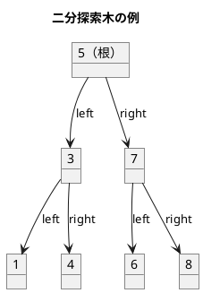
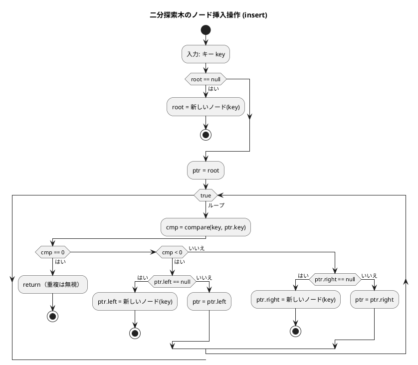
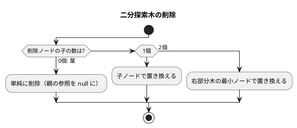
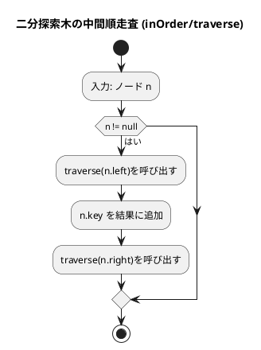

# 第 9 章 木構造

## はじめに

前章までで、配列、探索、スタック、キュー、再帰、ソート、文字列処理、リストなどを学びました。この章では、データ構造の中でも特に重要な「**木構造**」、特に**二分探索木（BST）**を Scala の TDD で実装します。

木構造はノードが親子関係で繋がった非線形データ構造です。Scala では `[T: Ordering]` コンテキスト境界と Union Type `Node | Null` を活用した型安全な汎用実装が可能です。

### 目次

1. [木構造とは](#木構造とは)
2. [二分木](#二分木)
3. [二分探索木の性質](#二分探索木の性質)
4. [Red — 失敗するテストを書く](#red--失敗するテストを書く)
5. [Green — テストを通す実装](#green--テストを通す実装)
6. [ノードの削除](#ノードの削除)
7. [木の走査](#木の走査)
8. [ヒープ](#ヒープ)

---

## 木構造とは

木構造とは、データを階層的に表現するデータ構造です。木構造は、以下の要素から構成されます：

- **ノード**：データを格納する要素
- **エッジ**：ノード間の関係を表す線
- **ルート**：木の最上位に位置するノード
- **親ノード**：あるノードの上位に位置するノード
- **子ノード**：あるノードの下位に位置するノード
- **葉ノード**：子ノードを持たないノード
- **高さ**：ルートから最も深い葉までのエッジ数

木構造は、以下のような特徴を持ちます：

1. 一つのルートノードから始まる
2. 各ノードは 0 個以上の子ノードを持つ
3. 循環構造を持たない（サイクルがない）

### 順序木と無順序木

木構造は、子ノードの順序に意味があるかどうかによって、「順序木」と「無順序木」に分類されます。

- **順序木**：子ノードの順序に意味がある木構造
- **無順序木**：子ノードの順序に意味がない木構造

### 順序木の探索

順序木を探索する方法には、主に以下の 3 つがあります：

1. **先行順（行きがけ順）探索**：ノード自身 → 左部分木 → 右部分木の順に探索
2. **中間順（通りがけ順）探索**：左部分木 → ノード自身 → 右部分木の順に探索
3. **後行順（帰りがけ順）探索**：左部分木 → 右部分木 → ノード自身の順に探索

---

## 二分木

二分木は、各ノードが最大 2 つの子ノード（左の子と右の子）を持つ木構造です。二分木の特徴：

1. 各ノードは最大 2 つの子ノードを持つ
2. 左の子と右の子が明確に区別される
3. 空の二分木も存在する

二分木は、二分探索木、ヒープ、ハフマン木などの基礎となります。

---

## 二分探索木の性質



**性質**:
- 左部分木のすべてのキー < ルートのキー
- 右部分木のすべてのキー > ルートのキー
- 中順探索（left → root → right）は昇順になる

---

## Red — 失敗するテストを書く

```scala
// TreesTest.scala
class TreesTest extends AnyFunSuite with Matchers:

  test("BinarySearchTree: 挿入と検索"):
    val bst = BinarySearchTree[Int]()
    bst.insert(5)
    bst.contains(5) shouldBe true

  test("BinarySearchTree: 中順走査は昇順"):
    val bst = BinarySearchTree[Int]()
    List(5, 3, 7, 1, 4, 6, 8).foreach(bst.insert)
    bst.inOrder() shouldBe List(1, 3, 4, 5, 6, 7, 8)

  test("BinarySearchTree: 子が 2 つのノードの削除"):
    val bst = BinarySearchTree[Int]()
    List(5, 3, 7, 1, 4).foreach(bst.insert)
    bst.delete(3)
    bst.contains(3) shouldBe false
```

---

## Green — テストを通す実装

```scala
// Trees.scala
class BinarySearchTree[T: Ordering]:
  import Ordering.Implicits.*

  private class Node(var key: T, var left: Node | Null = null, var right: Node | Null = null)

  private var root: Node | Null = null
  private var _size = 0

  def size: Int = _size
  def isEmpty: Boolean = root == null
  def contains(key: T): Boolean = search(key) != null

  private def search(key: T): Node | Null =
    var ptr = root
    while ptr != null do
      val cmp = summon[Ordering[T]].compare(key, ptr.key)
      if cmp == 0 then return ptr
      ptr = if cmp < 0 then ptr.left else ptr.right
    null

  def insert(key: T): Unit =
    if root == null then { root = Node(key); _size += 1; return }
    var ptr = root
    while true do
      val cmp = summon[Ordering[T]].compare(key, ptr.key)
      if cmp == 0 then return  // 重複は無視
      if cmp < 0 then
        if ptr.left == null then { ptr.left = Node(key); _size += 1; return }
        ptr = ptr.left
      else
        if ptr.right == null then { ptr.right = Node(key); _size += 1; return }
        ptr = ptr.right
```

### フローチャート



Scala では `[T: Ordering]` コンテキスト境界で `summon[Ordering[T]].compare()` を使い、任意の型 T に対して比較ができます。Python 版と異なり、型安全にジェネリックな BST を実装できます。

---

## ノードの削除

削除は 3 つのケースに分かれます：



```scala
def delete(key: T): Unit =
  var parent: Node | Null = null
  var ptr = root
  var isLeftChild = false
  while ptr != null do
    val cmp = summon[Ordering[T]].compare(key, ptr.key)
    if cmp == 0 then ptr = null  // break（ループで探索済み）
    else
      parent = ptr
      if cmp < 0 then { isLeftChild = true;  ptr = ptr.left  }
      else             { isLeftChild = false; ptr = ptr.right }

  val node = search(key)
  if node == null then return
  _size -= 1

  def replace(child: Node | Null): Unit =
    if parent == null then root = child
    else if isLeftChild then parent.left = child
    else parent.right = child

  if node.left == null && node.right == null then replace(null)       // ケース1: 葉
  else if node.right == null then replace(node.left)                  // ケース2: 左の子のみ
  else if node.left == null then replace(node.right)                  // ケース2: 右の子のみ
  else                                                                 // ケース3: 両方の子
    var succParent = node
    var succ = node.right
    while succ.left != null do
      succParent = succ; succ = succ.left
    node.key = succ.key
    if succParent == node then succParent.right = succ.right
    else succParent.left = succ.right
```

アルゴリズムの流れ：
1. 削除するノードを探索します
2. 削除するノードの子ノードの状況に応じて処理を分けます：
   - **葉（子が 0 個）**: 単純に削除（親の参照を null に）
   - **子が 1 個**: 子ノードで置き換えます
   - **子が 2 個**: 右部分木の中から最小ノード（中順後継ノード）を探し、そのキーで置き換えてから最小ノードを削除します

---

## 木の走査

| 走査方法 | 順序 | 用途 |
|---------|------|------|
| 前順（preOrder） | 根→左→右 | ツリーのコピー |
| 中順（inOrder） | 左→根→右 | ソート済みリスト取得 |
| 後順（postOrder） | 左→右→根 | ツリーの削除 |

### 中順走査（In-Order）— 昇順出力

```scala
def inOrder(): List[T] =
  val result = ArrayBuffer[T]()
  def traverse(n: Node | Null): Unit =
    if n != null then
      traverse(n.left); result += n.key; traverse(n.right)
  traverse(root)
  result.toList
```

### 前順走査（Pre-Order）

```scala
def preOrder(): List[T] =
  val result = ArrayBuffer[T]()
  def traverse(n: Node | Null): Unit =
    if n != null then
      result += n.key; traverse(n.left); traverse(n.right)
  traverse(root)
  result.toList
```

### 後順走査（Post-Order）

```scala
def postOrder(): List[T] =
  val result = ArrayBuffer[T]()
  def traverse(n: Node | Null): Unit =
    if n != null then
      traverse(n.left); traverse(n.right); result += n.key
  traverse(root)
  result.toList
```

### フローチャート



中間順走査では、左部分木 → ノード自身 → 右部分木の順に処理するため、二分探索木のノードをキーの昇順に取得できます。

---

## ヒープ

ヒープは、完全二分木の一種で、以下の性質を持ちます：

1. 各ノードの値は、その子ノードの値以上（または以下）である
2. 木は可能な限り左から右へ、上から下へ詰めて構築される

ヒープには、最大ヒープと最小ヒープの 2 種類があります：

- **最大ヒープ**：各ノードの値は、その子ノードの値以上である
- **最小ヒープ**：各ノードの値は、その子ノードの値以下である

### ヒープの配列表現

ヒープは通常、配列を用いて実装されます。完全二分木の性質を利用すると、配列のインデックスで親子関係を表現できます：

- インデックス i のノードの左の子: `2 * i + 1`
- インデックス i のノードの右の子: `2 * i + 2`
- インデックス i のノードの親: `(i - 1) / 2`

### ヒープの操作

Scala では `scala.collection.mutable.PriorityQueue` で最大ヒープを利用できます：

```scala
import scala.collection.mutable.PriorityQueue

// 最大ヒープ（デフォルト）
val maxHeap = PriorityQueue.empty[Int]
maxHeap.enqueue(3, 1, 4, 2)
println(maxHeap.dequeue())  // 4
println(maxHeap.dequeue())  // 3

// 最小ヒープ（Ordering を逆転）
val minHeap = PriorityQueue.empty[Int](Ordering[Int].reverse)
minHeap.enqueue(3, 1, 4, 2)
println(minHeap.dequeue())  // 1
println(minHeap.dequeue())  // 2
```

### ヒープの応用（第6章 heapSort）

第6章のヒープソートでは、最大ヒープを配列で実装し、ソートに活用しました：

```scala
// 最大ヒープを構築してから順番に最大値を取り出す
def heapSort(a: Array[Int]): Unit =
  val n = a.length
  if n <= 1 then return
  for i <- (n - 1) / 2 to 0 by -1 do downHeap(a, i, n - 1)  // ヒープ構築
  for i <- n - 1 to 1 by -1 do
    val tmp = a(0); a(0) = a(i); a(i) = tmp                  // 最大値を末尾へ
    downHeap(a, 0, i - 1)                                     // ヒープ性質を復元
```

### 解説

ヒープは、最大値または最小値を効率的に取得できるデータ構造です。

- 要素の追加: O(log n)
- 最大/最小値の取得: O(1)
- 最大/最小値の削除: O(log n)

ヒープは、優先度付きキューの実装、ヒープソート、ダイクストラのアルゴリズムなど、様々な場面で利用されます。

---

## テスト実行結果

```
$ cd apps/scala && sbt test

[info] TreesTest:
[info] - BinarySearchTree: 挿入と検索
[info] - BinarySearchTree: 中順走査は昇順
[info] - BinarySearchTree: 子が 2 つのノードの削除
[info] - ... (計 12 テスト)
[info] Tests: succeeded 12, failed 0
```

---

## 二分探索木の計算量

| 操作 | 平均 | 最悪（偏り木） |
|------|------|--------------|
| 探索 | O(log n) | O(n) |
| 挿入 | O(log n) | O(n) |
| 削除 | O(log n) | O(n) |
| 中順走査 | O(n) | O(n) |

バランス木（AVL 木、赤黒木）を使うと最悪でも O(log n) を保証できます。

## まとめ

この章では、木構造について Scala の TDD で学びました：

1. **木構造**：データを階層的に表現するデータ構造。ノード、エッジ、ルートなどの基本要素から構成される。
2. **二分木**：各ノードが最大 2 つの子ノードを持つ木構造。
3. **二分探索木**：効率的な探索を可能にする二分木。平均 O(log n) で探索・挿入・削除が可能。
4. **ノードの削除**：葉の削除、1つの子を持つノードの削除、2つの子を持つノードの削除（中順後継ノードで置き換え）の 3 ケース。
5. **木の走査**：前順（preOrder）、中順（inOrder）、後順（postOrder）の 3 種類。中順走査は昇順になる。
6. **ヒープ**：完全二分木の一種。優先度付きキューの実装に利用。Scala では `PriorityQueue` で利用可能。

Python 版と比較した Scala の特徴：
- `[T: Ordering]` コンテキスト境界で任意の型 T に対して比較可能
- `Node | Null` Union Type でコンパイル時の null 安全性
- ローカル関数（`def traverse`）で再帰を簡潔に実装

## 参考文献

- 『新・明解アルゴリズムとデータ構造』 — 柴田望洋
- 『テスト駆動開発』 — Kent Beck
