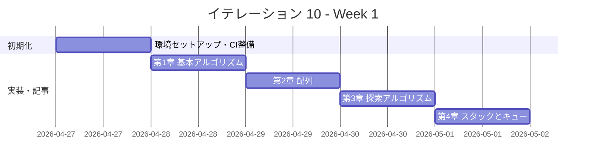
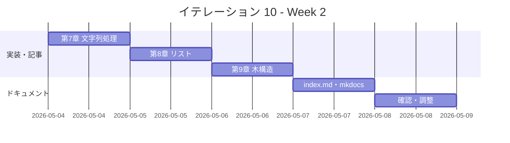

# イテレーション 10 計画

## 概要

| 項目 | 内容 |
|------|------|
| **イテレーション** | 10 |
| **期間** | Week 19-20（2 週間） |
| **ゴール** | F# 版を Python 版から展開し、TDD で実装する |
| **目標 SP** | 5 |

---

## ゴール

### イテレーション終了時の達成状態

1. **記事**: `docs/article/fsharp/` に全 9 章 + index.md が完成している
2. **実装**: `apps/fsharp/` に TDD 実装コードが動作する状態で存在する
3. **公開**: mkdocs.yml に F# 版が反映され、ローカルプレビューで閲覧可能

### 成功基準

- [ ] 9 章すべてのファイルが作成されている
- [ ] 各章のコード例が `apps/fsharp/` の実コードと同期している（記事記述と実装を同一コミットで完結）
- [ ] `apps/fsharp/` のテストが全てパス（`dotnet test`）
- [ ] mkdocs.yml の nav に F# 版全 9 章が追加されている
- [ ] ローカルプレビューで表示確認済み（`mkdocs serve`）
- [ ] 各章執筆時に Python 版との内容差分チェックを実施済み（差分 30% 以内）
- [ ] F# の関数型スタイル（パイプライン演算子、パターンマッチ、`option<T>`）を活用した実装

---

## ユーザーストーリー

### 対象ストーリー

| ID | ユーザーストーリー | SP | 優先度 |
|----|-------------------|----|--------|
| US-010 | F# 版を Python 版から展開する | 5 | 中 |
| **合計** | | **5** | |

### ストーリー詳細

#### US-010: F# 版を Python 版から展開する

**ストーリー**:

> 学習者として、F# でアルゴリズムとデータ構造を TDD で学びたい。なぜなら、F# は .NET 上で動く関数型ファースト言語であり、パターンマッチ、パイプライン演算子、不変データ構造を活用した簡潔で安全な実装を学ぶことで、関数型プログラミングの考え方を .NET エコシステムの中で実践的に理解できるからだ。

**受入条件**:

1. 全 9 章が Python 版を基に F# 版として再構成されている
2. 各章に TDD のコード例（テスト → 実装 → リファクタリング）が含まれている
3. `apps/fsharp/` で全テストがパスする（`dotnet test`）
4. F# の関数型スタイル（パイプライン演算子 `|>`、パターンマッチ、`option<T>`、`Result<T,E>`）を活用した実装

---

## タスク

### 1. 環境セットアップ（0.5 SP）

| # | タスク | 見積もり | 状態 |
|---|--------|---------|------|
| 1-1 | F# プロジェクト作成（apps/fsharp/、getting-started-algorithm.sln） | 20 分 | [ ] |
| 1-2 | 章ごとのプロジェクト分割（Chapter01〜Chapter09 + Tests） | 20 分 | [ ] |
| 1-3 | `.gitignore` 作成（`bin/`、`obj/`、`.vs/`） | 5 分 | [ ] |
| 1-4 | Nix devShell（.#dotnet）設定確認 | 15 分 | [ ] |

### 2. CI 整備（0.5 SP）

| # | タスク | 見積もり | 状態 |
|---|--------|---------|------|
| 2-1 | CI 設定（.github/workflows/ci-fsharp.yml: `dotnet test`） | 20 分 | [ ] |
| 2-2 | CI 動作確認 | 10 分 | [ ] |

### 3. 第 1 章 基本的なアルゴリズム（0.3 SP）

| # | タスク | 見積もり | 状態 |
|---|--------|---------|------|
| 3-1 | TDD 実装（3 値最大値・中央値、条件判定、繰り返し） | 40 分 | [ ] |
| 3-2 | 記事執筆（docs/article/fsharp/01-basic-algorithms.md） | 30 分 | [ ] |

### 4. 第 2 章 配列（0.3 SP）

| # | タスク | 見積もり | 状態 |
|---|--------|---------|------|
| 4-1 | TDD 実装（配列操作、基数変換、素数列挙） | 40 分 | [ ] |
| 4-2 | 記事執筆（docs/article/fsharp/02-arrays.md） | 20 分 | [ ] |

### 5. 第 3 章 探索アルゴリズム（0.3 SP）

| # | タスク | 見積もり | 状態 |
|---|--------|---------|------|
| 5-1 | TDD 実装（線形探索、二分探索、ハッシュ法） | 40 分 | [ ] |
| 5-2 | 記事執筆（docs/article/fsharp/03-search-algorithms.md） | 20 分 | [ ] |

### 6. 第 4 章 スタックとキュー（0.3 SP）

| # | タスク | 見積もり | 状態 |
|---|--------|---------|------|
| 6-1 | TDD 実装（スタック、キュー） | 40 分 | [ ] |
| 6-2 | 記事執筆（docs/article/fsharp/04-stacks-and-queues.md） | 20 分 | [ ] |

### 7. 第 5 章 再帰アルゴリズム（0.3 SP）

| # | タスク | 見積もり | 状態 |
|---|--------|---------|------|
| 7-1 | TDD 実装（再帰基本、再帰と反復、再帰応用） | 40 分 | [ ] |
| 7-2 | 記事執筆（docs/article/fsharp/05-recursion.md） | 20 分 | [ ] |

### 8. 第 6 章 ソートアルゴリズム（0.4 SP）

| # | タスク | 見積もり | 状態 |
|---|--------|---------|------|
| 8-1 | TDD 実装（バブル、選択、挿入、シェル、クイック、マージ、ヒープ、度数） | 50 分 | [ ] |
| 8-2 | 記事執筆（docs/article/fsharp/06-sort-algorithms.md） | 20 分 | [ ] |

### 9. 第 7 章 文字列処理（0.3 SP）

| # | タスク | 見積もり | 状態 |
|---|--------|---------|------|
| 9-1 | TDD 実装（文字列探索 BF/KMP/BM、文字数カウント、逆順、回文） | 40 分 | [ ] |
| 9-2 | 記事執筆（docs/article/fsharp/07-strings.md） | 20 分 | [ ] |

### 10. 第 8 章 リスト（0.4 SP）

| # | タスク | 見積もり | 状態 |
|---|--------|---------|------|
| 10-1 | TDD 実装（単方向リスト、双方向リスト、配列カーソル版） | 50 分 | [ ] |
| 10-2 | 記事執筆（docs/article/fsharp/08-linked-lists.md） | 20 分 | [ ] |

### 11. 第 9 章 木構造（0.4 SP）

| # | タスク | 見積もり | 状態 |
|---|--------|---------|------|
| 11-1 | TDD 実装（BST、走査 3 種、最小ヒープ） | 50 分 | [ ] |
| 11-2 | 記事執筆（docs/article/fsharp/09-trees.md） | 20 分 | [ ] |

### 12. ドキュメント整備（0.5 SP）

| # | タスク | 見積もり | 状態 |
|---|--------|---------|------|
| 12-1 | index.md 作成（docs/article/fsharp/index.md） | 30 分 | [ ] |
| 12-2 | mkdocs.yml に F# 版 9 章を追加 | 10 分 | [ ] |
| 12-3 | ローカルプレビュー確認（`mkdocs serve`） | 10 分 | [ ] |

### タスク合計

| カテゴリ | SP | 理想時間 | 状態 |
|---------|----|----------|------|
| 環境セットアップ | 0.5 | 60 分 | [ ] |
| CI 整備 | 0.5 | 30 分 | [ ] |
| 第 1〜9 章 TDD 実装 + 記事 | 3.0 | 540 分 | [ ] |
| ドキュメント整備 | 1.0 | 50 分 | [ ] |
| **合計** | **5** | **680 分（約 11.3h）** | |

**1 SP あたり**: 約 136 分（2.3h）
**進捗率**: 0%（0/5 SP）

---

## スケジュール

### Week 1（Day 1-5）



| 日 | タスク |
|----|--------|
| Day 1 | 環境セットアップ（apps/fsharp/、sln、.gitignore、CI） |
| Day 2 | 第 1 章 基本的なアルゴリズム（実装 + 記事） |
| Day 3 | 第 2〜3 章（配列、探索アルゴリズム） |
| Day 4 | 第 4〜5 章（スタックとキュー、再帰アルゴリズム） |
| Day 5 | 第 6 章（ソートアルゴリズム） |

### Week 2（Day 6-10）



| 日 | タスク |
|----|--------|
| Day 6 | 第 7 章（文字列処理） |
| Day 7 | 第 8 章（リスト） |
| Day 8 | 第 9 章（木構造） |
| Day 9 | index.md 作成、mkdocs.yml 更新 |
| Day 10 | 統合テスト、ローカルプレビュー確認、バグ修正 |

---

## 設計

### ディレクトリ構成

```
apps/fsharp/
├── .gitignore
├── getting-started-algorithm.sln
├── Chapter01/
│   ├── Chapter01.fsproj
│   └── BasicAlgorithms.fs
├── Chapter01.Tests/
│   ├── Chapter01.Tests.fsproj
│   └── BasicAlgorithmsTests.fs
├── Chapter02/
│   ├── Chapter02.fsproj
│   └── Arrays.fs
├── Chapter02.Tests/
│   ├── Chapter02.Tests.fsproj
│   └── ArraysTests.fs
├── Chapter03/
│   ├── Chapter03.fsproj
│   └── SearchAlgorithms.fs
├── Chapter03.Tests/
│   ├── Chapter03.Tests.fsproj
│   └── SearchAlgorithmsTests.fs
├── Chapter04/
│   ├── Chapter04.fsproj
│   └── StacksAndQueues.fs
├── Chapter04.Tests/
│   ├── Chapter04.Tests.fsproj
│   └── StacksAndQueuesTests.fs
├── Chapter05/
│   ├── Chapter05.fsproj
│   └── Recursion.fs
├── Chapter05.Tests/
│   ├── Chapter05.Tests.fsproj
│   └── RecursionTests.fs
├── Chapter06/
│   ├── Chapter06.fsproj
│   └── SortAlgorithms.fs
├── Chapter06.Tests/
│   ├── Chapter06.Tests.fsproj
│   └── SortAlgorithmsTests.fs
├── Chapter07/
│   ├── Chapter07.fsproj
│   └── Strings.fs
├── Chapter07.Tests/
│   ├── Chapter07.Tests.fsproj
│   └── StringsTests.fs
├── Chapter08/
│   ├── Chapter08.fsproj
│   └── LinkedLists.fs
├── Chapter08.Tests/
│   ├── Chapter08.Tests.fsproj
│   └── LinkedListsTests.fs
├── Chapter09/
│   ├── Chapter09.fsproj
│   └── Trees.fs
└── Chapter09.Tests/
    ├── Chapter09.Tests.fsproj
    └── TreesTests.fs

docs/article/fsharp/
├── index.md
├── 01-basic-algorithms.md
├── 02-arrays.md
├── 03-search-algorithms.md
├── 04-stacks-and-queues.md
├── 05-recursion.md
├── 06-sort-algorithms.md
├── 07-strings.md
├── 08-linked-lists.md
└── 09-trees.md
```

### F# 言語の設計方針

- ソリューション（.sln）+ 章ごとのプロジェクト（.fsproj）で分割
- テストは章ごとに `ChapterXX.Tests` プロジェクトとして分離（xUnit.net 使用）
- 関数型ファーストで実装し、必要に応じて `mutable` を使用
- パイプライン演算子 `|>` で処理の流れを明示
- パターンマッチ（`match ... with`）で条件分岐を表現
- `option<T>` で NULL 安全な実装（Python の `None` に対応）
- `Result<T,E>` でエラーハンドリング（Python の例外に対応）
- 判別共用体（Discriminated Union）でデータモデルを表現

### Python との対応実装方針

| 機能 | Python | F# |
|------|--------|-----|
| クラス | `class Stack` | `type Stack(capacity) =` |
| リスト | `list` | `list<T>` / `ResizeArray<T>` |
| 辞書 | `dict` | `Dictionary<K,V>` / `Map<K,V>` |
| 例外 | `raise Exception` | `raise` / `Result<T,E>` |
| None | `None` | `None`（`option<T>`） |
| 変更可能 | デフォルト | `mutable` キーワード / `ref` |
| テスト | pytest | xUnit.net |
| ラムダ | `lambda x: x` | `fun x -> x` |
| リスト内包 | `[x for x in ...]` | `[for x in ... -> ...]` / `List.map` |
| パイプ | なし | `\|>` |
| パターンマッチ | `match`（3.10+） | `match ... with` |

### F# 固有の設計指針

| データ構造 | 実装方針 | 理由 |
|-----------|---------|------|
| 連結リスト | 判別共用体 + 再帰 | F# のイディオムに合致 |
| 双方向リスト | `mutable` フィールド + クラス型 | 双方向参照に可変性が必要 |
| BST | 判別共用体 + 再帰 | 不変ツリーとして自然な表現 |
| ヒープ | `ResizeArray<T>`（配列ベース） | 可変配列が効率的 |
| ハッシュテーブル | `Dictionary<K,V>` | .NET 標準コレクション活用 |
| スタック・キュー | `ResizeArray<T>` / クラス型 | 可変操作が必要 |

---

## リスクと対策

| リスク | 影響度 | 対策 |
|--------|--------|------|
| .NET SDK / dotnet コマンドの Nix 設定 | 高 | flake.nix の `.#dotnet` devShell を事前確認。IT-4（C#）で .NET 環境は構築済みのため、F# テンプレートの追加のみ |
| xUnit.net のテストプロジェクト設定 | 中 | IT-4（C#/NUnit）の CI 設定を参考にする。C# 版と同じ .NET テストランナーを使用 |
| F# の可変状態（`mutable`）と純粋関数型スタイルの混在 | 中 | 初期実装は命令型スタイルで進め、リファクタリング段階で関数型化。データ構造ごとに方針を事前決定（上記設計指針参照） |
| F# のファイル順序依存（.fsproj 内のファイル順序が重要） | 中 | 各プロジェクトは単一 .fs ファイルとし、ファイル順序問題を回避 |
| レートリミットによるエージェント中断 | 低 | 章ごとに細かくコミットし、中断時に再開しやすい状態を保つ（IT-9 ふりかえりより） |

---

## 完了条件

### Definition of Done

- [ ] `apps/fsharp/` の全テストがパス（`dotnet test`）
- [ ] 全 9 章 + index.md が作成されている
- [ ] mkdocs.yml の nav に F# 版全 9 章が追加されている
- [ ] ローカルプレビューで表示確認済み（`mkdocs serve`）
- [ ] 各章のコード例が実装コードと同期している
- [ ] Python 版との記事記述量差分が 30% 以内
- [ ] `.gitignore` に `bin/`、`obj/` が登録済み
- [ ] F# の関数型スタイル（パイプライン、パターンマッチ、`option<T>`）を活用した実装

### デモ項目

1. `dotnet test` で全テストがパスすることを確認
2. `mkdocs serve` でブラウザから F# 版記事を閲覧
3. 第 8 章（リスト）の判別共用体による連結リスト実装をデモ

---

## IT-9 ふりかえりからの引き継ぎ事項

- `apps/fsharp/` 作成時に最初から `.gitignore`（`bin/`、`obj/`）を用意する → タスク 1-3 として明記済み
- .NET ランタイム（`dotnet` SDK）と flake.nix の F# シェル設定を事前に確認する → タスク 1-4 として明記済み
- 参照実装として Python 版 + C# 版（同じ .NET 系）+ Rust 版の 3 言語が利用可能 → 設計方針に反映済み
- CI テンプレート: `ci-rust.yml` を参考に `ci-fsharp.yml`（`dotnet test`）を整備する → タスク 2-1 として明記済み
- レートリミット対策として、章ごとに細かくコミットし、中断時の再開ポイントを明確にする → リスク対策に明記済み
- ローカルプレビュー確認をイテレーション完了条件として明示的にチェックする → 成功基準・DoD に明記済み
- 記事の記述量チェックを開発完了基準に加える（Python 版との差分 30% 以内） → 成功基準・DoD に明記済み

---

## 更新履歴

| 日付 | 更新内容 | 更新者 |
|------|---------|--------|
| 2026-04-12 | 初版作成 | - |

---

## 関連ドキュメント

- [イテレーション 10 ふりかえり](./retrospective-10.md)
- [リリース計画](./release_plan.md)
- [F# 版記事](../article/fsharp/index.md)
- [イテレーション 9 ふりかえり](./retrospective-9.md)
- [C# 版記事](../article/csharp/index.md)（同じ .NET 系の参照実装）
