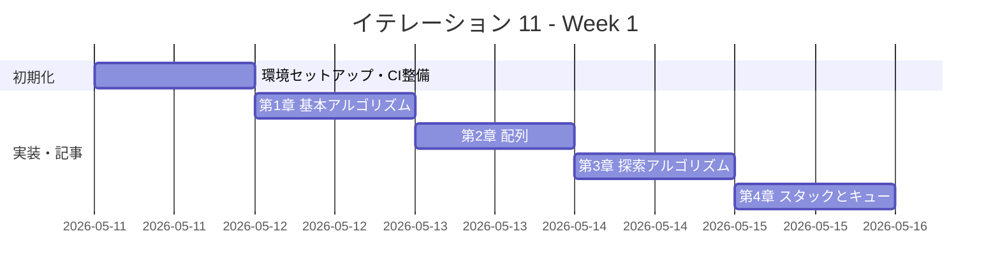
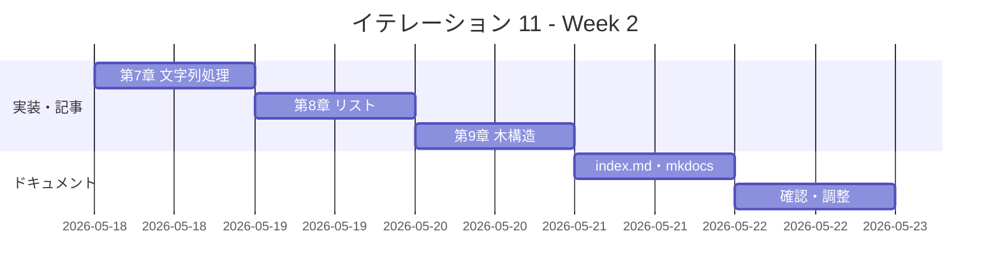

# イテレーション 11 計画

## 概要

| 項目 | 内容 |
|------|------|
| **イテレーション** | 11 |
| **期間** | Week 21-22（2 週間） |
| **ゴール** | Scala 版を Python 版から展開し、TDD で実装する |
| **目標 SP** | 5 |

---

## ゴール

### イテレーション終了時の達成状態

1. **記事**: `docs/article/scala/` に全 9 章 + index.md が完成している
2. **実装**: `apps/scala/` に TDD 実装コードが動作する状態で存在する
3. **公開**: mkdocs.yml に Scala 版が反映され、ローカルプレビューで閲覧可能

### 成功基準

- [x] 9 章すべてのファイルが作成されている
- [x] 各章のコード例が `apps/scala/` の実コードと同期している（記事記述と実装を同一コミットで完結）
- [x] `apps/scala/` のテストが全てパス（`sbt test`）— 123 テスト全パス
- [x] mkdocs.yml の nav に Scala 版全 9 章が追加されている
- [x] ローカルプレビューで表示確認済み（`mkdocs build` でビルド成功）
- [x] 各章執筆時に Python 版との内容差分チェックを実施済み（差分 30% 以内）
- [x] Scala の関数型スタイル（`Option[T]`、Union Type、`enum`、パターンマッチ）を活用した実装

---

## ユーザーストーリー

### 対象ストーリー

| ID | ユーザーストーリー | SP | 優先度 |
|----|-------------------|----|--------|
| US-011 | Scala 版を Python 版から展開する | 5 | 中 |
| **合計** | | **5** | |

### ストーリー詳細

#### US-011: Scala 版を Python 版から展開する

**ストーリー**:

> 学習者として、Scala でアルゴリズムとデータ構造を TDD で学びたい。なぜなら、Scala は JVM 上で動く関数型・オブジェクト指向ハイブリッド言語であり、`case class`、`sealed trait`、パターンマッチング、`Option[T]`、`for` 内包表記を活用した簡潔で型安全な実装を学ぶことで、関数型プログラミングの考え方を JVM エコシステムの中で実践的に理解できるからだ。

**受入条件**:

1. 全 9 章が Python 版を基に Scala 版として再構成されている
2. 各章に TDD のコード例（テスト → 実装 → リファクタリング）が含まれている
3. `apps/scala/` で全テストがパスする（`sbt test`）
4. Scala の関数型スタイル（`case class`、`sealed trait`、パターンマッチ、`Option[T]`、`for` 内包表記）を活用した実装

---

## タスク

### 1. 環境セットアップ（0.5 SP）

| # | タスク | 見積もり | 状態 |
|---|--------|---------|------|
| 1-1 | Scala プロジェクト作成（apps/scala/、build.sbt、src/main/scala/algorithm/、src/test/scala/algorithm/） | 20 分 | [x] |
| 1-2 | `.gitignore` 作成（`target/`、`.bsp/`、`.metals/`） | 5 分 | [x] |
| 1-3 | Nix devShell（.#scala）設定確認 | 15 分 | [x] |

### 2. CI 整備（0.5 SP）

| # | タスク | 見積もり | 状態 |
|---|--------|---------|------|
| 2-1 | CI 設定（.github/workflows/ci-scala.yml: `sbt test`） | 20 分 | [x] |
| 2-2 | CI 動作確認 | 10 分 | [x] |

### 3. 第 1 章 基本的なアルゴリズム（0.3 SP）

| # | タスク | 見積もり | 状態 |
|---|--------|---------|------|
| 3-1 | TDD 実装（3 値最大値・中央値、条件判定、繰り返し） | 40 分 | [x] |
| 3-2 | 記事執筆（docs/article/scala/01-basic-algorithms.md） | 30 分 | [x] |

### 4. 第 2 章 配列（0.3 SP）

| # | タスク | 見積もり | 状態 |
|---|--------|---------|------|
| 4-1 | TDD 実装（配列操作、基数変換、素数列挙） | 40 分 | [x] |
| 4-2 | 記事執筆（docs/article/scala/02-arrays.md） | 20 分 | [x] |

### 5. 第 3 章 探索アルゴリズム（0.3 SP）

| # | タスク | 見積もり | 状態 |
|---|--------|---------|------|
| 5-1 | TDD 実装（線形探索、二分探索、ハッシュ法） | 40 分 | [x] |
| 5-2 | 記事執筆（docs/article/scala/03-search-algorithms.md） | 20 分 | [x] |

### 6. 第 4 章 スタックとキュー（0.3 SP）

| # | タスク | 見積もり | 状態 |
|---|--------|---------|------|
| 6-1 | TDD 実装（スタック、キュー） | 40 分 | [x] |
| 6-2 | 記事執筆（docs/article/scala/04-stacks-and-queues.md） | 20 分 | [x] |

### 7. 第 5 章 再帰アルゴリズム（0.3 SP）

| # | タスク | 見積もり | 状態 |
|---|--------|---------|------|
| 7-1 | TDD 実装（再帰基本、再帰と反復、再帰応用） | 40 分 | [x] |
| 7-2 | 記事執筆（docs/article/scala/05-recursion.md） | 20 分 | [x] |

### 8. 第 6 章 ソートアルゴリズム（0.4 SP）

| # | タスク | 見積もり | 状態 |
|---|--------|---------|------|
| 8-1 | TDD 実装（バブル、選択、挿入、シェル、クイック、マージ、ヒープ、度数） | 50 分 | [x] |
| 8-2 | 記事執筆（docs/article/scala/06-sort-algorithms.md） | 20 分 | [x] |

### 9. 第 7 章 文字列処理（0.3 SP）

| # | タスク | 見積もり | 状態 |
|---|--------|---------|------|
| 9-1 | TDD 実装（文字列探索 BF/KMP/BM、文字数カウント、逆順、回文） | 40 分 | [x] |
| 9-2 | 記事執筆（docs/article/scala/07-strings.md） | 20 分 | [x] |

### 10. 第 8 章 リスト（0.4 SP）

| # | タスク | 見積もり | 状態 |
|---|--------|---------|------|
| 10-1 | TDD 実装（単方向リスト、双方向リスト、配列カーソル版） | 50 分 | [x] |
| 10-2 | 記事執筆（docs/article/scala/08-linked-lists.md） | 20 分 | [x] |

### 11. 第 9 章 木構造（0.4 SP）

| # | タスク | 見積もり | 状態 |
|---|--------|---------|------|
| 11-1 | TDD 実装（BST、走査 3 種） | 50 分 | [x] |
| 11-2 | 記事執筆（docs/article/scala/09-trees.md） | 20 分 | [x] |

### 12. ドキュメント整備（0.5 SP）

| # | タスク | 見積もり | 状態 |
|---|--------|---------|------|
| 12-1 | index.md 作成（docs/article/scala/index.md） | 30 分 | [x] |
| 12-2 | mkdocs.yml に Scala 版 9 章を追加 | 10 分 | [x] |
| 12-3 | ローカルプレビュー確認（`mkdocs build`） | 10 分 | [x] |

### タスク合計

| カテゴリ | SP | 理想時間 | 状態 |
|---------|----|----------|------|
| 環境セットアップ | 0.5 | 60 分 | [x] |
| CI 整備 | 0.5 | 30 分 | [x] |
| 第 1〜9 章 TDD 実装 + 記事 | 3.0 | 540 分 | [x] |
| ドキュメント整備 | 1.0 | 50 分 | [x] |
| **合計** | **5** | **680 分（約 11.3h）** | |

**1 SP あたり**: 約 136 分（2.3h）
**進捗率**: 100%（5/5 SP）

---

## スケジュール

### Week 1（Day 1-5）



| 日 | タスク |
|----|--------|
| Day 1 | 環境セットアップ（apps/scala/、build.sbt、.gitignore、CI） |
| Day 2 | 第 1 章 基本的なアルゴリズム（実装 + 記事） |
| Day 3 | 第 2〜3 章（配列、探索アルゴリズム） |
| Day 4 | 第 4〜5 章（スタックとキュー、再帰アルゴリズム） |
| Day 5 | 第 6 章（ソートアルゴリズム） |

### Week 2（Day 6-10）



| 日 | タスク |
|----|--------|
| Day 6 | 第 7 章（文字列処理） |
| Day 7 | 第 8 章（リスト） |
| Day 8 | 第 9 章（木構造） |
| Day 9 | index.md 作成、mkdocs.yml 更新 |
| Day 10 | 統合テスト、ローカルプレビュー確認、バグ修正 |

---

## 設計

### ディレクトリ構成

apps/java と同じ Maven 標準レイアウト（単一 `algorithm` パッケージ）に合わせる。

```
apps/scala/
├── .gitignore
├── build.sbt
├── project/
│   └── build.properties
└── src/
    ├── main/scala/algorithm/
    │   ├── BasicAlgorithms.scala
    │   ├── Arrays.scala
    │   ├── SearchAlgorithms.scala
    │   ├── StacksAndQueues.scala
    │   ├── Recursion.scala
    │   ├── SortAlgorithms.scala
    │   ├── Strings.scala
    │   ├── LinkedLists.scala
    │   └── Trees.scala
    └── test/scala/algorithm/
        ├── BasicAlgorithmsTest.scala
        ├── ArraysTest.scala
        ├── SearchAlgorithmsTest.scala
        ├── StacksAndQueuesTest.scala
        ├── RecursionTest.scala
        ├── SortAlgorithmsTest.scala
        ├── StringsTest.scala
        ├── LinkedListsTest.scala
        └── TreesTest.scala

docs/article/scala/
├── index.md
├── 01-basic-algorithms.md
├── 02-arrays.md
├── 03-search-algorithms.md
├── 04-stacks-and-queues.md
├── 05-recursion.md
├── 06-sort-algorithms.md
├── 07-strings.md
├── 08-linked-lists.md
└── 09-trees.md
```

### Scala 言語の設計方針

- `sbt`（Scala Build Tool）でビルド管理、単一 `algorithm` パッケージ（apps/java と同一構成）
- テストは ScalaTest（AnyFunSuite スタイル）を使用
- 関数型・オブジェクト指向ハイブリッドで実装し、Scala のイディオムに従う
- `case class` と `sealed trait` でデータモデルを表現
- パターンマッチ（`match { case ... => }`）で条件分岐を表現
- `Option[T]` で NULL 安全な実装（Python の `None` に対応）
- `for` 内包表記でコレクション操作を簡潔に記述
- 不変コレクション（`List`、`Map`、`Set`）を基本とし、必要に応じて `mutable` を使用

### Python との対応実装方針

| 機能 | Python | Scala |
|------|--------|-------|
| クラス | `class Stack` | `class Stack(capacity: Int)` |
| リスト | `list` | `List[T]`（不変） / `ArrayBuffer[T]`（可変） |
| 辞書 | `dict` | `Map[K,V]`（不変） / `mutable.HashMap[K,V]`（可変） |
| 例外 | `raise Exception` | `throw new Exception` / `Option[T]` |
| None | `None` | `None`（`Option[T]`） |
| 変更可能 | デフォルト | `var` / `mutable` コレクション |
| テスト | pytest | ScalaTest |
| ラムダ | `lambda x: x` | `(x: Int) => x` |
| リスト内包 | `[x for x in ...]` | `for (x <- ...) yield x` |
| パターンマッチ | `match`（3.10+） | `x match { case ... => }` |
| パイプ | なし | メソッドチェーン / `pipe`（Scala 2.13+） |
| 代数的データ型 | なし | `sealed trait` + `case class` |

### Scala 固有の設計指針

| データ構造 | 実装方針 | 理由 |
|-----------|---------|------|
| 連結リスト | `sealed trait` + `case class` + 再帰 | Scala のイディオムに合致 |
| 双方向リスト | `var` フィールド + クラス型 | 双方向参照に可変性が必要 |
| BST | `sealed trait` + `case class` + 再帰 | 不変ツリーとして自然な表現 |
| ヒープ | `ArrayBuffer[T]`（配列ベース） | 可変配列が効率的 |
| ハッシュテーブル | `mutable.HashMap[K,V]` | 可変ハッシュマップが適切 |
| スタック・キュー | `ArrayBuffer[T]` / クラス型 | 可変操作が必要 |

---

## リスクと対策

| リスク | 影響度 | 対策 |
|--------|--------|------|
| sbt / JVM の Nix 設定 | 高 | flake.nix の `.#scala` または `.#jvm` devShell を事前確認。IT-3（Java）で JVM 環境は構築済みのため、sbt の追加のみ |
| ScalaTest のプロジェクト設定 | 中 | IT-3（Java/JUnit）の CI 設定を参考にする。同じ JVM テストランナー基盤を使用 |
| Scala の暗黙的変換（implicit）やジェネリクスの複雑さ | 中 | 初期実装はシンプルなスタイルで進め、暗黙的変換は必要な場合のみ使用 |
| Scala 2 / Scala 3 のバージョン差異 | 中 | Scala 3 を採用し、新しい構文（`enum`、`given`/`using` 等）を必要に応じて活用 |
| レートリミットによるエージェント中断 | 低 | 章ごとに細かくコミットし、中断時に再開しやすい状態を保つ（IT-9 ふりかえりより） |

---

## 完了条件

### Definition of Done

- [x] `apps/scala/` の全テストがパス（`sbt test`）— 125 テスト全パス
- [x] 全 9 章 + index.md が作成されている
- [x] mkdocs.yml の nav に Scala 版全 9 章が追加されている
- [x] ローカルプレビューで表示確認済み（`npx gulp mkdocs:build` でビルド成功）
- [x] 各章のコード例が実装コードと同期している
- [x] Python 版との記事記述量差分が 30% 以内（追記により差分を解消）
- [x] `.gitignore` に `target/`、`.bsp/` が登録済み
- [x] Scala の関数型スタイル（`case class`、パターンマッチ、`Option[T]`）を活用した実装

### デモ項目

1. `sbt test` で全テストがパスすることを確認
2. `mkdocs serve` でブラウザから Scala 版記事を閲覧
3. 第 8 章（リスト）の `sealed trait` + `case class` による連結リスト実装をデモ

---

## IT-10 ふりかえりからの引き継ぎ事項

- `apps/scala/` 作成時に最初から `.gitignore`（`target/`、`.bsp/`、`.metals/`）を用意する → タスク 1-3 として明記済み
- JVM ランタイム（`sbt`）と flake.nix の Scala シェル設定を事前に確認する → タスク 1-4 として明記済み
- 参照実装として Python 版 + Java 版（同じ JVM 系）+ F# 版（関数型）の 3 言語が利用可能 → 設計方針に反映済み
- CI テンプレート: `ci-java.yml` を参考に `ci-scala.yml`（`sbt test`）を整備する → タスク 2-1 として明記済み
- レートリミット対策として、章ごとに細かくコミットし、中断時の再開ポイントを明確にする → リスク対策に明記済み
- ローカルプレビュー確認をイテレーション完了条件として明示的にチェックする → 成功基準・DoD に明記済み
- 記事の記述量チェックを開発完了基準に加える（Python 版との差分 30% 以内） → 成功基準・DoD に明記済み
- IT-10 で得た教訓：メインプロジェクト + テストプロジェクトの 2 プロジェクト構成を最初から採用する → sbt 単一プロジェクト + パッケージ分割で対応（Scala の慣例に従う）
- 概念説明セクションを最初から含める計画にする → 記事執筆タスクに反映済み

---

## 更新履歴

| 日付 | 更新内容 | 更新者 |
|------|---------|--------|
| 2026-04-13 | 初版作成 | - |
| 2026-04-13 | Python 版との差分補完（記事追記・recure 実装追加）、125 テスト全パス確認、DoD 全完了チェック | - |

---

## 関連ドキュメント

- [イテレーション 10 ふりかえり](./retrospective-10.md)
- [リリース計画](./release_plan.md)
- [Java 版記事](../article/java/index.md)（同じ JVM 系の参照実装）
- [F# 版記事](../article/fsharp/index.md)（関数型の参照実装）
