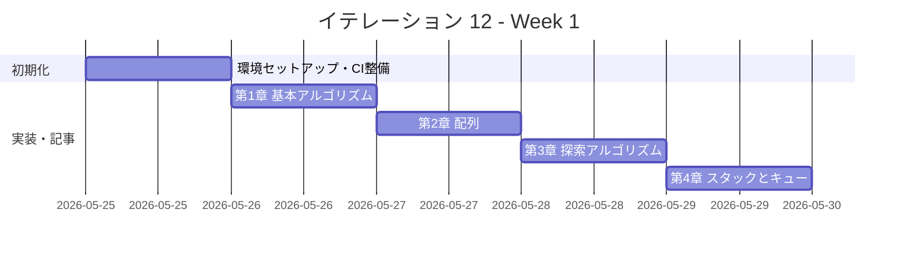
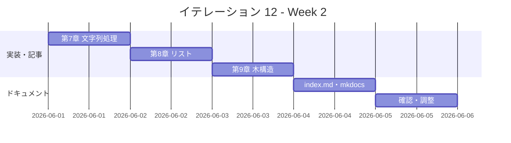

# イテレーション 12 計画

## 概要

| 項目 | 内容 |
|------|------|
| **イテレーション** | 12 |
| **期間** | Week 23-24（2 週間） |
| **ゴール** | Clojure 版を Python 版から展開し、TDD で実装する |
| **目標 SP** | 5 |

---

## ゴール

### イテレーション終了時の達成状態

1. **記事**: `docs/article/clojure/` に全 9 章 + index.md が完成している
2. **実装**: `apps/clojure/` に TDD 実装コードが動作する状態で存在する
3. **公開**: mkdocs.yml に Clojure 版が反映され、ローカルプレビューで閲覧可能

### 成功基準

- [x] 9 章すべてのファイルが作成されている
- [x] 各章のコード例が `apps/clojure/` の実コードと同期している（記事執筆と実装を同一コミットで完結）
- [x] `apps/clojure/` のテストが全てパス（`lein test`）
- [x] mkdocs.yml の nav に Clojure 版全 9 章が追加されている
- [x] ローカルプレビューで表示確認済み（`npx gulp mkdocs:build` でビルド成功）
- [x] 各章執筆時に Python 版との内容差分チェックを実施済み（差分 30% 以内）
- [x] Clojure の関数型スタイル（不変データ構造・高階関数・`defn`・マクロ・遅延評価）を活用した実装

---

## ユーザーストーリー

### 対象ストーリー

| ID | ユーザーストーリー | SP | 優先度 |
|----|-------------------|----|--------|
| US-012 | Clojure 版を Python 版から展開する | 5 | 中 |
| **合計** | | **5** | |

### ストーリー詳細

#### US-012: Clojure 版を Python 版から展開する

**ストーリー**:

> 学習者として、Clojure でアルゴリズムとデータ構造を TDD で学びたい。なぜなら、Clojure は JVM 上で動く Lisp 系関数型言語であり、不変データ構造（`vector`・`list`・`map`・`set`）、遅延評価（`lazy-seq`）、マクロ（`defmacro`）、REPL 駆動開発を活用した簡潔で表現力豊かな実装を学ぶことで、関数型プログラミングとデータ変換の本質的な考え方を理解できるからだ。

**受入条件**:

1. 全 9 章が Python 版を基に Clojure 版として再構成されている
2. 各章に TDD のコード例（テスト → 実装 → リファクタリング）が含まれている
3. `apps/clojure/` で全テストがパスする（`lein test`）
4. Clojure の関数型スタイル（不変データ構造・`map`/`filter`/`reduce`・`loop/recur`・遅延評価）を活用した実装

---

## タスク

### 1. 環境セットアップ（0.5 SP）

| # | タスク | 見積もり | 状態 |
|---|--------|---------|------|
| 1-1 | Clojure プロジェクト作成（apps/clojure/、project.clj、src/algorithm/、test/algorithm/） | 20 分 | [x] |
| 1-2 | `.gitignore` 作成（`target/`、`.clj-kondo/`、`.lsp/`、`.cpcache/`） | 5 分 | [x] |
| 1-3 | Nix devShell（.#clojure）設定確認（leiningen + clojure）| 15 分 | [x] |

### 2. CI 整備（0.5 SP）

| # | タスク | 見積もり | 状態 |
|---|--------|---------|------|
| 2-1 | CI 設定（.github/workflows/ci-clojure.yml: `lein test`） | 20 分 | [x] |
| 2-2 | CI 動作確認 | 10 分 | [x] |

### 3. 第 1 章 基本的なアルゴリズム（0.3 SP）

| # | タスク | 見積もり | 状態 |
|---|--------|---------|------|
| 3-1 | TDD 実装（3 値最大値・中央値、条件判定、繰り返し） | 40 分 | [x] |
| 3-2 | 記事執筆（docs/article/clojure/01-basic-algorithms.md）+ Python 版差分チェック | 30 分 | [x] |

### 4. 第 2 章 配列（0.3 SP）

| # | タスク | 見積もり | 状態 |
|---|--------|---------|------|
| 4-1 | TDD 実装（配列操作、基数変換、素数列挙） | 40 分 | [x] |
| 4-2 | 記事執筆（docs/article/clojure/02-arrays.md）+ Python 版差分チェック | 20 分 | [x] |

### 5. 第 3 章 探索アルゴリズム（0.3 SP）

| # | タスク | 見積もり | 状態 |
|---|--------|---------|------|
| 5-1 | TDD 実装（線形探索、二分探索、ハッシュ法） | 40 分 | [x] |
| 5-2 | 記事執筆（docs/article/clojure/03-search-algorithms.md）+ Python 版差分チェック | 20 分 | [x] |

### 6. 第 4 章 スタックとキュー（0.3 SP）

| # | タスク | 見積もり | 状態 |
|---|--------|---------|------|
| 6-1 | TDD 実装（スタック、キュー） | 40 分 | [x] |
| 6-2 | 記事執筆（docs/article/clojure/04-stacks-and-queues.md）+ Python 版差分チェック | 20 分 | [x] |

### 7. 第 5 章 再帰アルゴリズム（0.3 SP）

| # | タスク | 見積もり | 状態 |
|---|--------|---------|------|
| 7-1 | TDD 実装（再帰基本・GCD・ハノイの塔・迷路・8 王妃問題） | 40 分 | [x] |
| 7-2 | 記事執筆（docs/article/clojure/05-recursion.md）+ Python 版差分チェック | 20 分 | [x] |

### 8. 第 6 章 ソートアルゴリズム（0.4 SP）

| # | タスク | 見積もり | 状態 |
|---|--------|---------|------|
| 8-1 | TDD 実装（バブル、選択、挿入、シェル、クイック、マージ、ヒープ、度数） | 50 分 | [x] |
| 8-2 | 記事執筆（docs/article/clojure/06-sort-algorithms.md）+ Python 版差分チェック | 20 分 | [x] |

### 9. 第 7 章 文字列処理（0.3 SP）

| # | タスク | 見積もり | 状態 |
|---|--------|---------|------|
| 9-1 | TDD 実装（文字列探索 BF/KMP/BM、文字数カウント、逆順、回文） | 40 分 | [x] |
| 9-2 | 記事執筆（docs/article/clojure/07-strings.md）+ Python 版差分チェック | 20 分 | [x] |

### 10. 第 8 章 リスト（0.4 SP）

| # | タスク | 見積もり | 状態 |
|---|--------|---------|------|
| 10-1 | TDD 実装（単方向リスト、双方向リスト、配列カーソル版） | 50 分 | [x] |
| 10-2 | 記事執筆（docs/article/clojure/08-linked-lists.md）+ Python 版差分チェック | 20 分 | [x] |

### 11. 第 9 章 木構造（0.4 SP）

| # | タスク | 見積もり | 状態 |
|---|--------|---------|------|
| 11-1 | TDD 実装（BST、走査 3 種） | 50 分 | [x] |
| 11-2 | 記事執筆（docs/article/clojure/09-trees.md）+ Python 版差分チェック | 20 分 | [x] |

### 12. ドキュメント整備（0.5 SP）

| # | タスク | 見積もり | 状態 |
|---|--------|---------|------|
| 12-1 | index.md 作成（docs/article/clojure/index.md） | 30 分 | [x] |
| 12-2 | mkdocs.yml に Clojure 版 9 章を追加 | 10 分 | [x] |
| 12-3 | ローカルプレビュー確認（`npx gulp mkdocs:build`） | 10 分 | [x] |

### タスク合計

| カテゴリ | SP | 理想時間 | 状態 |
|---------|----|----------|------|
| 環境セットアップ | 0.5 | 40 分 | [x] |
| CI 整備 | 0.5 | 30 分 | [x] |
| 第 1〜9 章 TDD 実装 + 記事 | 3.0 | 540 分 | [x] |
| ドキュメント整備 | 1.0 | 50 分 | [x] |
| **合計** | **5** | **660 分（約 11.0h）** | |

**1 SP あたり**: 約 132 分（2.2h）
**進捗率**: 100%（5/5 SP）

---

## スケジュール

### Week 1（Day 1-5）



| 日 | タスク |
|----|--------|
| Day 1 | 環境セットアップ（apps/clojure/、project.clj、.gitignore、CI） |
| Day 2 | 第 1 章 基本的なアルゴリズム（実装 + 記事 + 差分チェック） |
| Day 3 | 第 2〜3 章（配列、探索アルゴリズム） |
| Day 4 | 第 4〜5 章（スタックとキュー、再帰アルゴリズム） |
| Day 5 | 第 6 章（ソートアルゴリズム） |

### Week 2（Day 6-10）



| 日 | タスク |
|----|--------|
| Day 6 | 第 7 章（文字列処理） |
| Day 7 | 第 8 章（リスト） |
| Day 8 | 第 9 章（木構造） |
| Day 9 | index.md 作成、mkdocs.yml 更新 |
| Day 10 | 統合テスト、ローカルプレビュー確認、バグ修正 |

---

## 設計

### ディレクトリ構成

Leiningen の標準レイアウト（単一 `algorithm` 名前空間）を採用する。

```
apps/clojure/
├── .gitignore
├── project.clj
└── src/
    └── algorithm/
        ├── basic_algorithms.clj
        ├── arrays.clj
        ├── search_algorithms.clj
        ├── stacks_and_queues.clj
        ├── recursion.clj
        ├── sort_algorithms.clj
        ├── strings.clj
        ├── linked_lists.clj
        └── trees.clj
└── test/
    └── algorithm/
        ├── basic_algorithms_test.clj
        ├── arrays_test.clj
        ├── search_algorithms_test.clj
        ├── stacks_and_queues_test.clj
        ├── recursion_test.clj
        ├── sort_algorithms_test.clj
        ├── strings_test.clj
        ├── linked_lists_test.clj
        └── trees_test.clj

docs/article/clojure/
├── index.md
├── 01-basic-algorithms.md
├── 02-arrays.md
├── 03-search-algorithms.md
├── 04-stacks-and-queues.md
├── 05-recursion.md
├── 06-sort-algorithms.md
├── 07-strings.md
├── 08-linked-lists.md
└── 09-trees.md
```

### Clojure 言語の設計方針

- Leiningen（lein）でビルド管理、単一 `algorithm` 名前空間
- テストは `clojure.test`（`deftest` + `is` マクロ）を使用
- 関数型プログラミングスタイルで実装し、Clojure のイディオムに従う
- 不変データ構造（`vector`・`list`・`map`・`set`）をデフォルトとして使用
- `loop/recur` で末尾再帰最適化を活用
- `defrecord`・`defprotocol` でデータ型を表現（必要な場合）
- `atom`・`ref` で可変状態を管理（必要最小限）
- 遅延評価（`lazy-seq`・`range`）でコレクション操作を効率化

### Python との対応実装方針

| 機能 | Python | Clojure |
|------|--------|---------|
| 関数定義 | `def max3(a, b, c):` | `(defn max3 [a b c] ...)` |
| リスト | `list` | `vector` (`[]`) |
| 辞書 | `dict` | `map` (`{}`) |
| 条件分岐 | `if/elif/else` | `if`・`cond`・`case` |
| ループ | `for`・`while` | `loop/recur`・`map`・`reduce` |
| None | `None` | `nil` |
| クラス | `class Stack` | `defrecord`・`atom` でのクロージャ |
| テスト | `pytest` | `clojure.test` |
| ラムダ | `lambda x: x` | `(fn [x] x)` または `#(% ...)` |
| リスト内包 | `[x for x in ...]` | `(map f coll)`・`(for [x coll] ...)` |
| パターンマッチ | `match`（3.10+） | `cond`・`condp`・`case` |

### Clojure 固有の設計指針

| データ構造 | 実装方針 | 理由 |
|-----------|---------|------|
| 配列・リスト | `vector` + `seq` 操作 | 不変性を保ちながら高効率 |
| スタック・キュー | `atom` + `vector`/`list` | 可変状態は `atom` で管理 |
| 連結リスト | `defrecord` + 再帰 | Clojure のデータ型として自然 |
| BST | `defrecord` + 再帰 | 不変ツリーとして自然な表現 |
| ハッシュ | `hash-map`（組み込み） | Clojure の `map` が直接利用可能 |

---

## リスクと対策

| リスク | 影響度 | 対策 |
|--------|--------|------|
| Leiningen の Nix 設定 | 高 | flake.nix の `.#clojure` devShell には `leiningen` + `clojure` + `babashka` が設定済みのため、環境は確認済み |
| Clojure の REPL 依存による開発スタイルの違い | 中 | `lein test` によるバッチテスト実行を基本とし、REPL は補助的に使用 |
| `loop/recur` と通常再帰の選択 | 中 | スタックオーバーフローのリスクがある箇所では `loop/recur` を使用し、浅い再帰では通常の `defn` で再帰を行う |
| Clojure 2 / ClojureScript の混在リスク | 低 | JVM 版 Clojure（`clojure.jar`）のみを使用し、ClojureScript は対象外とする |
| レートリミットによるエージェント中断 | 低 | 章ごとに細かくコミットし、中断時に再開しやすい状態を保つ（IT-11 ふりかえりより） |

---

## 完了条件

### Definition of Done

- [x] `apps/clojure/` の全テストがパス（`lein test`）
- [x] 全 9 章 + index.md が作成されている
- [x] mkdocs.yml の nav に Clojure 版全 9 章が追加されている
- [x] ローカルプレビューで表示確認済み（`npx gulp mkdocs:build` でビルド成功）
- [x] 各章のコード例が実装コードと同期している
- [x] Python 版との記事記述量差分が 30% 以内
- [x] `.gitignore` に `target/`、`.clj-kondo/`、`.lsp/`、`.cpcache/` が登録済み
- [x] Clojure の関数型スタイル（不変データ構造・`map`/`filter`/`reduce`・`loop/recur`）を活用した実装

### デモ項目

1. `lein test` で全テストがパスすることを確認
2. `npx gulp mkdocs:build` でブラウザから Clojure 版記事を閲覧
3. 第 8 章（リスト）の `defrecord` + `atom` による連結リスト実装をデモ

---

## IT-11 ふりかえりからの引き継ぎ事項

- `apps/clojure/` 作成時に最初から `.gitignore`（`target/`、`.clj-kondo/`、`.lsp/`、`.cpcache/`）を用意する → タスク 1-2 として明記済み
- Leiningen（lein）と flake.nix の Clojure シェル設定を事前に確認する → flake.nix に `.#clojure` devShell が設定済み（`leiningen` + `clojure` + `babashka` + `clojure-lsp`）
- 参照実装として Python 版 + Java 版（JVM 系）+ Scala 版（JVM 関数型）の 3 言語が利用可能
- CI テンプレート: `ci-scala.yml` を参考に `ci-clojure.yml`（`lein test`）を整備する → タスク 2-1 として明記済み
- 記事と差分チェックの同時実施: 実装完了後すぐに Python 版と差分チェックを行い、TDD セクション・フローチャートを含む記事を完成させる → 各タスク記述に「+ Python 版差分チェック」として明記済み

---

## 更新履歴

| 日付 | 更新内容 | 更新者 |
|------|---------|--------|
| 2026-04-13 | 初版作成 | - |

---

## 関連ドキュメント

- [イテレーション 11 ふりかえり](./retrospective-11.md)
- [リリース計画](./release_plan.md)
- [Java 版記事](../article/java/index.md)（同じ JVM 系の参照実装）
- [Scala 版記事](../article/scala/index.md)（JVM 関数型の参照実装）
