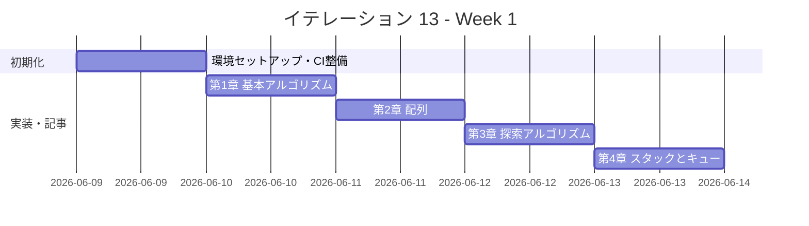

# イテレーション 13 計画

## 概要

| 項目 | 内容 |
|------|------|
| **イテレーション** | 13 |
| **期間** | Week 25-26（2 週間） |
| **ゴール** | Elixir 版を Python 版から展開し、TDD で実装する |
| **目標 SP** | 5 |

---

## ゴール

### イテレーション終了時の達成状態

1. **記事**: `docs/article/elixir/` に全 9 章 + index.md が完成している
2. **実装**: `apps/elixir/` に TDD 実装コードが動作する状態で存在する
3. **公開**: mkdocs.yml に Elixir 版が反映され、ローカルプレビューで閲覧可能

### 成功基準

- [ ] 9 章すべてのファイルが作成されている
- [ ] 各章のコード例が `apps/elixir/` の実コードと同期している（記事執筆と実装を同一コミットで完結）
- [ ] `apps/elixir/` のテストが全てパス（`mix test`）
- [ ] mkdocs.yml の nav に Elixir 版全 9 章が追加されている
- [ ] ローカルプレビューで表示確認済み（`npx gulp mkdocs:build` でビルド成功）
- [ ] 各章執筆時に Python 版との内容差分チェックを実施済み（差分 30% 以内）
- [ ] Elixir の関数型スタイル（パターンマッチ・パイプ演算子 `|>`・`defmodule`・`defstruct`・プロセス）を活用した実装

---

## ユーザーストーリー

### 対象ストーリー

| ID | ユーザーストーリー | SP | 優先度 |
|----|-------------------|----|--------|
| US-013 | Elixir 版を Python 版から展開する | 5 | 中 |
| **合計** | | **5** | |

### ストーリー詳細

#### US-013: Elixir 版を Python 版から展開する

**ストーリー**:

> 学習者として、Elixir でアルゴリズムとデータ構造を TDD で学びたい。なぜなら、Elixir は Erlang VM（BEAM）上で動く関数型言語であり、パターンマッチ（`case`/`cond`/関数頭部マッチ）、パイプ演算子（`|>`）、不変データ構造、`Enum`/`Stream` モジュール、`defstruct` による構造化データ、軽量プロセス（`Agent`/`GenServer`）を活用した簡潔で並行性に優れた実装を学ぶことで、関数型・並行プログラミングの本質的な考え方を理解できるからだ。

**受入条件**:

1. 全 9 章が Python 版を基に Elixir 版として再構成されている
2. 各章に TDD のコード例（テスト → 実装 → リファクタリング）が含まれている
3. `apps/elixir/` で全テストがパスする（`mix test`）
4. Elixir の関数型スタイル（パターンマッチ・`|>`・`Enum`/`Stream`・`defstruct`・`Agent`）を活用した実装

---

## タスク

### 1. 環境セットアップ（0.5 SP）

| # | タスク | 見積もり | 状態 |
|---|--------|---------|------|
| 1-1 | Elixir プロジェクト作成（apps/elixir/、mix.exs、lib/algorithm/、test/algorithm/） | 20 分 | [ ] |
| 1-2 | `.gitignore` 作成（`_build/`、`.elixir_ls/`、`deps/`、`.cpcache/`） | 5 分 | [ ] |
| 1-3 | Nix devShell（.#elixir）設定確認（elixir + erlang + elixir-ls）| 15 分 | [ ] |

### 2. CI 整備（0.5 SP）

| # | タスク | 見積もり | 状態 |
|---|--------|---------|------|
| 2-1 | CI 設定（.github/workflows/ci-elixir.yml: `mix test`） | 20 分 | [ ] |
| 2-2 | CI 動作確認 | 10 分 | [ ] |

### 3. 第 1 章 基本的なアルゴリズム（0.3 SP）

| # | タスク | 見積もり | 状態 |
|---|--------|---------|------|
| 3-1 | TDD 実装（3 値最大値・中央値、条件判定、繰り返し） | 40 分 | [ ] |
| 3-2 | 記事執筆（docs/article/elixir/01-basic-algorithms.md）+ Python 版差分チェック | 30 分 | [ ] |

### 4. 第 2 章 配列（0.3 SP）

| # | タスク | 見積もり | 状態 |
|---|--------|---------|------|
| 4-1 | TDD 実装（配列操作、基数変換、素数列挙） | 40 分 | [ ] |
| 4-2 | 記事執筆（docs/article/elixir/02-arrays.md）+ Python 版差分チェック | 20 分 | [ ] |

### 5. 第 3 章 探索アルゴリズム（0.3 SP）

| # | タスク | 見積もり | 状態 |
|---|--------|---------|------|
| 5-1 | TDD 実装（線形探索、二分探索、ハッシュ法） | 40 分 | [ ] |
| 5-2 | 記事執筆（docs/article/elixir/03-search-algorithms.md）+ Python 版差分チェック | 20 分 | [ ] |

### 6. 第 4 章 スタックとキュー（0.3 SP）

| # | タスク | 見積もり | 状態 |
|---|--------|---------|------|
| 6-1 | TDD 実装（スタック、キュー） | 40 分 | [ ] |
| 6-2 | 記事執筆（docs/article/elixir/04-stacks-and-queues.md）+ Python 版差分チェック | 20 分 | [ ] |

### 7. 第 5 章 再帰アルゴリズム（0.3 SP）

| # | タスク | 見積もり | 状態 |
|---|--------|---------|------|
| 7-1 | TDD 実装（再帰基本・GCD・ハノイの塔・迷路・8 王妃問題） | 40 分 | [ ] |
| 7-2 | 記事執筆（docs/article/elixir/05-recursion.md）+ Python 版差分チェック | 20 分 | [ ] |

### 8. 第 6 章 ソートアルゴリズム（0.4 SP）

| # | タスク | 見積もり | 状態 |
|---|--------|---------|------|
| 8-1 | TDD 実装（バブル、選択、挿入、シェル、クイック、マージ、ヒープ、度数） | 50 分 | [ ] |
| 8-2 | 記事執筆（docs/article/elixir/06-sort-algorithms.md）+ Python 版差分チェック | 20 分 | [ ] |

### 9. 第 7 章 文字列処理（0.3 SP）

| # | タスク | 見積もり | 状態 |
|---|--------|---------|------|
| 9-1 | TDD 実装（文字列探索 BF/KMP/BM、文字数カウント、逆順、回文） | 40 分 | [ ] |
| 9-2 | 記事執筆（docs/article/elixir/07-strings.md）+ Python 版差分チェック | 20 分 | [ ] |

### 10. 第 8 章 リスト（0.4 SP）

| # | タスク | 見積もり | 状態 |
|---|--------|---------|------|
| 10-1 | TDD 実装（単方向リスト、双方向リスト、配列カーソル版） | 50 分 | [ ] |
| 10-2 | 記事執筆（docs/article/elixir/08-linked-lists.md）+ Python 版差分チェック | 20 分 | [ ] |

### 11. 第 9 章 木構造（0.4 SP）

| # | タスク | 見積もり | 状態 |
|---|--------|---------|------|
| 11-1 | TDD 実装（BST、走査 3 種） | 50 分 | [ ] |
| 11-2 | 記事執筆（docs/article/elixir/09-trees.md）+ Python 版差分チェック | 20 分 | [ ] |

### 12. ドキュメント整備（0.5 SP）

| # | タスク | 見積もり | 状態 |
|---|--------|---------|------|
| 12-1 | index.md 作成（docs/article/elixir/index.md） | 30 分 | [ ] |
| 12-2 | mkdocs.yml に Elixir 版 9 章を追加 | 10 分 | [ ] |
| 12-3 | ローカルプレビュー確認（`npx gulp mkdocs:build`） | 10 分 | [ ] |

### タスク合計

| カテゴリ | SP | 理想時間 | 状態 |
|---------|----|----------|------|
| 環境セットアップ | 0.5 | 40 分 | [ ] |
| CI 整備 | 0.5 | 30 分 | [ ] |
| 第 1〜9 章 TDD 実装 + 記事 | 3.0 | 540 分 | [ ] |
| ドキュメント整備 | 1.0 | 50 分 | [ ] |
| **合計** | **5** | **660 分（約 11.0h）** | |

**1 SP あたり**: 約 132 分（2.2h）
**進捗率**: 0%（0/5 SP）

---

## スケジュール

### Week 1（Day 1-5）



| 日 | タスク |
|----|--------|
| Day 1 | 環境セットアップ（apps/elixir/、mix.exs、.gitignore、CI） |
| Day 2 | 第 1 章 基本的なアルゴリズム（実装 + 記事 + 差分チェック） |
| Day 3 | 第 2〜3 章（配列、探索アルゴリズム） |
| Day 4 | 第 4〜5 章（スタックとキュー、再帰アルゴリズム） |
| Day 5 | 第 6 章（ソートアルゴリズム） |

### Week 2（Day 6-10）


| 日 | タスク |
|----|--------|
| Day 6 | 第 7 章（文字列処理） |
| Day 7 | 第 8 章（リスト） |
| Day 8 | 第 9 章（木構造） |
| Day 9 | index.md 作成、mkdocs.yml 更新 |
| Day 10 | 統合テスト、ローカルプレビュー確認、バグ修正 |

---

## 設計

### ディレクトリ構成

Mix の標準レイアウト（単一 `Algorithm` モジュール）を採用する。

```
apps/elixir/
├── .gitignore
├── mix.exs
└── lib/
    └── algorithm/
        ├── basic_algorithms.ex
        ├── arrays.ex
        ├── search_algorithms.ex
        ├── stacks_and_queues.ex
        ├── recursion.ex
        ├── sort_algorithms.ex
        ├── strings.ex
        ├── linked_lists.ex
        └── trees.ex
└── test/
    └── algorithm/
        ├── basic_algorithms_test.exs
        ├── arrays_test.exs
        ├── search_algorithms_test.exs
        ├── stacks_and_queues_test.exs
        ├── recursion_test.exs
        ├── sort_algorithms_test.exs
        ├── strings_test.exs
        ├── linked_lists_test.exs
        └── trees_test.exs

docs/article/elixir/
├── index.md
├── 01-basic-algorithms.md
├── 02-arrays.md
├── 03-search-algorithms.md
├── 04-stacks-and-queues.md
├── 05-recursion.md
├── 06-sort-algorithms.md
├── 07-strings.md
├── 08-linked-lists.md
└── 09-trees.md
```

### Elixir 設計方針

#### 言語特性

| Elixir 機能 | 用途 |
|-------------|------|
| パターンマッチ（`case`/関数頭部） | アルゴリズムの条件分岐 |
| パイプ演算子（`|>`） | データ変換チェーン |
| `Enum`/`Stream` | リスト処理・遅延評価 |
| `defstruct` | データ構造の定義 |
| `Agent` | 可変状態の管理（スタック・キューなど） |
| 再帰 + パターンマッチ | 繰り返し処理（`loop/recur` の代わり） |
| `Map`/`MapSet` | ハッシュ・集合 |

#### Python vs Elixir 対応表

| Python | Elixir |
|--------|--------|
| `for` ループ | `Enum.each/2`、`Enum.reduce/3`、再帰 |
| リスト内包表記 | `Enum.map/2`、`for` 内包表記 |
| クラス | `defmodule` + `defstruct` |
| `None` | `nil` |
| 例外 | `{:ok, value}` / `{:error, reason}` タプル |
| リスト | リスト（`[1, 2, 3]`）、タプル（`{1, 2, 3}`） |
| 辞書 | `Map`（`%{key: value}`） |

#### テストフレームワーク

```elixir
# ExUnit の基本構造
defmodule Algorithm.BasicAlgorithmsTest do
  use ExUnit.Case

  describe "max3/3" do
    test "3 つの値のうち最大値を返す" do
      assert Algorithm.BasicAlgorithms.max3(3, 2, 1) == 3
      assert Algorithm.BasicAlgorithms.max3(1, 2, 3) == 3
    end
  end
end
```

### IT-12（Clojure）引き継ぎ事項

- `.gitignore` の整備を環境セットアップタスク（1-2）に明記（`_build/`、`.elixir_ls/`、`deps/`）
- 記事の差分チェックは各章の TDD 実装完了後に同タスクで実施する
- worktree を使用する場合、`mkdocs.yml` の Elixir 版エントリは develop ブランチへのマージ時にコンフリクトしやすいため、章ごとのコミットで細分化する
- テスト件数よりアサーション数を重視する（Elixir の ExUnit は `assert` を 1 テスト内に複数配置できる）

---

## リスクと対策

| リスク | 影響度 | 対策 |
|--------|--------|------|
| Elixir の BEAM VM 起動時間 | 低 | `mix test` の初回実行が遅い場合は `--no-start` オプションを検討 |
| worktree マージ時の mkdocs.yml コンフリクト | 中 | 開発前に develop の最新を取り込み、章ごとに細かくコミット |
| レートリミットによるエージェント中断 | 低 | 章ごとに細かくコミットし、中断時に再開しやすい状態を保つ（IT-11・IT-12 ふりかえりより） |

---

## 完了条件

### Definition of Done

- [ ] `apps/elixir/` の全テストがパス（`mix test`）
- [ ] 全 9 章 + index.md が作成されている
- [ ] mkdocs.yml の nav に Elixir 版全 9 章が追加されている
- [ ] ローカルプレビューで表示確認済み（`npx gulp mkdocs:build` でビルド成功）
- [ ] 各章のコード例が実装コードと同期している
- [ ] Python 版との記事記述量差分が 30% 以内
- [ ] `.gitignore` に `_build/`、`.elixir_ls/`、`deps/` が登録済み
- [ ] Elixir の関数型スタイル（パターンマッチ・`|>`・`Enum`/`Stream`・`defstruct`）を活用した実装

### デモ項目

1. `mix test` で全テストがパスすることを確認
2. `npx gulp mkdocs:build` でブラウザから Elixir 版記事を閲覧
3. 第 5 章（再帰）の末尾再帰最適化（TCO）を活用した実装をデモ

---

## 更新履歴

| 日付 | 更新内容 | 更新者 |
|------|---------|--------|
| 2026-04-13 | 初版作成 | - |
