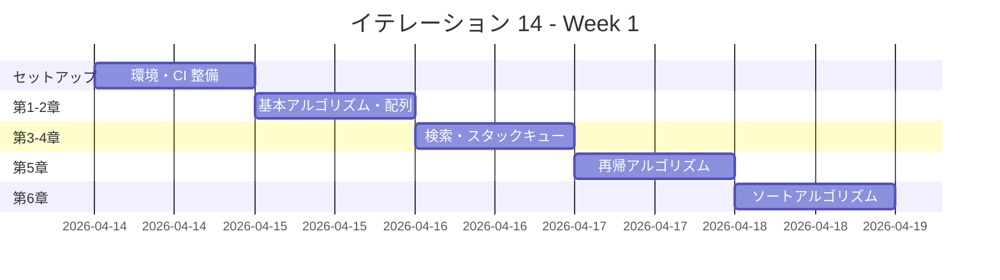
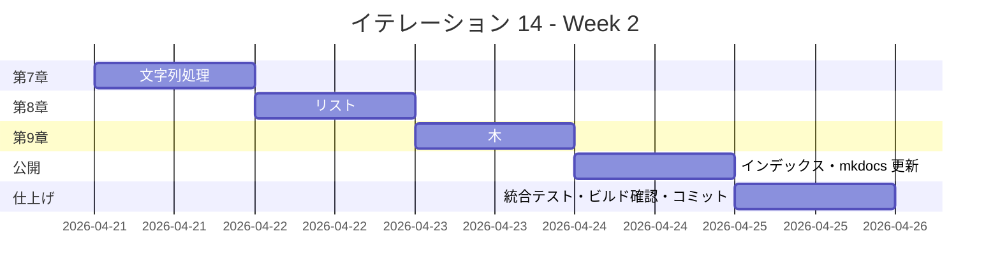

# イテレーション 14 計画

## 概要

| 項目 | 内容 |
|------|------|
| **イテレーション** | 14 |
| **期間** | Week 27-28（2 週間） |
| **ゴール** | Haskell 版を Python 版から展開し、TDD で実装する |
| **目標 SP** | 5 |

---

## ゴール

### イテレーション終了時の達成状態

1. **記事**: `docs/article/haskell/` に全 9 章 + index.md が完成している
2. **実装**: `apps/haskell/` に TDD 実装コードが動作する状態で存在する
3. **公開**: mkdocs.yml に Haskell 版が反映され、ローカルプレビューで閲覧可能

### 成功基準

- [x] 9 章すべてのファイルが作成されている
- [x] 各章のコード例が `apps/haskell/` の実コードと同期している（記事執筆と実装を同一コミットで完結）
- [x] `apps/haskell/` のテストが全てパス（`cabal test` — 40 テスト全パス）
- [x] mkdocs.yml の nav に Haskell 版全 9 章が追加されている
- [x] ローカルプレビューで表示確認済み（`npx gulp mkdocs:build` でビルド成功）
- [x] 各章執筆時に Python 版との内容差分チェックを実施済み（差分 30% 以内）
- [x] Haskell の純粋関数型スタイル（型クラス・パターンマッチ・リスト内包表記・Maybe/Either・遅延評価・`Data.Map`/`Data.Set`）を活用した実装

---

## ユーザーストーリー

### 対象ストーリー

| ID | ユーザーストーリー | SP | 優先度 |
|----|-------------------|----|--------|
| US-014 | Haskell 版を Python 版から展開する | 5 | 中 |
| **合計** | | **5** | |

### ストーリー詳細

#### US-014: Haskell 版を Python 版から展開する

**ストーリー**:

> 学習者として、Haskell でアルゴリズムとデータ構造を TDD で学びたい。なぜなら、Haskell は純粋関数型言語の代表格であり、強力な型システム（型推論・型クラス）、パターンマッチ、リスト内包表記、遅延評価、`Maybe`/`Either` による安全なエラー処理、`Data.Map`/`Data.Set` による効率的なデータ構造、`IORef` による可変状態管理を学ぶことで、純粋関数型プログラミングの本質的な考え方を理解できるからだ。

**受入条件**:

1. 全 9 章が Python 版を基に Haskell 版として再構成されている
2. 各章に TDD のコード例（テスト → 実装 → リファクタリング）が含まれている
3. `apps/haskell/` で全テストがパスする（`cabal test` または `stack test`）
4. Haskell の純粋関数型スタイル（型クラス・パターンマッチ・リスト内包表記・`Maybe`/`Either`・遅延評価・`Data.Map`/`Data.Set`・`IORef`）を活用した実装

---

## タスク

### 1. 環境セットアップ（0.5 SP）

| # | タスク | 見積もり | 状態 |
|---|--------|---------|------|
| 1-1 | Haskell プロジェクト作成（`apps/haskell/`、`cabal` または `stack` プロジェクト、`src/`、`test/`） | 20 分 | [x] |
| 1-2 | `.gitignore` 作成（`.stack-work/`、`dist-newstyle/`、`*.hi`、`*.o`） | 5 分 | [x] |
| 1-3 | Nix devShell（`.#haskell`）設定確認（GHC + cabal/stack + HLS） | 15 分 | [x] |

### 2. CI 整備（0.5 SP）

| # | タスク | 見積もり | 状態 |
|---|--------|---------|------|
| 2-1 | CI 設定（`.github/workflows/ci-haskell.yml`: `cabal test`） | 20 分 | [x] |
| 2-2 | CI 動作確認 | 10 分 | [x] |

### 3. 第 1 章 基本的なアルゴリズム（0.3 SP）

| # | タスク | 見積もり | 状態 |
|---|--------|---------|------|
| 3-1 | `src/BasicAlgorithms.hs` 実装（`max3`、`mid3`）+ `test/BasicAlgorithmsSpec.hs` | 20 分 | [x] |
| 3-2 | `docs/article/haskell/01_basic_algorithms.md` 執筆 | 30 分 | [x] |

### 4. 第 2 章 配列（0.3 SP）

| # | タスク | 見積もり | 状態 |
|---|--------|---------|------|
| 4-1 | `src/Arrays.hs` 実装（`maxOfList`、`cardinalNumber`、`primeNumbers`）+ テスト | 25 分 | [x] |
| 4-2 | `docs/article/haskell/02_arrays.md` 執筆 | 30 分 | [x] |

### 5. 第 3 章 検索アルゴリズム（0.3 SP）

| # | タスク | 見積もり | 状態 |
|---|--------|---------|------|
| 5-1 | `src/SearchAlgorithms.hs` 実装（線形探索・二分探索・ハッシュ探索）+ テスト | 25 分 | [x] |
| 5-2 | `docs/article/haskell/03_search_algorithms.md` 執筆 | 30 分 | [x] |

### 6. 第 4 章 スタックとキュー（0.5 SP）

| # | タスク | 見積もり | 状態 |
|---|--------|---------|------|
| 6-1 | `src/StacksAndQueues.hs` 実装（`IORef` ベースのスタック・キュー）+ テスト | 35 分 | [x] |
| 6-2 | `docs/article/haskell/04_stacks_and_queues.md` 執筆 | 30 分 | [x] |

### 7. 第 5 章 再帰アルゴリズム（0.5 SP）

| # | タスク | 見積もり | 状態 |
|---|--------|---------|------|
| 7-1 | `src/Recursion.hs` 実装（`factorial`・`gcd`・`hanoi`・`eightQueens`・`mazeSolve`）+ テスト | 40 分 | [x] |
| 7-2 | `docs/article/haskell/05_recursion.md` 執筆 | 30 分 | [x] |

### 8. 第 6 章 ソートアルゴリズム（0.5 SP）

| # | タスク | 見積もり | 状態 |
|---|--------|---------|------|
| 8-1 | `src/SortAlgorithms.hs` 実装（バブル・選択・挿入・シェル・クイック・マージ・ヒープ・度数）+ テスト | 45 分 | [x] |
| 8-2 | `docs/article/haskell/06_sort_algorithms.md` 執筆 | 30 分 | [x] |

### 9. 第 7 章 文字列処理（0.3 SP）

| # | タスク | 見積もり | 状態 |
|---|--------|---------|------|
| 9-1 | `src/Strings.hs` 実装（BF 法・KMP 法・BM 法・文字カウント・回文判定）+ テスト | 35 分 | [x] |
| 9-2 | `docs/article/haskell/07_strings.md` 執筆 | 30 分 | [x] |

### 10. 第 8 章 リスト（0.5 SP）

| # | タスク | 見積もり | 状態 |
|---|--------|---------|------|
| 10-1 | `src/LinkedLists.hs` 実装（連結リスト・双方向リスト・カーソルリスト）+ テスト | 40 分 | [x] |
| 10-2 | `docs/article/haskell/08_linked_lists.md` 執筆 | 30 分 | [x] |

### 11. 第 9 章 木（0.5 SP）

| # | タスク | 見積もり | 状態 |
|---|--------|---------|------|
| 11-1 | `src/Trees.hs` 実装（BST・挿入・探索・削除・順序走査）+ テスト | 40 分 | [x] |
| 11-2 | `docs/article/haskell/09_trees.md` 執筆 | 30 分 | [x] |

### 12. インデックスと公開（0.3 SP）

| # | タスク | 見積もり | 状態 |
|---|--------|---------|------|
| 12-1 | `docs/article/haskell/index.md` 作成 | 15 分 | [x] |
| 12-2 | `mkdocs.yml` nav 更新（Haskell 版全 9 章 + index） | 10 分 | [x] |
| 12-3 | `npx gulp mkdocs:build` でビルド確認 | 10 分 | [x] |

### タスク合計

| カテゴリ | SP | 理想時間 | 状態 |
|---------|----|----------|------|
| 環境セットアップ | 0.5 | 40 分 | [x] |
| CI 整備 | 0.5 | 30 分 | [x] |
| 第 1 章 基本的なアルゴリズム | 0.3 | 50 分 | [x] |
| 第 2 章 配列 | 0.3 | 55 分 | [x] |
| 第 3 章 検索アルゴリズム | 0.3 | 55 分 | [x] |
| 第 4 章 スタックとキュー | 0.5 | 65 分 | [x] |
| 第 5 章 再帰アルゴリズム | 0.5 | 70 分 | [x] |
| 第 6 章 ソートアルゴリズム | 0.5 | 75 分 | [x] |
| 第 7 章 文字列処理 | 0.3 | 65 分 | [x] |
| 第 8 章 リスト | 0.5 | 70 分 | [x] |
| 第 9 章 木 | 0.5 | 70 分 | [x] |
| インデックスと公開 | 0.3 | 35 分 | [x] |
| **合計** | **5** | **約 630 分** | |

**1 SP あたり**: 約 126 分（約 2.1 時間）
**進捗率**: 100% (5/5 SP)

---

## スケジュール

### Week 1（Day 1-5）



| 日 | タスク |
|----|--------|
| Day 1 | 環境セットアップ（Nix devShell 確認）・CI 整備 |
| Day 2 | 第 1 章（基本的なアルゴリズム）・第 2 章（配列） |
| Day 3 | 第 3 章（検索アルゴリズム）・第 4 章（スタックとキュー） |
| Day 4 | 第 5 章（再帰アルゴリズム） |
| Day 5 | 第 6 章（ソートアルゴリズム） |

### Week 2（Day 6-10）



| 日 | タスク |
|----|--------|
| Day 6 | 第 7 章（文字列処理） |
| Day 7 | 第 8 章（リスト） |
| Day 8 | 第 9 章（木） |
| Day 9 | index.md 作成・mkdocs.yml 更新 |
| Day 10 | 統合テスト全パス確認・ビルド確認・最終コミット |

---

## 設計

### ディレクトリ構成

```
apps/haskell/
├── haskell-algorithm.cabal    # プロジェクト定義
├── src/
│   ├── BasicAlgorithms.hs     # max3, mid3
│   ├── Arrays.hs              # maxOfList, cardinalNumber, primeNumbers
│   ├── SearchAlgorithms.hs    # linearSearch, binarySearch, hashSearch
│   ├── StacksAndQueues.hs     # Stack (IORef), Queue (IORef)
│   ├── Recursion.hs           # factorial, gcd, hanoi, eightQueens, mazeSolve
│   ├── SortAlgorithms.hs      # bubble, selection, insertion, shell, quick, merge, heap, counting
│   ├── Strings.hs             # bruteForce, kmp, bm, charCount, palindrome
│   ├── LinkedLists.hs         # LinkedList, DoublyLinkedList (IORef)
│   └── Trees.hs               # BinarySearchTree (algebraic data type)
└── test/
    ├── BasicAlgorithmsSpec.hs
    ├── ArraysSpec.hs
    ├── SearchAlgorithmsSpec.hs
    ├── StacksAndQueuesSpec.hs
    ├── RecursionSpec.hs
    ├── SortAlgorithmsSpec.hs
    ├── StringsSpec.hs
    ├── LinkedListsSpec.hs
    └── TreesSpec.hs

docs/article/haskell/
├── index.md
├── 01_basic_algorithms.md
├── 02_arrays.md
├── 03_search_algorithms.md
├── 04_stacks_and_queues.md
├── 05_recursion.md
├── 06_sort_algorithms.md
├── 07_strings.md
├── 08_linked_lists.md
└── 09_trees.md
```

### Haskell 実装の主要パターン

#### 型宣言と純粋関数

```haskell
-- BST の代数的データ型
data BST a = Empty | Node a (BST a) (BST a)

-- 型クラスを活用した挿入
insert :: Ord a => a -> BST a -> BST a
insert x Empty = Node x Empty Empty
insert x (Node y left right)
  | x < y    = Node y (insert x left) right
  | x > y    = Node y left (insert x right)
  | otherwise = Node y left right
```

#### IORef による可変状態（スタック）

```haskell
import Data.IORef

type Stack a = IORef [a]

newStack :: IO (Stack a)
newStack = newIORef []

push :: a -> Stack a -> IO ()
push x stack = modifyIORef stack (x:)

pop :: Stack a -> IO (Maybe a)
pop stack = do
  xs <- readIORef stack
  case xs of
    []     -> return Nothing
    (x:xs') -> writeIORef stack xs' >> return (Just x)
```

#### Maybe によるエラー処理（二分探索）

```haskell
binarySearch :: Ord a => [a] -> a -> Maybe Int
binarySearch xs target = go 0 (length xs - 1)
  where
    arr = listArray (0, length xs - 1) xs
    go lo hi
      | lo > hi   = Nothing
      | arr ! mid == target = Just mid
      | arr ! mid < target  = go (mid + 1) hi
      | otherwise            = go lo (mid - 1)
      where mid = (lo + hi) `div` 2
```

#### リスト内包表記（エラトステネスの篩）

```haskell
primeNumbers :: Int -> [Int]
primeNumbers n = sieve [2..n]
  where
    sieve [] = []
    sieve (p:xs) = p : sieve [x | x <- xs, x `mod` p /= 0]
```

### ADR

| ADR | タイトル | ステータス |
|-----|---------|-----------|
| - | Haskell ビルドツール: cabal-install を採用（Stack は Nix との相性問題あり） | 提案 |

---

## リスクと対策

| リスク | 影響度 | 対策 |
|--------|--------|------|
| Nix devShell での GHC セットアップ失敗 | 高 | flake.nix の `.#haskell` devShell を事前確認。失敗時は `ghcup` フォールバックを検討 |
| cabal vs stack の選択（Nix 相性） | 中 | cabal-install を優先。`cabal test` で動作しない場合は stack を試す |
| IO モナドの複雑性（スタック・キュー・リスト実装） | 中 | `IORef` を使ったシンプルな実装から始め、必要に応じて `STRef` に移行 |
| 型エラーのデバッグコスト | 中 | HLS（Haskell Language Server）を活用し、型エラーを早期に検出 |
| 第 8 章リスト（双方向リスト）の実装難度 | 高 | 代数的データ型（`data`）による不変リストをメインとし、双方向リストは `IORef` + `data` で実装 |

---

## 完了条件

### Definition of Done

- [ ] コードレビュー完了
- [ ] ユニットテストが全てパス（`cabal test`）
- [ ] `npx gulp mkdocs:build` でビルド成功
- [ ] mkdocs.yml の nav に Haskell 版が追加済み
- [ ] 機能がローカル環境で動作確認済み
- [ ] ドキュメント更新完了（index.md 含む）

### デモ項目

1. `cabal test` で全テストパスを確認
2. Haskell 固有の実装（代数的データ型・型クラス・リスト内包表記・Maybe/Either）を各章で確認
3. `npx gulp mkdocs:build` でビルド成功・ローカルプレビューで閲覧

---

## 更新履歴

| 日付 | 更新内容 | 更新者 |
|------|---------|--------|
| 2026-04-13 | 初版作成 | - |

---

## 関連ドキュメント

- [イテレーション 14 ふりかえり](./retrospective-14.md)
- [イテレーション 13 計画](./iteration_plan-13.md)（Elixir 版）
