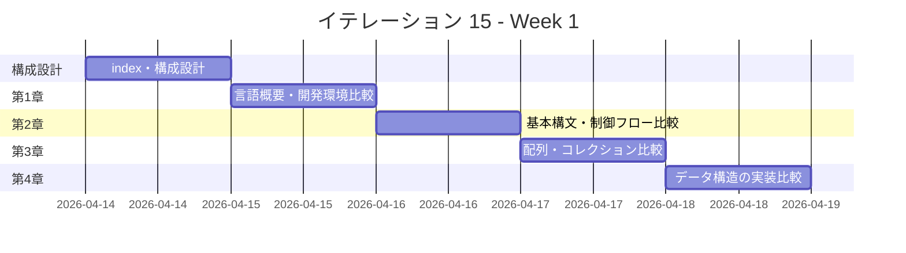
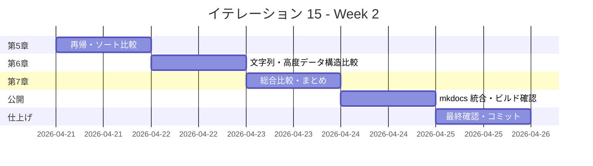

# イテレーション 15 計画

## 概要

| 項目 | 内容 |
|------|------|
| **イテレーション** | 15 |
| **期間** | Week 29-30（2 週間） |
| **ゴール** | 14 言語横断比較の統合解説記事を執筆し、シリーズを完成させる |
| **目標 SP** | 8 |

---

## ゴール

### イテレーション終了時の達成状態

1. **記事**: `docs/article/all/` に統合解説（index.md + 章別記事）が完成している
2. **比較表**: 14 言語の特徴・実装パターン・パフォーマンス特性を比較した表が各章に含まれている
3. **公開**: mkdocs.yml に多言語統合解説が反映され、ローカルプレビューで閲覧可能

### 成功基準

- [x] 統合解説の全章ファイルが作成されている
- [x] 各章に 14 言語の実装比較（コード例 + 比較表）が含まれている
- [x] 言語パラダイム別の設計思想比較が記述されている
- [x] mkdocs.yml の nav に多言語統合解説が追加されている
- [x] ローカルプレビューで表示確認済み（`npx gulp mkdocs:build` でビルド成功）
- [x] `docs/article/index.md` の多言語統合解説リンクが有効

---

## ユーザーストーリー

### 対象ストーリー

| ID | ユーザーストーリー | SP | 優先度 |
|----|-------------------|----|--------|
| US-015 | 多言語統合解説（14 言語横断比較）を執筆する | 8 | 中 |
| **合計** | | **8** | |

### ストーリー詳細

#### US-015: 多言語統合解説（14 言語横断比較）を執筆する

**ストーリー**:

> 学習者として、14 言語でのアルゴリズム実装を横断的に比較・解説した記事を読みたい。なぜなら、各言語の特徴・設計思想を俯瞰的に理解し、言語選択の判断材料としたいからだ。

**受入条件**:

1. 14 言語すべてのアルゴリズム実装を比較した章が存在する
2. 各言語の特徴が明確に記述されている
3. 図表・比較表が含まれている
4. 言語パラダイム（OOP・手続き型・関数型・純粋関数型）ごとの設計アプローチの違いが整理されている

---

## タスク

### 1. 統合解説の構成設計と index 作成（0.5 SP）

| # | タスク | 見積もり | 状態 |
|---|--------|---------|------|
| 1-1 | `docs/article/all/` ディレクトリ作成 | 5 分 | [x] |
| 1-2 | `docs/article/all/index.md` 作成（目次・導入・言語一覧・読み方ガイド） | 30 分 | [x] |
| 1-3 | 14 言語の分類整理（パラダイム・型システム・メモリ管理・主要特徴） | 25 分 | [x] |

### 2. 第 1 章 言語概要と開発環境比較（1.0 SP）

| # | タスク | 見積もり | 状態 |
|---|--------|---------|------|
| 2-1 | `docs/article/all/01-language-overview.md` 執筆 | 60 分 | [x] |
| 2-2 | 言語パラダイム分類表（OOP / 手続き型 / 関数型 / 純粋関数型）作成 | 30 分 | [x] |
| 2-3 | 型システム比較表（静的/動的・強い/弱い・型推論）作成 | 20 分 | [x] |
| 2-4 | 開発環境・テストフレームワーク比較表作成 | 20 分 | [x] |

### 3. 第 2 章 基本構文と制御フロー比較（1.0 SP）

| # | タスク | 見積もり | 状態 |
|---|--------|---------|------|
| 3-1 | `docs/article/all/02-basic-syntax-comparison.md` 執筆 | 60 分 | [x] |
| 3-2 | 変数宣言・条件分岐・ループの 14 言語コード比較 | 30 分 | [x] |
| 3-3 | `max3`・`mid3` の 14 言語実装比較表作成 | 30 分 | [x] |

### 4. 第 3 章 配列・コレクション比較（1.0 SP）

| # | タスク | 見積もり | 状態 |
|---|--------|---------|------|
| 4-1 | `docs/article/all/03-arrays-and-collections.md` 執筆 | 60 分 | [x] |
| 4-2 | 配列/リスト/スライスの言語別データ構造比較表作成 | 30 分 | [x] |
| 4-3 | 探索アルゴリズム（線形探索・二分探索）の実装パターン比較 | 30 分 | [x] |

### 5. 第 4 章 データ構造の実装アプローチ比較（1.0 SP）

| # | タスク | 見積もり | 状態 |
|---|--------|---------|------|
| 5-1 | `docs/article/all/04-data-structures.md` 執筆 | 60 分 | [x] |
| 5-2 | スタック・キューの実装パターン比較（クラス / 構造体 / モジュール / 代数的データ型） | 30 分 | [x] |
| 5-3 | ハッシュ法の実装パターン比較 | 20 分 | [x] |
| 5-4 | 可変/不変データ構造のアプローチ比較表 | 20 分 | [x] |

### 6. 第 5 章 再帰とソートアルゴリズム比較（1.0 SP）

| # | タスク | 見積もり | 状態 |
|---|--------|---------|------|
| 6-1 | `docs/article/all/05-recursion-and-sorting.md` 執筆 | 60 分 | [x] |
| 6-2 | 再帰の表現力比較（末尾再帰最適化・パターンマッチ・ガード） | 30 分 | [x] |
| 6-3 | ソートアルゴリズムの実装スタイル比較（破壊的/非破壊的） | 30 分 | [x] |

### 7. 第 6 章 文字列処理と高度なデータ構造比較（1.0 SP）

| # | タスク | 見積もり | 状態 |
|---|--------|---------|------|
| 7-1 | `docs/article/all/06-strings-and-advanced-structures.md` 執筆 | 60 分 | [x] |
| 7-2 | 文字列探索（BF/KMP/BM）の実装スタイル比較 | 30 分 | [x] |
| 7-3 | リスト・木構造の実装パターン比較（ポインタ / 参照 / 代数的データ型 / IORef） | 30 分 | [x] |

### 8. 第 7 章 総合比較とまとめ（1.0 SP）

| # | タスク | 見積もり | 状態 |
|---|--------|---------|------|
| 8-1 | `docs/article/all/07-comprehensive-comparison.md` 執筆 | 60 分 | [x] |
| 8-2 | 言語選択ガイド（用途別おすすめ言語表）作成 | 30 分 | [x] |
| 8-3 | パフォーマンス・可読性・安全性の総合評価表作成 | 30 分 | [x] |
| 8-4 | 学習ロードマップ（どの順序で言語を学ぶべきか）作成 | 20 分 | [x] |

### 9. mkdocs 統合と公開（0.5 SP）

| # | タスク | 見積もり | 状態 |
|---|--------|---------|------|
| 9-1 | `mkdocs.yml` nav 更新（多言語統合解説セクション追加） | 15 分 | [x] |
| 9-2 | `docs/article/index.md` の多言語統合解説リンク確認 | 10 分 | [x] |
| 9-3 | `npx gulp mkdocs:build` でビルド確認 | 10 分 | [x] |

### タスク合計

| カテゴリ | SP | 理想時間 | 状態 |
|---------|----|----------|------|
| 構成設計と index 作成 | 0.5 | 60 分 | [x] |
| 第 1 章 言語概要と開発環境比較 | 1.0 | 130 分 | [x] |
| 第 2 章 基本構文と制御フロー比較 | 1.0 | 120 分 | [x] |
| 第 3 章 配列・コレクション比較 | 1.0 | 120 分 | [x] |
| 第 4 章 データ構造の実装アプローチ比較 | 1.0 | 130 分 | [x] |
| 第 5 章 再帰とソートアルゴリズム比較 | 1.0 | 120 分 | [x] |
| 第 6 章 文字列処理と高度なデータ構造比較 | 1.0 | 120 分 | [x] |
| 第 7 章 総合比較とまとめ | 1.0 | 140 分 | [x] |
| mkdocs 統合と公開 | 0.5 | 35 分 | [x] |
| **合計** | **8** | **約 975 分** | |

**1 SP あたり**: 約 122 分（約 2.0 時間）
**進捗率**: 100% (8/8 SP)

---

## スケジュール

### Week 1（Day 1-5）



| 日 | タスク |
|----|--------|
| Day 1 | 構成設計・index 作成・言語分類整理 |
| Day 2 | 第 1 章（言語概要・パラダイム分類・型システム・開発環境比較） |
| Day 3 | 第 2 章（基本構文・制御フロー・max3/mid3 の 14 言語比較） |
| Day 4 | 第 3 章（配列・コレクション・探索アルゴリズム比較） |
| Day 5 | 第 4 章（スタック・キュー・ハッシュ法の実装比較） |

### Week 2（Day 6-10）



| 日 | タスク |
|----|--------|
| Day 6 | 第 5 章（再帰・ソートアルゴリズムの実装スタイル比較） |
| Day 7 | 第 6 章（文字列処理・リスト・木構造の実装パターン比較） |
| Day 8 | 第 7 章（総合比較・言語選択ガイド・学習ロードマップ） |
| Day 9 | mkdocs 統合・ビルド確認・リンク整合性チェック |
| Day 10 | 最終確認・全体レビュー・コミット |

---

## 設計

### ディレクトリ構成

```
docs/article/all/
├── index.md                              # 統合解説トップ（目次・導入）
├── 01-language-overview.md               # 言語概要と開発環境比較
├── 02-basic-syntax-comparison.md         # 基本構文と制御フロー比較
├── 03-arrays-and-collections.md          # 配列・コレクション比較
├── 04-data-structures.md                 # データ構造の実装アプローチ比較
├── 05-recursion-and-sorting.md           # 再帰とソートアルゴリズム比較
├── 06-strings-and-advanced-structures.md # 文字列処理と高度なデータ構造比較
└── 07-comprehensive-comparison.md        # 総合比較とまとめ
```

### 記事構成方針

各章は以下の構成で統一する:

1. **導入**: 章テーマの概要と比較の観点
2. **パラダイム別比較**: OOP / 手続き型 / 関数型 / 純粋関数型ごとの実装例
3. **14 言語コード比較**: 同一アルゴリズムの全言語実装を並べて比較
4. **比較表**: 特徴・パフォーマンス・可読性などの定量/定性比較
5. **まとめ**: 章のポイント整理

### 言語パラダイム分類

| パラダイム | 言語 |
|-----------|------|
| マルチパラダイム（OOP 寄り） | Python, TypeScript, Java, C#, Ruby, PHP |
| 手続き型 / システム言語 | Go, C, Rust |
| 関数型（OOP ハイブリッド） | F#, Scala |
| 関数型（LISP 系） | Clojure |
| 関数型（BEAM VM） | Elixir |
| 純粋関数型 | Haskell |

---

## リスクと対策

| リスク | 影響度 | 対策 |
|--------|--------|------|
| 14 言語の実装コード収集の作業量 | 高 | 各 `apps/{lang}/` の既存コードを直接参照し、新規コーディングは不要 |
| 比較表の情報量が膨大になる | 中 | パラダイム別にグルーピングし、全 14 行の表は要点に絞る |
| 記事が冗長になり読みづらくなる | 中 | 各章のコード例は 3-4 言語の代表例 + 全言語比較表の構成にする |
| mkdocs ビルドで大量の Markdown がパースエラーになる | 低 | 各章完成時にビルド確認を実施する |

---

## 完了条件

### Definition of Done

- [x] 統合解説の全 7 章 + index.md が作成されている
- [x] 各章に 14 言語の比較表が含まれている
- [x] `npx gulp mkdocs:build` でビルド成功
- [x] mkdocs.yml の nav に多言語統合解説が追加済み
- [x] `docs/article/index.md` のリンクが有効
- [x] ドキュメント更新完了（development/index.md 含む）

### デモ項目

1. `docs/article/all/index.md` から各章へのナビゲーション確認
2. 代表的な比較表（言語パラダイム分類・型システム・ソートアルゴリズム実装スタイル）を確認
3. `npx gulp mkdocs:build` でビルド成功・ローカルプレビューで閲覧

---

## 更新履歴

| 日付 | 更新内容 | 更新者 |
|------|---------|--------|
| 2026-04-13 | 初版作成 | - |

---

## 関連ドキュメント

- [イテレーション 15 ふりかえり](./retrospective-15.md)
- [イテレーション 14 計画](./iteration_plan-14.md)（Haskell 版）
- [US-015 GitHub Issue](https://github.com/k2works/getting-started-algorithm/issues/13)
