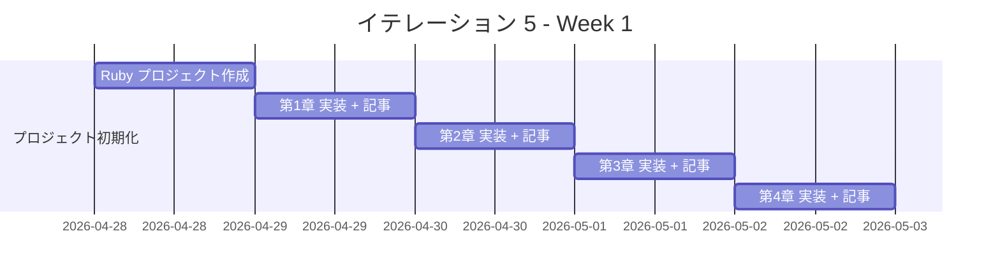
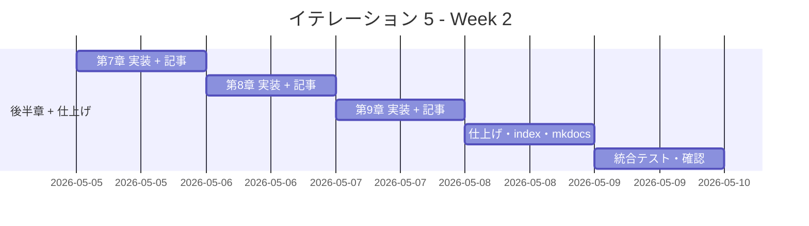

# イテレーション 5 計画

## 概要

| 項目 | 内容 |
|------|------|
| **イテレーション** | 5 |
| **期間** | Week 9-10（2 週間） |
| **ゴール** | Ruby 版を Python 版から展開し、TDD で実装する |
| **目標 SP** | 3 |

---

## ゴール

### イテレーション終了時の達成状態

1. **記事**: `docs/article/ruby/` に全 9 章 + index.md が完成している
2. **実装**: `apps/ruby/` に TDD 実装コードが動作する状態で存在する
3. **公開**: mkdocs.yml に Ruby 版が反映され、ローカルプレビューで閲覧可能

### 成功基準

- [ ] 9 章すべてのファイルが作成されている
- [ ] 各章のコード例が `apps/ruby/` の実コードと同期している（記事記述と実装を同一コミットで完結）
- [ ] `apps/ruby/` のテストが全てパス
- [ ] mkdocs.yml の nav に Ruby 全 9 章が追加されている
- [ ] ローカルプレビューで表示確認済み
- [ ] 各章執筆時に Python 版との内容差分チェックを実施済み

---

## ユーザーストーリー

### 対象ストーリー

| ID | ユーザーストーリー | SP | 優先度 |
|----|-------------------|----|----|
| US-005 | Ruby 版を Python 版から展開する | 3 | 必須 |
| **合計** | | **3** | |

### ストーリー詳細

#### US-005: Ruby 版を Python 版から展開する

**ストーリー**:

> 学習者として、Ruby でアルゴリズムとデータ構造を TDD で学びたい。なぜなら、Ruby はシンプルで表現力豊かな構文を持ち、RubyGems エコシステムで広く使われており、オブジェクト指向プログラミングの哲学を深く学べるからだ。

**受入条件**:

1. 全 9 章が Python 版を基に Ruby 版として再構成されている
2. 各章に TDD のコード例（テスト → 実装 → リファクタリング）が含まれている
3. `apps/ruby/` で全テストがパスする

---

## タスク

### 1. プロジェクト初期化（0.5 SP）

| # | タスク | 見積もり | 状態 |
|---|--------|---------|------|
| 1-1 | Ruby プロジェクト作成（apps/ruby/） | 30 分 | [ ] |
| 1-2 | RSpec テスト環境設定 | 30 分 | [ ] |
| 1-3 | Nix devShell（.#ruby）設定確認 | 30 分 | [ ] |

### 2. 第 1 章 基本的なアルゴリズム（0.25 SP）

| # | タスク | 見積もり | 状態 |
|---|--------|---------|------|
| 2-1 | TDD 実装（3 値最大値・中央値、条件判定、繰り返し） | 30 分 | [ ] |
| 2-2 | 記事執筆（docs/article/ruby/01-basic-algorithms.md） | 30 分 | [ ] |

### 3. 第 2 章 配列（0.25 SP）

| # | タスク | 見積もり | 状態 |
|---|--------|---------|------|
| 3-1 | TDD 実装（配列操作、探索、並べ替え） | 20 分 | [ ] |
| 3-2 | 記事執筆（docs/article/ruby/02-arrays.md） | 15 分 | [ ] |

### 4. 第 3 章 探索アルゴリズム（0.25 SP）

| # | タスク | 見積もり | 状態 |
|---|--------|---------|------|
| 4-1 | TDD 実装（線形探索、二分探索、ハッシュ法） | 20 分 | [ ] |
| 4-2 | 記事執筆（docs/article/ruby/03-search-algorithms.md） | 15 分 | [ ] |

### 5. 第 4 章 スタックとキュー（0.25 SP）

| # | タスク | 見積もり | 状態 |
|---|--------|---------|------|
| 5-1 | TDD 実装（FixedStack、FixedQueue） | 20 分 | [ ] |
| 5-2 | 記事執筆（docs/article/ruby/04-stacks-and-queues.md） | 15 分 | [ ] |

### 6. 第 5 章 再帰アルゴリズム（0.25 SP）

| # | タスク | 見積もり | 状態 |
|---|--------|---------|------|
| 6-1 | TDD 実装（再帰基本、ハノイの塔、8 クイーン） | 20 分 | [ ] |
| 6-2 | 記事執筆（docs/article/ruby/05-recursion.md） | 15 分 | [ ] |

### 7. 第 6 章 ソートアルゴリズム（0.25 SP）

| # | タスク | 見積もり | 状態 |
|---|--------|---------|------|
| 7-1 | TDD 実装（バブル〜計数ソート） | 20 分 | [ ] |
| 7-2 | 記事執筆（docs/article/ruby/06-sort-algorithms.md） | 15 分 | [ ] |

### 8. 第 7 章 文字列処理（0.25 SP）

| # | タスク | 見積もり | 状態 |
|---|--------|---------|------|
| 8-1 | TDD 実装（BF/KMP/BM 法、文字カウント、回文） | 20 分 | [ ] |
| 8-2 | 記事執筆（docs/article/ruby/07-string-processing.md） | 15 分 | [ ] |

### 9. 第 8 章 リスト（0.25 SP）

| # | タスク | 見積もり | 状態 |
|---|--------|---------|------|
| 9-1 | TDD 実装（LinkedList、DoublyLinkedList、ArrayLinkedList） | 20 分 | [ ] |
| 9-2 | 記事執筆（docs/article/ruby/08-linked-lists.md） | 15 分 | [ ] |

### 10. 第 9 章 木構造（0.25 SP）

| # | タスク | 見積もり | 状態 |
|---|--------|---------|------|
| 10-1 | TDD 実装（BinarySearchTree） | 20 分 | [ ] |
| 10-2 | 記事執筆（docs/article/ruby/09-trees.md） | 15 分 | [ ] |

### 11. 仕上げ（0.25 SP）

| # | タスク | 見積もり | 状態 |
|---|--------|---------|------|
| 11-1 | index.md 作成（docs/article/ruby/index.md） | 15 分 | [ ] |
| 11-2 | mkdocs.yml の nav に Ruby 版を追加 | 15 分 | [ ] |
| 11-3 | ローカルプレビュー確認 | 15 分 | [ ] |

#### タスク合計

| カテゴリ | SP | 理想時間 |
|---------|----|----|
| プロジェクト初期化 | 0.5 | 90 分 |
| 第 1〜9 章（執筆 + 実装） | 2.0 | 270 分 |
| 仕上げ | 0.5 | 45 分 |
| **合計** | **3** | **約 405 分（約 7 時間）** |

**1 SP あたり**: 約 2.3 時間（AI 支援により短縮）
**進捗率**: 0%（0/3 SP）

---

## スケジュール

### Week 1（Day 1-5）

| 日 | タスク |
|----|--------|
| Day 1 | プロジェクト初期化（Ruby, RSpec, Nix 設定） |
| Day 2 | 第 1 章 基本的なアルゴリズム（実装 + 記事） |
| Day 3 | 第 2 章 配列 + 第 3 章 探索アルゴリズム |
| Day 4 | 第 4 章 スタックとキュー + 第 5 章 再帰 |
| Day 5 | 第 6 章 ソートアルゴリズム |

### Week 2（Day 6-10）

| 日 | タスク |
|----|--------|
| Day 6 | 第 7 章 文字列処理（実装 + 記事） |
| Day 7 | 第 8 章 リスト（実装 + 記事） |
| Day 8 | 第 9 章 木構造（実装 + 記事） |
| Day 9 | index.md 作成、mkdocs.yml 更新 |
| Day 10 | 統合テスト、ローカルプレビュー確認、デモ準備 |

---

## 技術メモ

### Ruby 版の特徴

| 概念 | Python | Ruby |
|------|--------|------|
| スワップ | `a[i], a[j] = a[j], a[i]` | `a[i], a[j] = a[j], a[i]`（同様） |
| 配列 | `list` | `Array` |
| ハッシュ | `dict` | `Hash` |
| 例外クラス | 内部クラス | カスタム例外クラス（`StandardError` 継承） |
| イテレーション | `for`/リスト内包表記 | `each`/`map`/`select` 等のブロック |
| nil チェック | `if x is None` | `if x.nil?` |
| 型チェック | `isinstance(x, T)` | `x.is_a?(T)` |
| 文字列操作 | `str.upper()` | `str.upcase` |
| 範囲 | `range(n)` | `(0...n)` / `(0..n-1)` |
| 無限大 | `float('inf')` | `Float::INFINITY` |

### テスト環境

- **フレームワーク**: RSpec
- **ビルドツール**: Bundler（Gemfile）
- **Ruby バージョン**: Ruby 3.x

### Ruby のイディオム

- ブロック構文: `do...end` または `{ }` でイテレーション
- シンボル: `:key` で Hash のキーに使用
- `attr_accessor`/`attr_reader`/`attr_writer` でゲッター・セッター定義
- モジュールでミックスイン（Comparable, Enumerable 等）
- 例外: `raise` / `rescue` 構文

### 既存実装との対比

Ruby は Python と構文が類似しており、IT-1（Python）の実装パターンを参照しながら展開できる。
C# 版（IT-4）と同様に、ジェネリクスの代わりにダックタイピングを使用する。

---

## DoD（Definition of Done）

- [ ] `apps/ruby/` で全テストがパス（RSpec）
- [ ] 9 章の記事ファイルが作成済み
- [ ] mkdocs.yml の nav に Ruby 全 9 章が追加されている
- [ ] Python 版との差分が各記事に明記されている
- [ ] GitHub Issue #5（US-005）がクローズされている

---

## リスクと対策

| リスク | 影響度 | 対策 |
|--------|--------|------|
| Nix 環境での Ruby セットアップ失敗 | 中 | nixpkgs の ruby を使用、bundler で gem 管理 |
| RSpec の DSL 習熟 | 低 | `describe`/`context`/`it` の基本パターンで統一 |
| Ruby のオブジェクト指向設計 | 低 | Python 版クラス設計を Ruby イディオムに変換 |

---

## 完了条件

### デモ項目

1. `apps/ruby/` で `bundle exec rspec` が全テストパスすること
2. `docs/article/ruby/` の全 9 章がローカルプレビューで表示されること
3. IT-5 ふりかえりでベロシティ実績を記録すること

---

## 更新履歴

| 日付 | 更新内容 | 更新者 |
|------|---------|--------|
| 2026-04-12 | 初版作成 | - |

---

## 関連ドキュメント

- [イテレーション 5 ふりかえり](./retrospective-5.md)
- [イテレーション 4 計画](./iteration_plan-4.md)
- [リリース計画](./release_plan.md)
