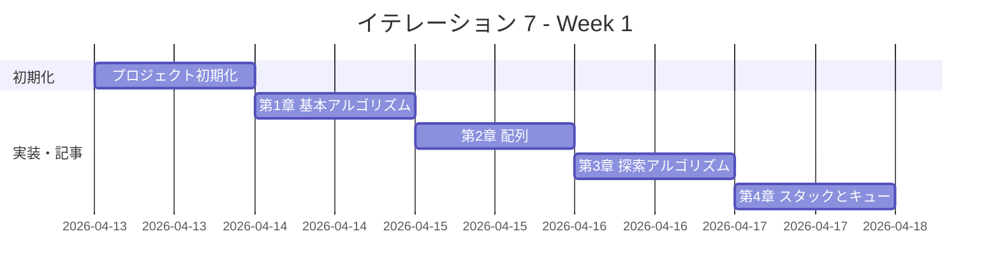
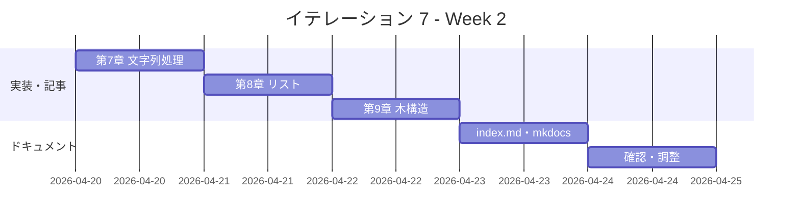

# イテレーション 7 計画

## 概要

| 項目 | 内容 |
|------|------|
| **イテレーション** | 7 |
| **期間** | Week 13-14（2 週間） |
| **ゴール** | Go 版を Python 版から展開し、TDD で実装する |
| **目標 SP** | 3 |

---

## ゴール

### イテレーション終了時の達成状態

1. **記事**: `docs/article/go/` に全 9 章 + index.md が完成している
2. **実装**: `apps/go/` に TDD 実装コードが動作する状態で存在する
3. **公開**: mkdocs.yml に Go 版が反映され、ローカルプレビューで閲覧可能

### 成功基準

- [x] 9 章すべてのファイルが作成されている
- [x] 各章のコード例が `apps/go/` の実コードと同期している（記事記述と実装を同一コミットで完結）
- [x] `apps/go/` のテストが全てパス
- [x] mkdocs.yml の nav に Go 全 9 章が追加されている
- [x] ローカルプレビューで表示確認済み
- [x] 各章執筆時に Python 版との内容差分チェックを実施済み

---

## ユーザーストーリー

### 対象ストーリー

| ID | ユーザーストーリー | SP | 優先度 |
|----|-------------------|----|--------|
| US-007 | Go 版を Python 版から展開する | 3 | 必須 |
| **合計** | | **3** | |

### ストーリー詳細

#### US-007: Go 版を Python 版から展開する

**ストーリー**:

> 学習者として、Go でアルゴリズムとデータ構造を TDD で学びたい。なぜなら、Go はシンプルな構文と強力な標準ライブラリを持ち、クラウドネイティブ開発や CLI ツール構築で広く使われており、アルゴリズムの理解がシステムプログラミングの実践に直結するからだ。

**受入条件**:

1. 全 9 章が Python 版を基に Go 版として再構成されている
2. 各章に TDD のコード例（テスト → 実装 → リファクタリング）が含まれている
3. `apps/go/` で全テストがパスする

---

## タスク

### 1. プロジェクト初期化（0.5 SP）

| # | タスク | 見積もり | 状態 |
|---|--------|---------|------|
| 1-1 | Go プロジェクト作成（apps/go/） | 20 分 | [ ] |
| 1-2 | Go モジュール初期化（go mod init） | 10 分 | [ ] |
| 1-3 | Nix devShell（.#go）設定確認 | 20 分 | [ ] |
| 1-4 | CI 設定（.github/workflows/ci-go.yml） | 20 分 | [ ] |

### 2. 第 1 章 基本的なアルゴリズム（0.25 SP）

| # | タスク | 見積もり | 状態 |
|---|--------|---------|------|
| 2-1 | TDD 実装（3 値最大値・中央値、条件判定、繰り返し） | 30 分 | [ ] |
| 2-2 | 記事執筆（docs/article/go/01-basic-algorithms.md） | 30 分 | [ ] |

### 3. 第 2 章 配列（0.25 SP）

| # | タスク | 見積もり | 状態 |
|---|--------|---------|------|
| 3-1 | TDD 実装（配列操作、探索、並べ替え） | 20 分 | [ ] |
| 3-2 | 記事執筆（docs/article/go/02-arrays.md） | 15 分 | [ ] |

### 4. 第 3 章 探索アルゴリズム（0.25 SP）

| # | タスク | 見積もり | 状態 |
|---|--------|---------|------|
| 4-1 | TDD 実装（線形探索、二分探索、ハッシュ法） | 30 分 | [ ] |
| 4-2 | 記事執筆（docs/article/go/03-search-algorithms.md） | 20 分 | [ ] |

### 5. 第 4 章 スタックとキュー（0.25 SP）

| # | タスク | 見積もり | 状態 |
|---|--------|---------|------|
| 5-1 | TDD 実装（スタック、キュー） | 30 分 | [ ] |
| 5-2 | 記事執筆（docs/article/go/04-stacks-and-queues.md） | 20 分 | [ ] |

### 6. 第 5 章 再帰アルゴリズム（0.25 SP）

| # | タスク | 見積もり | 状態 |
|---|--------|---------|------|
| 6-1 | TDD 実装（再帰基本、再帰と反復、再帰応用） | 30 分 | [ ] |
| 6-2 | 記事執筆（docs/article/go/05-recursion.md） | 20 分 | [ ] |

### 7. 第 6 章 ソートアルゴリズム（0.25 SP）

| # | タスク | 見積もり | 状態 |
|---|--------|---------|------|
| 7-1 | TDD 実装（バブル、選択、挿入、クイック、マージ） | 40 分 | [ ] |
| 7-2 | 記事執筆（docs/article/go/06-sort-algorithms.md） | 20 分 | [ ] |

### 8. 第 7 章 文字列処理（0.25 SP）

| # | タスク | 見積もり | 状態 |
|---|--------|---------|------|
| 8-1 | TDD 実装（文字列探索、照合） | 30 分 | [ ] |
| 8-2 | 記事執筆（docs/article/go/07-strings.md） | 20 分 | [ ] |

### 9. 第 8 章 リスト（0.25 SP）

| # | タスク | 見積もり | 状態 |
|---|--------|---------|------|
| 9-1 | TDD 実装（線形リスト、連結リスト、循環リスト、双方向リスト） | 40 分 | [ ] |
| 9-2 | 記事執筆（docs/article/go/08-linked-lists.md） | 20 分 | [ ] |

### 10. 第 9 章 木構造（0.25 SP）

| # | タスク | 見積もり | 状態 |
|---|--------|---------|------|
| 10-1 | TDD 実装（二分木、探索木、ヒープ） | 40 分 | [ ] |
| 10-2 | 記事執筆（docs/article/go/09-trees.md） | 20 分 | [ ] |

### 11. ドキュメント整備（0.25 SP）

| # | タスク | 見積もり | 状態 |
|---|--------|---------|------|
| 11-1 | index.md 作成（docs/article/go/index.md） | 20 分 | [ ] |
| 11-2 | mkdocs.yml に Go 版 9 章を追加 | 10 分 | [ ] |
| 11-3 | ローカルプレビュー確認 | 10 分 | [ ] |

### タスク合計

| カテゴリ | SP | 理想時間 | 状態 |
|---------|----|----------|------|
| プロジェクト初期化 | 0.5 | 70 分 | [ ] |
| 第 1〜9 章 TDD 実装 + 記事 | 2.25 | 370 分 | [ ] |
| ドキュメント整備 | 0.25 | 40 分 | [ ] |
| **合計** | **3** | **480 分（8h）** | |

**1 SP あたり**: 約 160 分（2.7h）
**進捗率**: 100%（3/3 SP）

---

## スケジュール

### Week 1（Day 1-5）



| 日 | タスク |
|----|--------|
| Day 1 | プロジェクト初期化（apps/go/, go mod, CI） |
| Day 2 | 第 1 章 基本的なアルゴリズム（実装 + 記事） |
| Day 3 | 第 2〜3 章（配列、探索アルゴリズム） |
| Day 4 | 第 4〜5 章（スタックとキュー、再帰アルゴリズム） |
| Day 5 | 第 6 章（ソートアルゴリズム） |

### Week 2（Day 6-10）



| 日 | タスク |
|----|--------|
| Day 6 | 第 7 章（文字列処理） |
| Day 7 | 第 8 章（リスト） |
| Day 8 | 第 9 章（木構造） |
| Day 9 | index.md 作成、mkdocs.yml 更新 |
| Day 10 | 統合テスト、ローカルプレビュー確認、バグ修正 |

---

## 設計

### ディレクトリ構成

```
apps/go/
├── go.mod
├── go.sum
├── chapter01/
│   ├── basic_algorithms.go
│   └── basic_algorithms_test.go
├── chapter02/
│   ├── arrays.go
│   └── arrays_test.go
├── chapter03/
│   ├── search.go
│   └── search_test.go
├── chapter04/
│   ├── stack_queue.go
│   └── stack_queue_test.go
├── chapter05/
│   ├── recursion.go
│   └── recursion_test.go
├── chapter06/
│   ├── sort.go
│   └── sort_test.go
├── chapter07/
│   ├── strings.go
│   └── strings_test.go
├── chapter08/
│   ├── linked_list.go
│   └── linked_list_test.go
└── chapter09/
    ├── tree.go
    └── tree_test.go

docs/article/go/
├── index.md
├── 01-basic-algorithms.md
├── 02-arrays.md
├── 03-search-algorithms.md
├── 04-stacks-and-queues.md
├── 05-recursion.md
├── 06-sort-algorithms.md
├── 07-strings.md
├── 08-linked-lists.md
└── 09-trees.md
```

### Go 言語の設計方針

- パッケージは章ごとに分割（chapter01〜chapter09）
- テストは Go 標準の `testing` パッケージを使用
- スライス・マップを積極活用（Python のリスト・辞書と対応）
- インターフェースは必要最小限に留め、シンプルな設計を優先

---

## リスクと対策

| リスク | 影響度 | 対策 |
|--------|--------|------|
| Go の木構造実装が複雑化する | 中 | ポインタとインターフェースを最小限に抑えシンプルに実装 |
| テスト実行環境のセットアップに時間がかかる | 低 | Nix devShell の既存設定を流用し迅速に構築 |
| Python 版との記法差異が大きくなる | 低 | 各章の冒頭に「Python との対応関係」を明記する |

---

## 完了条件

### Definition of Done

- [x] `apps/go/` の全テストがパス（`go test ./...`）
- [x] 全 9 章 + index.md が作成されている
- [x] mkdocs.yml の nav に Go 版全 9 章が追加されている
- [x] ローカルプレビューで表示確認済み（`mkdocs serve`）
- [x] 各章のコード例が実装コードと同期している

### デモ項目

1. `go test ./...` で全テストがパスすることを確認
2. `mkdocs serve` でブラウザから Go 版記事を閲覧
3. 第 1 章の TDD サイクル（Red → Green → Refactor）をデモ

---

## 更新履歴

| 日付 | 更新内容 | 更新者 |
|------|---------|--------|
| 2026-04-12 | 初版作成 | - |

---

## 関連ドキュメント

- [イテレーション 7 ふりかえり](./retrospective-7.md)
- [リリース計画](./release_plan.md)
- [Go 版記事](../article/go/index.md)
