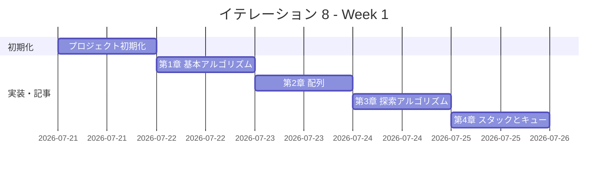
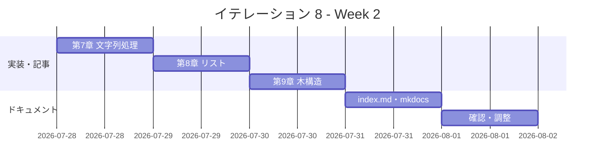

# イテレーション 8 計画

## 概要

| 項目 | 内容 |
|------|------|
| **イテレーション** | 8 |
| **期間** | Week 15-16（2 週間） |
| **ゴール** | C 版を Python 版から展開し、TDD で実装する |
| **目標 SP** | 5 |

---

## ゴール

### イテレーション終了時の達成状態

1. **記事**: `docs/article/c/` に全 9 章 + index.md が完成している
2. **実装**: `apps/c/` に TDD 実装コードが動作する状態で存在する
3. **公開**: mkdocs.yml に C 版が反映され、ローカルプレビューで閲覧可能

### 成功基準

- [ ] 9 章すべてのファイルが作成されている
- [ ] 各章のコード例が `apps/c/` の実コードと同期している（記事記述と実装を同一コミットで完結）
- [ ] `apps/c/` のテストが全てパス
- [ ] mkdocs.yml の nav に C 全 9 章が追加されている
- [ ] ローカルプレビューで表示確認済み
- [ ] 各章執筆時に Python 版との内容差分チェックを実施済み

---

## ユーザーストーリー

### 対象ストーリー

| ID | ユーザーストーリー | SP | 優先度 |
|----|-------------------|----|--------|
| US-008 | C 版を Python 版から展開する | 5 | 必須 |
| **合計** | | **5** | |

### ストーリー詳細

#### US-008: C 版を Python 版から展開する

**ストーリー**:

> 学習者として、C でアルゴリズムとデータ構造を TDD で学びたい。なぜなら、C はシステムプログラミングの基礎であり、メモリ管理・ポインタ・低レベル操作を理解することで、すべての言語の基盤となる仕組みを深く理解できるからだ。

**受入条件**:

1. 全 9 章が Python 版を基に C 版として再構成されている
2. 各章に TDD のコード例（テスト → 実装 → リファクタリング）が含まれている
3. `apps/c/` で全テストがパスする

---

## タスク

### 1. プロジェクト初期化（0.5 SP）

| # | タスク | 見積もり | 状態 |
|---|--------|---------|------|
| 1-1 | C プロジェクト作成（apps/c/） | 20 分 | [ ] |
| 1-2 | ビルドシステム設定（Makefile または CMake） | 30 分 | [ ] |
| 1-3 | テストフレームワーク設定（Unity または カスタムアサート） | 30 分 | [ ] |
| 1-4 | Nix devShell（.#c）設定確認 | 20 分 | [ ] |
| 1-5 | CI 設定（.github/workflows/ci-c.yml） | 20 分 | [ ] |

### 2. 第 1 章 基本的なアルゴリズム（0.5 SP）

| # | タスク | 見積もり | 状態 |
|---|--------|---------|------|
| 2-1 | TDD 実装（3 値最大値・中央値、条件判定、繰り返し） | 40 分 | [ ] |
| 2-2 | 記事執筆（docs/article/c/01-basic-algorithms.md） | 30 分 | [ ] |

### 3. 第 2 章 配列（0.5 SP）

| # | タスク | 見積もり | 状態 |
|---|--------|---------|------|
| 3-1 | TDD 実装（配列操作、基数変換、素数列挙） | 40 分 | [ ] |
| 3-2 | 記事執筆（docs/article/c/02-arrays.md） | 20 分 | [ ] |

### 4. 第 3 章 探索アルゴリズム（0.5 SP）

| # | タスク | 見積もり | 状態 |
|---|--------|---------|------|
| 4-1 | TDD 実装（線形探索、二分探索、ハッシュ法） | 40 分 | [ ] |
| 4-2 | 記事執筆（docs/article/c/03-search-algorithms.md） | 20 分 | [ ] |

### 5. 第 4 章 スタックとキュー（0.5 SP）

| # | タスク | 見積もり | 状態 |
|---|--------|---------|------|
| 5-1 | TDD 実装（スタック、キュー） | 40 分 | [ ] |
| 5-2 | 記事執筆（docs/article/c/04-stacks-and-queues.md） | 20 分 | [ ] |

### 6. 第 5 章 再帰アルゴリズム（0.5 SP）

| # | タスク | 見積もり | 状態 |
|---|--------|---------|------|
| 6-1 | TDD 実装（再帰基本、再帰と反復、再帰応用） | 40 分 | [ ] |
| 6-2 | 記事執筆（docs/article/c/05-recursion.md） | 20 分 | [ ] |

### 7. 第 6 章 ソートアルゴリズム（0.5 SP）

| # | タスク | 見積もり | 状態 |
|---|--------|---------|------|
| 7-1 | TDD 実装（バブル、選択、挿入、シェル、クイック、マージ、ヒープ、度数） | 50 分 | [ ] |
| 7-2 | 記事執筆（docs/article/c/06-sort-algorithms.md） | 20 分 | [ ] |

### 8. 第 7 章 文字列処理（0.5 SP）

| # | タスク | 見積もり | 状態 |
|---|--------|---------|------|
| 8-1 | TDD 実装（文字列探索 BF/KMP/BM、文字数カウント、逆順、回文） | 40 分 | [ ] |
| 8-2 | 記事執筆（docs/article/c/07-strings.md） | 20 分 | [ ] |

### 9. 第 8 章 リスト（0.5 SP）

| # | タスク | 見積もり | 状態 |
|---|--------|---------|------|
| 9-1 | TDD 実装（単方向リスト、双方向リスト、配列カーソル版） | 50 分 | [ ] |
| 9-2 | 記事執筆（docs/article/c/08-linked-lists.md） | 20 分 | [ ] |

### 10. 第 9 章 木構造（0.5 SP）

| # | タスク | 見積もり | 状態 |
|---|--------|---------|------|
| 10-1 | TDD 実装（BST、走査 3 種、最小ヒープ） | 50 分 | [ ] |
| 10-2 | 記事執筆（docs/article/c/09-trees.md） | 20 分 | [ ] |

### 11. ドキュメント整備（0.5 SP）

| # | タスク | 見積もり | 状態 |
|---|--------|---------|------|
| 11-1 | index.md 作成（docs/article/c/index.md） | 30 分 | [ ] |
| 11-2 | mkdocs.yml に C 版 9 章を追加 | 10 分 | [ ] |
| 11-3 | ローカルプレビュー確認 | 10 分 | [ ] |

### タスク合計

| カテゴリ | SP | 理想時間 | 状態 |
|---------|----|----------|------|
| プロジェクト初期化 | 0.5 | 120 分 | [ ] |
| 第 1〜9 章 TDD 実装 + 記事 | 4.0 | 540 分 | [ ] |
| ドキュメント整備 | 0.5 | 50 分 | [ ] |
| **合計** | **5** | **710 分（約 12h）** | |

**1 SP あたり**: 約 142 分（2.4h）
**進捗率**: 0%（0/5 SP）

---

## スケジュール

### Week 1（Day 1-5）



| 日 | タスク |
|----|--------|
| Day 1 | プロジェクト初期化（apps/c/, Makefile, テストフレームワーク, CI） |
| Day 2 | 第 1 章 基本的なアルゴリズム（実装 + 記事） |
| Day 3 | 第 2〜3 章（配列、探索アルゴリズム） |
| Day 4 | 第 4〜5 章（スタックとキュー、再帰アルゴリズム） |
| Day 5 | 第 6 章（ソートアルゴリズム） |

### Week 2（Day 6-10）



| 日 | タスク |
|----|--------|
| Day 6 | 第 7 章（文字列処理） |
| Day 7 | 第 8 章（リスト） |
| Day 8 | 第 9 章（木構造） |
| Day 9 | index.md 作成、mkdocs.yml 更新 |
| Day 10 | 統合テスト、ローカルプレビュー確認、バグ修正 |

---

## 設計

### ディレクトリ構成

```
apps/c/
├── Makefile
├── include/
│   └── test_helper.h     # アサートマクロ
├── chapter01/
│   ├── basic_algorithms.c
│   ├── basic_algorithms.h
│   └── basic_algorithms_test.c
├── chapter02/
│   ├── arrays.c
│   ├── arrays.h
│   └── arrays_test.c
├── chapter03/
│   ├── search.c
│   ├── search.h
│   └── search_test.c
├── chapter04/
│   ├── stack_queue.c
│   ├── stack_queue.h
│   └── stack_queue_test.c
├── chapter05/
│   ├── recursion.c
│   ├── recursion.h
│   └── recursion_test.c
├── chapter06/
│   ├── sort.c
│   ├── sort.h
│   └── sort_test.c
├── chapter07/
│   ├── strings.c
│   ├── strings.h
│   └── strings_test.c
├── chapter08/
│   ├── linked_list.c
│   ├── linked_list.h
│   └── linked_list_test.c
└── chapter09/
    ├── tree.c
    ├── tree.h
    └── tree_test.c

docs/article/c/
├── index.md
├── 01-basic-algorithms.md
├── 02-arrays.md
├── 03-search-algorithms.md
├── 04-stacks-and-queues.md
├── 05-recursion.md
├── 06-sort-algorithms.md
├── 07-strings.md
├── 08-linked-lists.md
└── 09-trees.md
```

### C 言語の設計方針

- 各章を独立したソースファイル（`.c` + `.h`）として分割
- テストは `main()` 関数を持つテスト実行ファイルで実装（`_test.c`）
- アサートマクロを `include/test_helper.h` で定義し全章で共有
- 動的メモリは `malloc`/`free` を明示的に管理、テスト後に解放
- Python のクラスは C の構造体（`struct`）で代替
- Python のリストは C の配列（`int[]`）または動的配列（`malloc`）で代替
- Python の例外処理は戻り値（`-1`, `NULL`）または `errno` で代替

### Python との対応実装方針

| 機能 | Python | C |
|------|--------|---|
| クラス | `class Stack` | `typedef struct Stack` |
| リスト | `list` | `int[]` / `malloc` 動的配列 |
| 辞書 | `dict` | ハッシュテーブル（手動実装） |
| 例外 | `raise Exception` | 戻り値 `NULL` / `-1` |
| 文字列 | `str` | `char[]` / `char*` |
| `None` | `None` | `NULL` |
| bool | `bool` | `int` (0/1) |
| ガベコレ | 自動 | `free()` 手動 |

---

## リスクと対策

| リスク | 影響度 | 対策 |
|--------|--------|------|
| メモリリークのテスト検証が難しい | 中 | Valgrind または AddressSanitizer（`-fsanitize=address`）を CI に組み込む |
| テストフレームワークの選定 | 中 | 外部依存を避け、シンプルなアサートマクロ（test_helper.h）で実装 |
| 文字列処理が `strlen`/`strcpy` 依存で複雑化 | 中 | `<string.h>` の標準関数を活用し、バッファオーバーフローを避ける |
| 木構造のポインタ管理が複雑 | 高 | 再帰的な `free()` ヘルパー関数を実装し、テストのクリーンアップを統一 |
| Nix devShell で C コンパイラの設定 | 低 | `gcc` / `clang` の両方で動作確認。既存の Nix flake に `c` シェルを追加 |

---

## 完了条件

### Definition of Done

- [ ] `apps/c/` の全テストがパス（`make test`）
- [ ] 全 9 章 + index.md が作成されている
- [ ] mkdocs.yml の nav に C 版全 9 章が追加されている
- [ ] ローカルプレビューで表示確認済み（`mkdocs serve`）
- [ ] 各章のコード例が実装コードと同期している
- [ ] メモリリークなし（AddressSanitizer または Valgrind で確認）

### デモ項目

1. `make test` で全テストがパスすることを確認
2. `mkdocs serve` でブラウザから C 版記事を閲覧
3. 第 1 章の TDD サイクル（Red → Green → Refactor）をデモ

---

## 更新履歴

| 日付 | 更新内容 | 更新者 |
|------|---------|--------|
| 2026-04-12 | 初版作成 | - |

---

## 関連ドキュメント

- [イテレーション 8 ふりかえり](./retrospective-8.md)
- [リリース計画](./release_plan.md)
- [C 版記事](../article/c/index.md)
