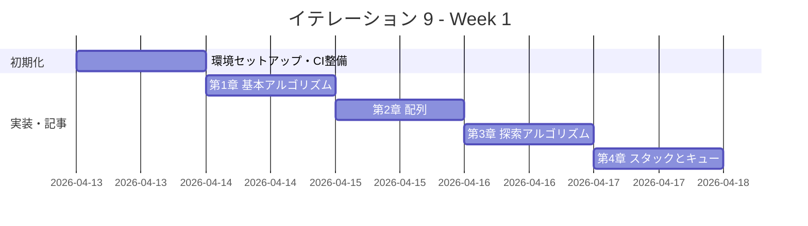

# イテレーション 9 計画

## 概要

| 項目 | 内容 |
|------|------|
| **イテレーション** | 9 |
| **期間** | Week 17-18（2 週間） |
| **ゴール** | Rust 版を Python 版から展開し、TDD で実装する |
| **目標 SP** | 5 |

---

## ゴール

### イテレーション終了時の達成状態

1. **記事**: `docs/article/rust/` に全 9 章 + index.md が完成している
2. **実装**: `apps/rust/` に TDD 実装コードが動作する状態で存在する
3. **公開**: mkdocs.yml に Rust 版が反映され、ローカルプレビューで閲覧可能

### 成功基準

- [ ] 9 章すべてのファイルが作成されている
- [ ] 各章のコード例が `apps/rust/` の実コードと同期している（記事記述と実装を同一コミットで完結）
- [ ] `apps/rust/` のテストが全てパス（`cargo test`）
- [ ] mkdocs.yml の nav に Rust 全 9 章が追加されている
- [ ] ローカルプレビューで表示確認済み（`mkdocs serve`）
- [ ] 各章執筆時に Python 版との内容差分チェックを実施済み（差分 30% 以内）
- [ ] 所有権モデル（`Box<T>`・`Option<T>`）を活用したメモリ安全な実装

---

## ユーザーストーリー

### 対象ストーリー

| ID | ユーザーストーリー | SP | 優先度 |
|----|-------------------|----|--------|
| US-009 | Rust 版を Python 版から展開する | 5 | 必須 |
| **合計** | | **5** | |

### ストーリー詳細

#### US-009: Rust 版を Python 版から展開する

**ストーリー**:

> 学習者として、Rust でアルゴリズムとデータ構造を TDD で学びたい。なぜなら、Rust は所有権モデルによるメモリ安全性と高パフォーマンスを両立するシステムプログラミング言語であり、`Box<T>` や `Option<T>` を活用した安全なデータ構造実装を学ぶことで、現代的なシステム開発の基盤を理解できるからだ。

**受入条件**:

1. 全 9 章が Python 版を基に Rust 版として再構成されている
2. 各章に TDD のコード例（テスト → 実装 → リファクタリング）が含まれている
3. `apps/rust/` で全テストがパスする（`cargo test`）
4. 所有権モデル（`Box<T>`・`Option<T>`）を活用したメモリ安全な実装

---

## タスク

### 1. 環境セットアップ（0.5 SP）

| # | タスク | 見積もり | 状態 |
|---|--------|---------|------|
| 1-1 | Rust プロジェクト作成（apps/rust/、Cargo.toml 設定） | 20 分 | [x] |
| 1-2 | ワークスペース構成（章ごとのモジュール分割） | 20 分 | [x] |
| 1-3 | Nix devShell（.#rust）設定確認 | 20 分 | [x] |

### 2. CI 整備（0.5 SP）

| # | タスク | 見積もり | 状態 |
|---|--------|---------|------|
| 2-1 | CI 設定（.github/workflows/ci-rust.yml: `cargo test`） | 20 分 | [x] |
| 2-2 | CI 動作確認 | 10 分 | [ ] |

### 3. 第 1 章 基本的なアルゴリズム（0.3 SP）

| # | タスク | 見積もり | 状態 |
|---|--------|---------|------|
| 3-1 | TDD 実装（3 値最大値・中央値、条件判定、繰り返し） | 40 分 | [x] |
| 3-2 | 記事執筆（docs/article/rust/01-basic-algorithms.md） | 30 分 | [x] |

### 4. 第 2 章 配列（0.3 SP）

| # | タスク | 見積もり | 状態 |
|---|--------|---------|------|
| 4-1 | TDD 実装（配列操作、基数変換、素数列挙） | 40 分 | [x] |
| 4-2 | 記事執筆（docs/article/rust/02-arrays.md） | 20 分 | [x] |

### 5. 第 3 章 探索アルゴリズム（0.3 SP）

| # | タスク | 見積もり | 状態 |
|---|--------|---------|------|
| 5-1 | TDD 実装（線形探索、二分探索、ハッシュ法） | 40 分 | [x] |
| 5-2 | 記事執筆（docs/article/rust/03-search-algorithms.md） | 20 分 | [x] |

### 6. 第 4 章 スタックとキュー（0.3 SP）

| # | タスク | 見積もり | 状態 |
|---|--------|---------|------|
| 6-1 | TDD 実装（スタック、キュー） | 40 分 | [x] |
| 6-2 | 記事執筆（docs/article/rust/04-stacks-and-queues.md） | 20 分 | [x] |

### 7. 第 5 章 再帰アルゴリズム（0.3 SP）

| # | タスク | 見積もり | 状態 |
|---|--------|---------|------|
| 7-1 | TDD 実装（再帰基本、再帰と反復、再帰応用） | 40 分 | [x] |
| 7-2 | 記事執筆（docs/article/rust/05-recursion.md） | 20 分 | [x] |

### 8. 第 6 章 ソートアルゴリズム（0.4 SP）

| # | タスク | 見積もり | 状態 |
|---|--------|---------|------|
| 8-1 | TDD 実装（バブル、選択、挿入、シェル、クイック、マージ、ヒープ、度数） | 50 分 | [x] |
| 8-2 | 記事執筆（docs/article/rust/06-sort-algorithms.md） | 20 分 | [x] |

### 9. 第 7 章 文字列処理（0.3 SP）

| # | タスク | 見積もり | 状態 |
|---|--------|---------|------|
| 9-1 | TDD 実装（文字列探索 BF/KMP/BM、文字数カウント、逆順、回文） | 40 分 | [x] |
| 9-2 | 記事執筆（docs/article/rust/07-strings.md） | 20 分 | [x] |

### 10. 第 8 章 リスト（0.4 SP）

| # | タスク | 見積もり | 状態 |
|---|--------|---------|------|
| 10-1 | TDD 実装（単方向リスト、双方向リスト、配列カーソル版） | 50 分 | [x] |
| 10-2 | 記事執筆（docs/article/rust/08-linked-lists.md） | 20 分 | [x] |

### 11. 第 9 章 木構造（0.4 SP）

| # | タスク | 見積もり | 状態 |
|---|--------|---------|------|
| 11-1 | TDD 実装（BST、走査 3 種、最小ヒープ） | 50 分 | [x] |
| 11-2 | 記事執筆（docs/article/rust/09-trees.md） | 20 分 | [x] |

### 12. ドキュメント整備（0.5 SP）

| # | タスク | 見積もり | 状態 |
|---|--------|---------|------|
| 12-1 | index.md 作成（docs/article/rust/index.md） | 30 分 | [x] |
| 12-2 | mkdocs.yml に Rust 版 9 章を追加 | 10 分 | [x] |
| 12-3 | ローカルプレビュー確認（`mkdocs serve`） | 10 分 | [ ] |

### タスク合計

| カテゴリ | SP | 理想時間 | 状態 |
|---------|----|----------|------|
| 環境セットアップ | 0.5 | 60 分 | [ ] |
| CI 整備 | 0.5 | 30 分 | [ ] |
| 第 1〜9 章 TDD 実装 + 記事 | 3.0 | 540 分 | [ ] |
| ドキュメント整備 | 1.0 | 50 分 | [ ] |
| **合計** | **5** | **680 分（約 11.3h）** | |

**1 SP あたり**: 約 136 分（2.3h）
**進捗率**: 0%（0/5 SP）

---

## スケジュール

### Week 1（Day 1-5）



| 日 | タスク |
|----|--------|
| Day 1 | 環境セットアップ（apps/rust/、Cargo.toml、CI） |
| Day 2 | 第 1 章 基本的なアルゴリズム（実装 + 記事） |
| Day 3 | 第 2〜3 章（配列、探索アルゴリズム） |
| Day 4 | 第 4〜5 章（スタックとキュー、再帰アルゴリズム） |
| Day 5 | 第 6 章（ソートアルゴリズム） |

### Week 2（Day 6-10）


| 日 | タスク |
|----|--------|
| Day 6 | 第 7 章（文字列処理） |
| Day 7 | 第 8 章（リスト） |
| Day 8 | 第 9 章（木構造） |
| Day 9 | index.md 作成、mkdocs.yml 更新 |
| Day 10 | 統合テスト、ローカルプレビュー確認、バグ修正 |

---

## 設計

### ディレクトリ構成

```
apps/rust/
├── Cargo.toml
├── src/
│   └── lib.rs
├── chapter01/
│   ├── Cargo.toml
│   └── src/
│       └── lib.rs          # 基本アルゴリズム + テスト
├── chapter02/
│   ├── Cargo.toml
│   └── src/
│       └── lib.rs          # 配列 + テスト
├── chapter03/
│   ├── Cargo.toml
│   └── src/
│       └── lib.rs          # 探索 + テスト
├── chapter04/
│   ├── Cargo.toml
│   └── src/
│       └── lib.rs          # スタック・キュー + テスト
├── chapter05/
│   ├── Cargo.toml
│   └── src/
│       └── lib.rs          # 再帰 + テスト
├── chapter06/
│   ├── Cargo.toml
│   └── src/
│       └── lib.rs          # ソート + テスト
├── chapter07/
│   ├── Cargo.toml
│   └── src/
│       └── lib.rs          # 文字列処理 + テスト
├── chapter08/
│   ├── Cargo.toml
│   └── src/
│       └── lib.rs          # リスト + テスト
└── chapter09/
    ├── Cargo.toml
    └── src/
        └── lib.rs          # 木構造 + テスト

docs/article/rust/
├── index.md
├── 01-basic-algorithms.md
├── 02-arrays.md
├── 03-search-algorithms.md
├── 04-stacks-and-queues.md
├── 05-recursion.md
├── 06-sort-algorithms.md
├── 07-strings.md
├── 08-linked-lists.md
└── 09-trees.md
```

### Rust 言語の設計方針

- Cargo ワークスペースで章ごとにクレートを分割
- テストは各クレートの `#[cfg(test)] mod tests` で実装
- 所有権モデルを活用し、`Box<T>` でヒープ確保（ツリー・リスト）
- `Option<T>` で NULL 安全な実装（Python の `None` に対応）
- `Result<T, E>` でエラーハンドリング（Python の例外に対応）
- ジェネリクス + トレイトで Python のクラス階層を表現
- `Vec<T>` で Python のリストに対応

### Python との対応実装方針

| 機能 | Python | Rust |
|------|--------|------|
| クラス | `class Stack` | `struct Stack` + `impl Stack` |
| リスト | `list` | `Vec<T>` |
| 辞書 | `dict` | `HashMap<K, V>` |
| 例外 | `raise Exception` | `Result<T, E>` / `Option<T>` |
| 文字列 | `str` | `String` / `&str` |
| `None` | `None` | `Option::None` |
| bool | `bool` | `bool` |
| ガベコレ | 自動 | 所有権モデル（自動 Drop） |
| ポインタ | なし | `Box<T>`、`Rc<T>` |

### 所有権モデルの設計指針（IT-8 ふりかえりからの引き継ぎ）

| データ構造 | 所有権戦略 | 理由 |
|-----------|-----------|------|
| 連結リスト | `Box<Node<T>>` + `Option` | 単一所有、再帰的ドロップ |
| 双方向リスト | `Rc<RefCell<Node<T>>>` | 複数参照が必要 |
| BST | `Box<TreeNode<T>>` + `Option` | 単一所有、再帰走査 |
| ヒープ | `Vec<T>` | 配列ベース、所有権問題なし |
| ハッシュテーブル | `Vec<Option<(K, V)>>` | 配列ベース |
| スタック・キュー | `Vec<T>` | 配列ベース |

---

## リスクと対策

| リスク | 影響度 | 対策 |
|--------|--------|------|
| 所有権・借用チェッカーによるコンパイルエラー多発 | 高 | 設計指針を事前確定し、各データ構造の所有権戦略を明確にする |
| 双方向リストの `Rc<RefCell>` が複雑化 | 中 | 配列カーソル版を優先実装し、ポインタ版は簡略化する |
| ジェネリクスのトレイト境界が複雑化 | 中 | 初期実装は具体型（`i32`）で進め、リファクタリング段階でジェネリクス化 |
| `cargo test` の実行時間が長い | 低 | ワークスペース機能で並列テストを活用 |
| Nix devShell での Rust ツールチェーン設定 | 低 | 既存の Nix flake に `rust` シェルを追加（rustup / cargo） |

---

## 完了条件

### Definition of Done

- [ ] `apps/rust/` の全テストがパス（`cargo test`）
- [ ] 全 9 章 + index.md が作成されている
- [ ] mkdocs.yml の nav に Rust 版全 9 章が追加されている
- [ ] ローカルプレビューで表示確認済み（`mkdocs serve`）
- [ ] 各章のコード例が実装コードと同期している
- [ ] Python 版との記事記述量差分が 30% 以内
- [ ] 所有権モデルの設計指針に準拠した実装

### デモ項目

1. `cargo test` で全テストがパスすることを確認
2. `mkdocs serve` でブラウザから Rust 版記事を閲覧
3. 第 8 章（リスト）の `Box<T>` + `Option<T>` による連結リスト実装をデモ

---

## IT-8 ふりかえりからの引き継ぎ事項

- `Box<T>` によるツリー・リスト実装、`Option<T>` によるエラー処理の方針を事前決定する → 「所有権モデルの設計指針」として本計画書に反映済み
- ローカルプレビュー確認をイテレーション完了条件として明示的にチェックする → 成功基準・DoD に明記済み
- 記事の記述量チェックを開発完了基準に加える（Python 版との差分 30% 以内） → 成功基準・DoD に明記済み

---

## 更新履歴

| 日付 | 更新内容 | 更新者 |
|------|---------|--------|
| 2026-04-12 | 初版作成 | - |

---

## 関連ドキュメント

- [イテレーション 9 ふりかえり](./retrospective-9.md)
- [リリース計画](./release_plan.md)
- [Rust 版記事](../article/rust/index.md)
- [イテレーション 8 ふりかえり](./retrospective-8.md)
