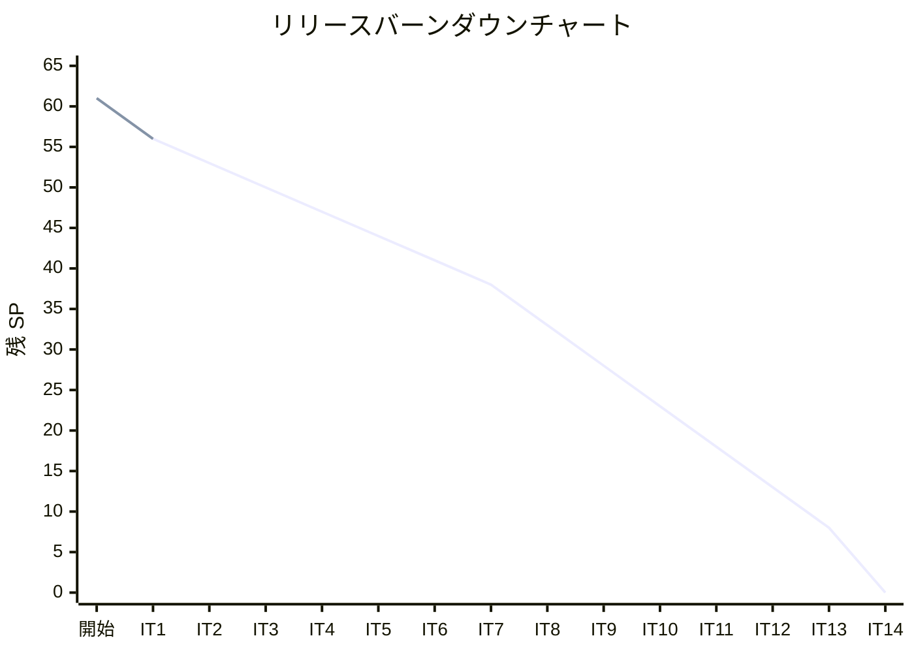
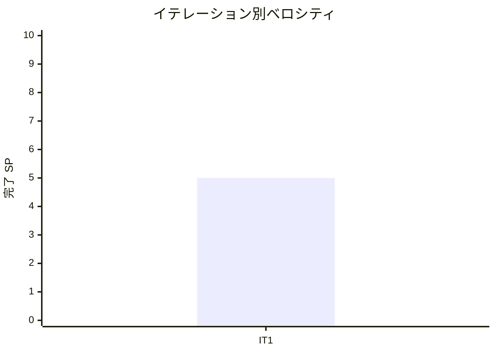

# イテレーション 1 完了報告書

## プロジェクト概要

| 項目 | 内容 |
|------|------|
| **イテレーション** | 1 |
| **ゴール** | Python 版（原本）の全 9 章を Wiki 記事から移行・再構成し、TDD で実装する |
| **対象ストーリー** | US-001: Python 版（原本）の全 9 章を執筆・実装する |
| **計画 SP** | 5 |
| **実績 SP** | 5 |
| **達成率** | 100% |

### 日程

| 項目 | 日付 |
|------|------|
| 計画期間 | Week 1-2（2 週間） |
| 実績開始日 | 2026-04-10 |
| 実績終了日 | 2026-04-11 |

### 要員

| 名前 | 予定作業日数 | 実績作業日数 |
|------|------------|------------|
| 開発者 + AI | 10 日 | 2 日（AI 支援により短縮） |

---

## 指標

### ベロシティ

| 指標 | 値 |
|------|-----|
| 計画 SP | 5 |
| 実績 SP | 5 |
| 達成率 | 100% |
| 累計完了 SP | 5 / 61 |
| 残 SP | 56 |

### リリースバーンダウン

### ベロシティチャート

---

## テスト結果

### Python テスト

| メトリクス | 値 |
|-----------|-----|
| テストファイル数 | 9 ファイル |
| テスト総数 | 239 |
| 通過数 | 239 |
| 失敗数 | 0 |
| カバレッジ | 99% |
| 実行時間 | 約 66 秒 |

### テスト内訳

| テストファイル | テスト対象 |
|--------------|-----------|
| `test_basic_algorithms.py` | 基本アルゴリズム（最大値・中央値・素数等） |
| `test_arrays.py` | 配列操作・バブルソート・選択ソート・挿入ソート |
| `test_search.py` | 線形探索・番兵法・二分探索・ハッシュ法 |
| `test_stack_queue.py` | Stack / Queue（固定・動的） |
| `test_recursion.py` | 再帰・GCD・ハノイ・EightQueen × 3 |
| `test_sort.py` | ヒープソート・度数ソート含む全ソートアルゴリズム |
| `test_strings.py` | BF / KMP / Boyer-Moore 文字列照合 |
| `test_linked_list.py` | 連結リスト・ArrayLinkedList・双方向リスト |
| `test_tree.py` | 二分探索木・ヒープ |

### テスト増分

| イテレーション | テスト数 | 増分 |
|--------------|---------|------|
| 開始前 | 0 | - |
| IT-1（今回） | 239 | +239 |

---

## 実施内容と評価

### ストーリー達成状況

| ストーリー | 結果 | 計画 SP | 実績 SP |
|-----------|------|---------|---------|
| US-001: Python 版（原本）の全 9 章を執筆・実装する | ✅ 完了 | 5 | 5 |
| **合計** | | **5** | **5** |

### US-001 受入条件の達成状況

- [x] 全 9 章が Wiki 記事から移行・再構成されている
- [x] 各章に TDD のコード例（テスト → 実装 → リファクタリング）が含まれている
- [x] `apps/python/` で全テストがパスする（239 テスト全通過）

### Definition of Done

- [x] 全 9 章のファイルが `docs/article/python/` に存在
- [x] `apps/python/` のテストが全てパス（239 テスト、カバレッジ 99%）
- [x] コード例が実装と同期
- [x] mkdocs.yml の nav 更新済み
- [x] ローカルプレビュー確認済み

### 実装した主要コンポーネント

#### 記事（`docs/article/python/`）

| ファイル | 内容 |
|---------|------|
| `index.md` | Python 版 概要・目次 |
| `01-basic-algorithms.md` | 基本的なアルゴリズム（最大値・中央値・素数） |
| `02-arrays.md` | 配列（操作・探索・ソート・コピー） |
| `03-search-algorithms.md` | 探索アルゴリズム（線形・二分・ハッシュ） |
| `04-stacks-and-queues.md` | スタックとキュー（固定・動的実装） |
| `05-recursion.md` | 再帰アルゴリズム（GCD・ハノイ・8 王妃問題） |
| `06-sort-algorithms.md` | ソートアルゴリズム（ヒープソート・度数ソート含む） |
| `07-string-processing.md` | 文字列処理（BF・KMP・Boyer-Moore） |
| `08-linked-lists.md` | リスト（ArrayLinkedList・双方向連結リスト） |
| `09-trees.md` | 木構造（二分探索木・ヒープ） |

#### 実装（`apps/python/src/algorithm/`）

| モジュール | 主要実装 |
|-----------|---------|
| `basic_algorithms.py` | 最大値・中央値・素数判定・最大公約数 |
| `arrays.py` | バブルソート・選択ソート・挿入ソート |
| `search.py` | 線形探索・番兵法・二分探索・ハッシュ法（LinearSearch・BinarySearch・ChainedHash） |
| `stack_queue.py` | Stack・Queue（固定長・`deque` ベース） |
| `recursion.py` | 再帰・GCD・ハノイ・**EightQueen** / **EightQueen2** / **EightQueen3** |
| `sort.py` | バブル・選択・挿入・クイック・マージ・**heap_sort**・**counting_sort** |
| `strings.py` | BF・KMP・Boyer-Moore 文字列照合 |
| `linked_list.py` | LinkedList・DoubleLinkedList・**ArrayLinkedList** |
| `tree.py` | BinarySearchTree・Heap |

---

## 追加タスク（SP 外）

| タスク | 内容 |
|-------|------|
| 記事内容の補完 | wiki オリジナルと比較し 30〜40% 不足していた内容を全章に追記 |
| 未実装機能の実装 | 記事に記述済みだった heap_sort・counting_sort・EightQueen×3・ArrayLinkedList を実装 |
| Python CI 構築 | Nix devShell 経由の GitHub Actions ワークフローを整備 |
| コード品質修正 | ruff B017・I001 違反を修正（具体的な例外クラスに変更） |
| Elixir 追加 | 対象言語を 12 → 13 言語に拡張（outline.md・release_plan.md 更新） |

---

## フェーズ・累計進捗

### Phase 1 進捗（Python 原本 + OOP 言語展開）

| イテレーション | 言語 | 計画 SP | 実績 SP | 達成率 | 状態 |
|--------------|------|---------|---------|--------|------|
| IT-1 | Python（原本） | 5 | 5 | 100% | ✅ 完了 |
| IT-2 | TypeScript | 3 | - | - | 未着手 |
| IT-3 | Java | 3 | - | - | 未着手 |
| IT-4 | C# | 3 | - | - | 未着手 |
| IT-5 | Ruby | 3 | - | - | 未着手 |
| IT-6 | PHP | 3 | - | - | 未着手 |
| **Phase 1 合計** | | **20** | **5** | **25%** | |

### 全フェーズ累計

| フェーズ | SP | 完了 SP | 達成率 |
|---------|-----|---------|--------|
| Phase 1 | 20 | 5 | 25% |
| Phase 2 | 33 | 0 | 0% |
| Phase 3 | 8 | 0 | 0% |
| **合計** | **61** | **5** | **8%** |

---

## ふりかえり

詳細は [イテレーション 1 ふりかえり](./retrospective-1.md) を参照。

### 主要改善アクション

| # | アクション | 実施イテレーション |
|---|-----------|----------------|
| T1 | 各章 DoD に「wiki 比較チェック」を追加 | IT-2 から |
| T2 | 記事記述とコード実装を同一コミットで完結させる | IT-2 から |
| T3 | slow テスト（EightQueen 8^8）を CI から分離 | IT-2 開始前 |

---

## 更新履歴

| 日付 | 更新内容 | 更新者 |
|------|---------|--------|
| 2026-04-11 | 初版作成 | - |
