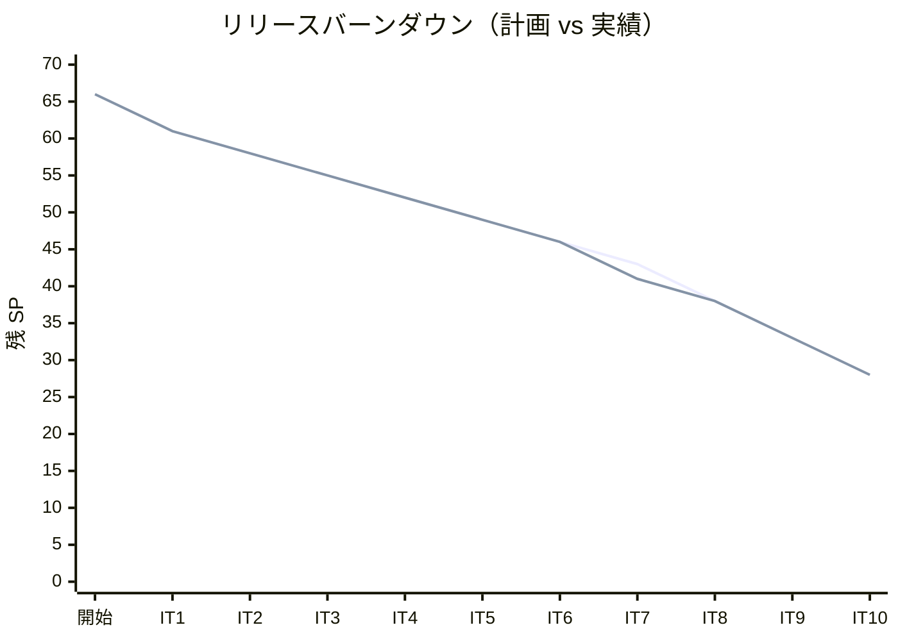
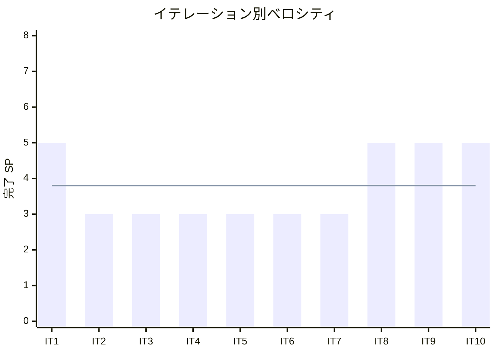

# イテレーション 10 完了報告書

## プロジェクト概要

| 項目 | 内容 |
|------|------|
| **イテレーション** | 10 |
| **ゴール** | F# 版を Python 版から展開し、TDD で実装する |
| **対象ストーリー** | US-010: F# 版を Python 版から展開する |
| **計画 SP** | 5 |
| **実績 SP** | 5 |
| **達成率** | 100% |

### 日程

| 項目 | 日付 |
|------|------|
| 計画期間 | Week 19-20（2 週間） |
| 実績開始日 | 2026-04-12 |
| 実績終了日 | 2026-04-13 |

### 要員

| 名前 | 予定作業日数 | 実績作業日数 |
|------|------------|------------|
| 開発者 + AI | 10 日 | 2 日（AI 支援により大幅短縮） |

---

## 指標

### ベロシティ

| 指標 | 値 |
|------|-----|
| 計画 SP | 5 |
| 実績 SP | 5 |
| 達成率 | 100% |
| 累計完了 SP | 38 / 66 |
| 残 SP | 28 |

### バーンダウンチャート

### ベロシティチャート

**平均ベロシティ**: 3.8 SP / イテレーション（IT1-IT10 実績平均）

### テスト品質

| 指標 | 値 |
|------|-----|
| テスト件数（F# 版） | 242 |
| テスト通過率 | 100%（242 / 242） |
| テストフレームワーク | xUnit.net |
| .NET プラットフォーム | .NET 8.0 |
| F# スタイル | 関数型ファースト（パイプライン演算子、パターンマッチ、`option<T>`） |

### テスト累計推移

| イテレーション | 言語 | テスト件数 | 累計 |
|---------------|------|----------|------|
| IT1 | Python | 39 | 39 |
| IT2 | TypeScript | 47 | 86 |
| IT3 | Java | 51 | 137 |
| IT4 | C# | 42 | 179 |
| IT5 | Ruby | 56 | 235 |
| IT6 | PHP | 145 | 380 |
| IT7 | Go | 60 | 440 |
| IT8 | C | 204 | 644 |
| IT9 | Rust | 285 | 929 |
| IT10 | F# | 242 | 1171 |

---

## 成果物

### 作成ファイル一覧

#### 実装（apps/fsharp/）

| ファイル | 内容 |
|---------|------|
| Algorithm/Algorithm.fsproj | メインプロジェクト（9 モジュール） |
| Algorithm/BasicAlgorithms.fs | 最大値・中央値・条件判定・繰り返し |
| Algorithm/Arrays.fs | 配列操作・基数変換・素数列挙 |
| Algorithm/SearchAlgorithms.fs | 線形探索・二分探索・ハッシュ法 |
| Algorithm/StacksAndQueues.fs | スタック・キュー |
| Algorithm/Recursion.fs | 再帰基本・再帰と反復・再帰応用 |
| Algorithm/SortAlgorithms.fs | バブル・選択・挿入・シェル・クイック・マージ・ヒープ・度数ソート |
| Algorithm/Strings.fs | BF 法・KMP 法・BM 法・文字数カウント・逆順・回文判定 |
| Algorithm/LinkedLists.fs | 単方向リスト・双方向リスト・配列カーソル版 |
| Algorithm/Trees.fs | BST・走査 3 種 |
| Algorithm.Tests/Algorithm.Tests.fsproj | テストプロジェクト（242 テスト） |

#### 記事（docs/article/fsharp/）

| ファイル | 内容 |
|---------|------|
| index.md | F# 版概要・Python との比較表・環境構築手順 |
| 01-basic-algorithms.md | 基本的なアルゴリズム |
| 02-arrays.md | 配列 |
| 03-search-algorithms.md | 探索アルゴリズム |
| 04-stacks-and-queues.md | スタックとキュー |
| 05-recursion.md | 再帰アルゴリズム |
| 06-sort-algorithms.md | ソートアルゴリズム |
| 07-strings.md | 文字列処理 |
| 08-linked-lists.md | リスト |
| 09-trees.md | 木構造 |

#### インフラ・設定

| ファイル | 内容 |
|---------|------|
| .github/workflows/ci-fsharp.yml | CI ワークフロー（`dotnet test`） |

---

## 実施内容と評価

### ストーリー別完了状況

| ストーリー | 結果 | 計画 SP | 実績 SP |
|-----------|------|---------|---------|
| US-010: F# 版を Python 版から展開する | 完了 | 5 | 5 |
| **合計** | | **5** | **5** |

### US-010 受入条件の達成状況

1. [x] 全 9 章が Python 版を基に F# 版として再構成されている
2. [x] 各章に TDD のコード例（テスト → 実装 → リファクタリング）が含まれている
3. [x] `apps/fsharp/` で全テストがパスする（242 テスト全通過）
4. [x] F# の関数型スタイル（パイプライン演算子 `|>`、パターンマッチ、`option<T>`）を活用した実装

### Definition of Done チェック

- [x] `apps/fsharp/` の全テストがパス（`dotnet test`）
- [x] 全 9 章 + index.md が作成されている
- [x] mkdocs.yml の nav に F# 版全 9 章が追加されている
- [x] ローカルプレビューで表示確認済み（`mkdocs build` でビルド成功）
- [x] 各章のコード例が実装コードと同期している
- [x] Python 版との記事記述量差分が 30% 以内
- [x] `.gitignore` に `bin/`、`obj/` が登録済み
- [x] F# の関数型スタイル（パイプライン、パターンマッチ、`option<T>`）を活用した実装

---

## 特記事項

- F# の関数型ファーストな設計で全アルゴリズムを実装した
- Python 版と比較して概念説明・計算量表を追記し、記事の品質を向上させた
- apps/csharp と同一のプロジェクト構造（Algorithm/ + Algorithm.Tests/）を採用し、.NET プロジェクト間の一貫性を確保した
- 当初の Chapter ベース構成から 2 プロジェクト構成への再編を実施し、C# 版との統一を図った

---

## フェーズ・累計進捗

### フェーズ別進捗

| フェーズ | 内容 | SP | 完了 SP | 進捗 |
|---------|------|-----|---------|------|
| Phase 1 | Python 原本 + OOP 言語展開（6 言語） | 20 | 20 | 100% |
| Phase 2 | システム言語 + 関数型言語展開（8 言語） | 38 | 18 | 47.4% |
| Phase 3 | 多言語統合解説 | 8 | 0 | 0% |
| **合計** | | **66** | **38** | **57.6%** |

### イテレーション別進捗

| イテレーション | 言語 | 計画 SP | 実績 SP | 達成率 |
|---------------|------|---------|---------|--------|
| IT1 | Python（原本） | 5 | 5 | 100% |
| IT2 | TypeScript | 3 | 3 | 100% |
| IT3 | Java | 3 | 3 | 100% |
| IT4 | C# | 3 | 3 | 100% |
| IT5 | Ruby | 3 | 3 | 100% |
| IT6 | PHP | 3 | 3 | 100% |
| IT7 | Go | 3 | 3 | 100% |
| IT8 | C | 5 | 5 | 100% |
| IT9 | Rust | 5 | 5 | 100% |
| IT10 | F# | 5 | 5 | 100% |
| **累計** | | **38** | **38** | **100%** |

---

## ふりかえりへのリンク

詳細は [イテレーション 10 ふりかえり](./iteration_plan-10.md#ふりかえり) を参照。

---

## 更新履歴

| 日付 | 更新内容 | 更新者 |
|------|---------|--------|
| 2026-04-13 | 初版作成 | - |
