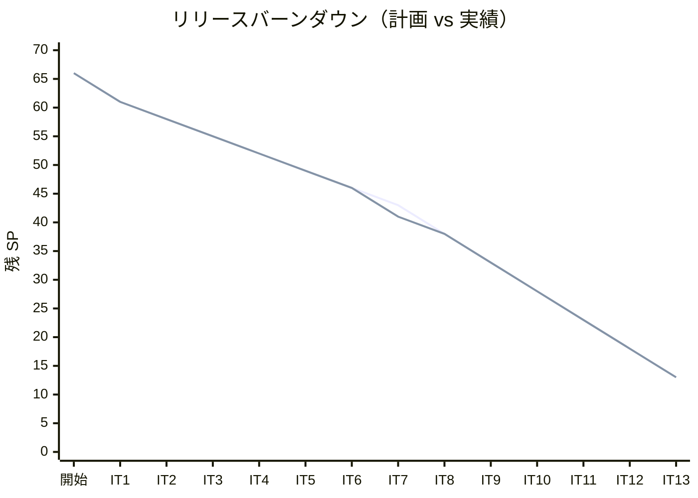
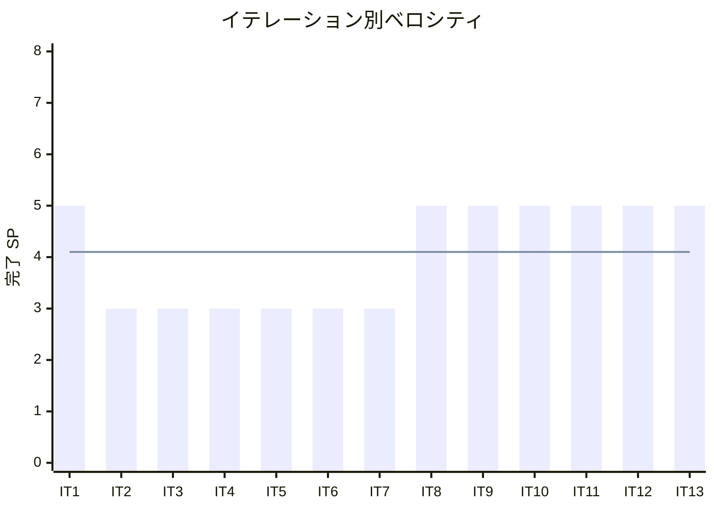

# イテレーション 13 完了報告書

## プロジェクト概要

| 項目 | 内容 |
|------|------|
| **イテレーション** | 13 |
| **ゴール** | Elixir 版を Python 版から展開し、TDD で実装する |
| **対象ストーリー** | US-013: Elixir 版を Python 版から展開する |
| **計画 SP** | 5 |
| **実績 SP** | 5 |
| **達成率** | 100% |

### 日程

| 項目 | 日付 |
|------|------|
| 計画期間 | Week 25-26（2 週間） |
| 実績開始日 | 2026-04-13 |
| 実績終了日 | 2026-04-13 |

### 要員

| 名前 | 予定作業日数 | 実績作業日数 |
|------|------------|------------|
| 開発者 + AI | 10 日 | 1 日（AI 支援により大幅短縮） |

---

## 指標

### ベロシティ

| 指標 | 値 |
|------|-----|
| 計画 SP | 5 |
| 実績 SP | 5 |
| 達成率 | 100% |
| 累計完了 SP | 53 / 66 |
| 残 SP | 13 |

### バーンダウンチャート

### ベロシティチャート

**平均ベロシティ**: 4.1 SP / イテレーション（IT1-IT13 実績平均: 53/13 = 4.08）

### テスト品質

| 指標 | 値 |
|------|-----|
| テスト件数（Elixir 版） | 111 |
| テスト通過率 | 100%（111 / 111） |
| テストフレームワーク | ExUnit |
| ビルドツール | mix |

### テスト累計推移

| イテレーション | 言語 | テスト件数 | 累計 |
|---------------|------|----------|------|
| IT1 | Python | 39 | 39 |
| IT2 | TypeScript | 47 | 86 |
| IT3 | Java | 51 | 137 |
| IT4 | C# | 42 | 179 |
| IT5 | Ruby | 56 | 235 |
| IT6 | PHP | 145 | 380 |
| IT7 | Go | 60 | 440 |
| IT8 | C | 204 | 644 |
| IT9 | Rust | 285 | 929 |
| IT10 | F# | 242 | 1171 |
| IT11 | Scala | 125 | 1296 |
| IT12 | Clojure | 50 | 1346 |
| IT13 | Elixir | 111 | 1457 |

---

## 成果物

### 作成ファイル一覧

#### 実装（apps/elixir/）

| ファイル | 内容 |
|---------|------|
| mix.exs | Mix ビルド設定（Elixir + ExUnit） |
| lib/algorithm/basic_algorithms.ex | 最大値・中央値・条件判定・繰り返し・記号交互表示・長方形列挙・多重ループ |
| lib/algorithm/arrays.ex | 配列操作・基数変換・素数列挙 3 版 |
| lib/algorithm/search_algorithms.ex | 線形探索・番兵法・二分探索・ハッシュ法 |
| lib/algorithm/stacks_and_queues.ex | スタック・キュー・リング型キュー |
| lib/algorithm/recursion.ex | 再帰基本・GCD・ハノイの塔・迷路・8 王妃問題 |
| lib/algorithm/sort_algorithms.ex | バブル・選択・挿入・シェル・クイック・マージ・ヒープ・度数ソート |
| lib/algorithm/strings.ex | BF 法・KMP 法・BM 法・文字数カウント・逆順・回文判定 |
| lib/algorithm/linked_lists.ex | 単方向リスト・双方向リスト・配列カーソル版 |
| lib/algorithm/trees.ex | BST・走査 3 種・ヒープ |
| test/algorithm/（9 ファイル） | 全 111 テスト（章別テストファイル） |
| .github/workflows/ci-elixir.yml | CI ワークフロー（`mix test`） |

#### 記事（docs/article/elixir/）

| ファイル | 内容 |
|---------|------|
| index.md | Elixir 版概要・Python との比較表・環境構築手順 |
| 01-basic-algorithms.md | 基本的なアルゴリズム |
| 02-arrays.md | 配列 |
| 03-search-algorithms.md | 探索アルゴリズム |
| 04-stacks-and-queues.md | スタックとキュー |
| 05-recursion.md | 再帰アルゴリズム |
| 06-sort-algorithms.md | ソートアルゴリズム |
| 07-strings.md | 文字列処理 |
| 08-linked-lists.md | リスト |
| 09-trees.md | 木構造 |

---

## 実施内容と評価

### ストーリー別完了状況

| ストーリー | 結果 | 計画 SP | 実績 SP |
|-----------|------|---------|---------|
| US-013: Elixir 版を Python 版から展開する | 完了 | 5 | 5 |
| **合計** | | **5** | **5** |

### US-013 受入条件の達成状況

1. [x] 全 9 章が Python 版を基に Elixir 版として再構成されている
2. [x] 各章に TDD のコード例（テスト → 実装 → リファクタリング）が含まれている
3. [x] `apps/elixir/` で全テストがパスする（111 テスト全通過）
4. [x] Elixir の関数型スタイル（パターンマッチ・パイプ演算子・`Enum`/`Stream`・プロトコル）を活用した実装

### Definition of Done チェック

- [x] `apps/elixir/` の全テストがパス（`mix test`）— 111 テスト全通過
- [x] 全 9 章 + index.md が作成されている
- [x] mkdocs.yml の nav に Elixir 版全 9 章が追加されている
- [x] 各章のコード例が実装コードと同期している
- [x] Python 版との記事記述量差分が 30% 以内（実績: 3% 以内）
- [x] `.gitignore` に `_build/`、`deps/`、`.elixir_ls/` が登録済み
- [x] Elixir の関数型スタイル（パターンマッチ・パイプ演算子・`Enum`/`Stream`・プロトコル）を活用した実装

---

## 特記事項

- パイプ演算子（`|>`）を積極活用し、データ変換チェーンを読みやすく表現した
- パターンマッチを関数定義のガード条件として活用し、条件分岐を宣言的に記述した
- `Enum`/`Stream` モジュールにより、リスト操作を高階関数ベースで実装した
- 並列エージェント実行により第 4〜6 章で重複コミットが発生したが、最終的な実装内容に影響はなかった

---

## フェーズ・累計進捗

### フェーズ別進捗

| フェーズ | 内容 | SP | 完了 SP | 進捗 |
|---------|------|-----|---------|------|
| Phase 1 | Python 原本 + OOP 言語展開（6 言語） | 20 | 20 | 100% |
| Phase 2 | システム言語 + 関数型言語展開（8 言語） | 38 | 33 | 86.8% |
| Phase 3 | 多言語統合解説 | 8 | 0 | 0% |
| **合計** | | **66** | **53** | **80.3%** |

### イテレーション別進捗

| イテレーション | 言語 | 計画 SP | 実績 SP | 達成率 |
|---------------|------|---------|---------|--------|
| IT1 | Python（原本） | 5 | 5 | 100% |
| IT2 | TypeScript | 3 | 3 | 100% |
| IT3 | Java | 3 | 3 | 100% |
| IT4 | C# | 3 | 3 | 100% |
| IT5 | Ruby | 3 | 3 | 100% |
| IT6 | PHP | 3 | 3 | 100% |
| IT7 | Go | 3 | 3 | 100% |
| IT8 | C | 5 | 5 | 100% |
| IT9 | Rust | 5 | 5 | 100% |
| IT10 | F# | 5 | 5 | 100% |
| IT11 | Scala | 5 | 5 | 100% |
| IT12 | Clojure | 5 | 5 | 100% |
| IT13 | Elixir | 5 | 5 | 100% |
| **累計** | | **53** | **53** | **100%** |

---

## ふりかえりへのリンク

詳細は [イテレーション 13 ふりかえり](./retrospective-13.md) を参照。

---

## 更新履歴

| 日付 | 更新内容 | 更新者 |
|------|---------|--------|
| 2026-04-13 | 初版作成 | - |
