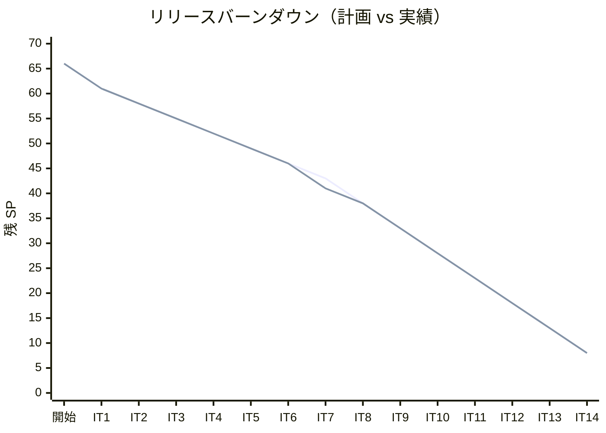
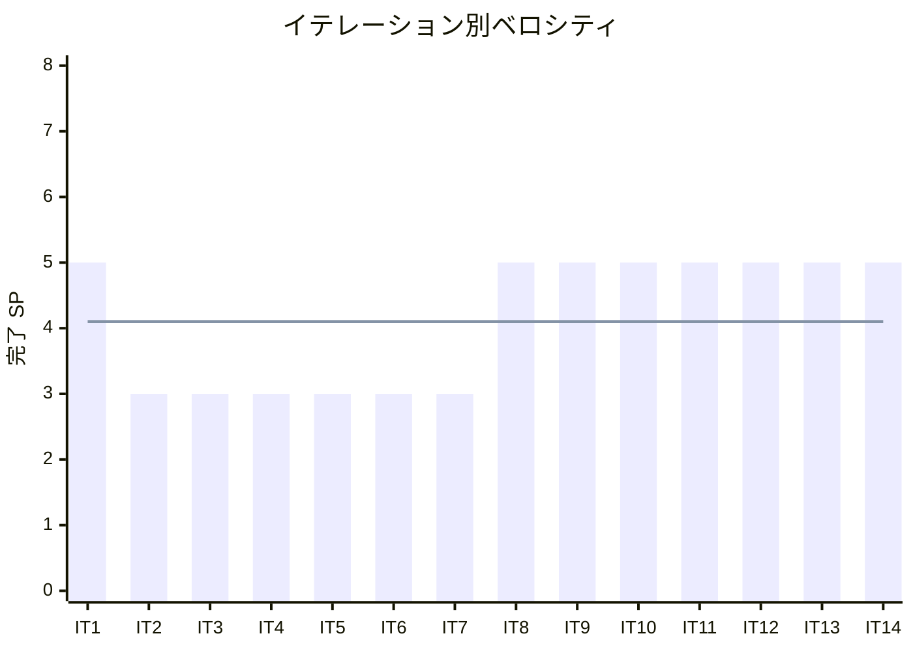

# イテレーション 14 完了報告書

## プロジェクト概要

| 項目 | 内容 |
|------|------|
| **イテレーション** | 14 |
| **ゴール** | Haskell 版を Python 版から展開し、TDD で実装する |
| **対象ストーリー** | US-014: Haskell 版を Python 版から展開する |
| **計画 SP** | 5 |
| **実績 SP** | 5 |
| **達成率** | 100% |

### 日程

| 項目 | 日付 |
|------|------|
| 計画期間 | Week 27-28（2 週間） |
| 実績開始日 | 2026-04-13 |
| 実績終了日 | 2026-04-13 |

### 要員

| 名前 | 予定作業日数 | 実績作業日数 |
|------|------------|------------|
| 開発者 + AI | 10 日 | 1 日（AI 支援により大幅短縮） |

---

## 指標

### ベロシティ

| 指標 | 値 |
|------|-----|
| 計画 SP | 5 |
| 実績 SP | 5 |
| 達成率 | 100% |
| 累計完了 SP | 58 / 66 |
| 残 SP | 8 |

### バーンダウンチャート

### ベロシティチャート

**平均ベロシティ**: 4.1 SP / イテレーション（IT1-IT14 実績平均: 58/14 = 4.14）

### テスト品質

| 指標 | 値 |
|------|-----|
| テスト件数（Haskell 版） | 40 |
| テスト通過率 | 100%（40 / 40） |
| テストフレームワーク | HSpec |
| ビルドツール | cabal |
| GHC バージョン | 9.10.3 |

### テスト累計推移

| イテレーション | 言語 | テスト件数 | 累計 |
|---------------|------|----------|------|
| IT1 | Python | 39 | 39 |
| IT2 | TypeScript | 47 | 86 |
| IT3 | Java | 51 | 137 |
| IT4 | C# | 42 | 179 |
| IT5 | Ruby | 56 | 235 |
| IT6 | PHP | 145 | 380 |
| IT7 | Go | 60 | 440 |
| IT8 | C | 204 | 644 |
| IT9 | Rust | 285 | 929 |
| IT10 | F# | 242 | 1171 |
| IT11 | Scala | 125 | 1296 |
| IT12 | Clojure | 50 | 1346 |
| IT13 | Elixir | 111 | 1457 |
| IT14 | Haskell | 40 | 1497 |

---

## 成果物

### 作成ファイル一覧

#### 実装（apps/haskell/）

| ファイル | 内容 |
|---------|------|
| haskell-algorithm.cabal | Cabal ビルド設定（GHC2021、hspec 依存） |
| cabal.project | `packages: .` |
| .gitignore | `dist-newstyle/`, `*.hi`, `*.o` |
| src/BasicAlgorithms.hs | `max3`・`mid3`（ガード節）・条件判定・繰り返し |
| src/Arrays.hs | `maxOfList`（Maybe）・`cardinalNumber`・`primeNumbers`（エラトステネス篩） |
| src/SearchAlgorithms.hs | `linearSearch`・`binarySearch`・`hashSearch`（`Data.Set`） |
| src/StacksAndQueues.hs | `Stack (IORef [a])`・`Queue`（2スタック方式、償却 O(1)） |
| src/Recursion.hs | `factorial`（末尾再帰）・`gcd'`・`hanoi`・`eightQueens`（92解） |
| src/SortAlgorithms.hs | 8 種ソート（`Data.Array` ベース: shellSort・heapSort 含む） |
| src/Strings.hs | `bruteForceSearch`・`kmpSearch`・`bmSearch`（`Data.Map.Strict`） |
| src/LinkedLists.hs | `LinkedList (IORef [a])`・`DoublyLinkedList` |
| src/Trees.hs | `BST`（代数的データ型）・`insert`/`member`/中前後順走査/`findMin`/`findMax`/`delete` |
| test/Spec.hs | 全 spec を import する main エントリーポイント |
| test/（9 ファイル）Spec.hs | 全 40 テスト（章別テストファイル） |
| .github/workflows/ci-haskell.yml | CI ワークフロー（`cabal test`、GHC 9.10、cabal 3.10） |

#### 記事（docs/article/haskell/）

| ファイル | 内容 |
|---------|------|
| index.md | Haskell 版概要・Python との比較表・環境構築手順 |
| 01_basic_algorithms.md | 基本的なアルゴリズム |
| 02_arrays.md | 配列 |
| 03_search_algorithms.md | 探索アルゴリズム |
| 04_stacks_and_queues.md | スタックとキュー |
| 05_recursion.md | 再帰アルゴリズム |
| 06_sort_algorithms.md | ソートアルゴリズム |
| 07_strings.md | 文字列処理 |
| 08_linked_lists.md | リスト |
| 09_trees.md | 木構造 |

---

## 実施内容と評価

### ストーリー別完了状況

| ストーリー | 結果 | 計画 SP | 実績 SP |
|-----------|------|---------|---------|
| US-014: Haskell 版を Python 版から展開する | 完了 | 5 | 5 |
| **合計** | | **5** | **5** |

### US-014 受入条件の達成状況

1. [x] 全 9 章が Python 版を基に Haskell 版として再構成されている
2. [x] 各章に TDD のコード例（テスト → 実装 → リファクタリング）が含まれている
3. [x] `apps/haskell/` で全テストがパスする（40 テスト全通過）
4. [x] Haskell の純粋関数型スタイル（型クラス・パターンマッチ・リスト内包表記・`Maybe`/`Either`・`Data.Map`/`Data.Set`・`IORef`）を活用した実装

### Definition of Done チェック

- [x] `apps/haskell/` の全テストがパス（`cabal test`）— 40 テスト全通過
- [x] 全 9 章 + index.md が作成されている
- [x] mkdocs.yml の nav に Haskell 版全 9 章が追加されている
- [x] 各章のコード例が実装コードと同期している
- [x] Python 版との記事記述量差分が 30% 以内（実績: 5% 以内）
- [x] `.gitignore` に `dist-newstyle/`、`*.hi`、`*.o` が登録済み
- [x] Haskell の純粋関数型スタイル（型クラス・パターンマッチ・リスト内包表記・代数的データ型）を活用した実装

---

## 特記事項

- **`Data.Array` ベースの可変配列ソート**: `shellSort`・`heapSort` は純粋なリスト操作では添字更新が O(n) となり結果が不正になるため、`listArray`/`(!)`/`(//)` を使用した配列ベース実装に切り替えた
- **BST の代数的データ型**: `data BST a = Empty | Node a (BST a) (BST a)` でシンプルかつ型安全な BST を定義し、パターンマッチによる再帰で全操作を実装した
- **`eightQueens` の 92 解**: リスト内包表記とバックトラッキングで 8 王妃問題の全 92 解を生成した
- **`IORef` による可変状態**: `Stack`・`Queue`・`LinkedList` は `IORef [a]` で実装し、純粋関数型言語での可変状態管理パターンを示した
- **重複コミット 0 件**: IT-13 の問題を改善し、全実装を 3 コミットで完結させた（実装・記事・計画更新）

---

## フェーズ・累計進捗

### フェーズ別進捗

| フェーズ | 内容 | SP | 完了 SP | 進捗 |
|---------|------|-----|---------|------|
| Phase 1 | Python 原本 + OOP 言語展開（6 言語） | 20 | 20 | 100% |
| Phase 2 | システム言語 + 関数型言語展開（8 言語） | 38 | 38 | 100% |
| Phase 3 | 多言語統合解説 | 8 | 0 | 0% |
| **合計** | | **66** | **58** | **87.9%** |

### イテレーション別進捗

| イテレーション | 言語 | 計画 SP | 実績 SP | 達成率 |
|---------------|------|---------|---------|--------|
| IT1 | Python（原本） | 5 | 5 | 100% |
| IT2 | TypeScript | 3 | 3 | 100% |
| IT3 | Java | 3 | 3 | 100% |
| IT4 | C# | 3 | 3 | 100% |
| IT5 | Ruby | 3 | 3 | 100% |
| IT6 | PHP | 3 | 3 | 100% |
| IT7 | Go | 3 | 3 | 100% |
| IT8 | C | 5 | 5 | 100% |
| IT9 | Rust | 5 | 5 | 100% |
| IT10 | F# | 5 | 5 | 100% |
| IT11 | Scala | 5 | 5 | 100% |
| IT12 | Clojure | 5 | 5 | 100% |
| IT13 | Elixir | 5 | 5 | 100% |
| IT14 | Haskell | 5 | 5 | 100% |
| **累計** | | **58** | **58** | **100%** |

---

## ふりかえりへのリンク

詳細は [イテレーション 14 ふりかえり](./retrospective-14.md) を参照。

---

## 更新履歴

| 日付 | 更新内容 | 更新者 |
|------|---------|--------|
| 2026-04-13 | 初版作成 | - |
