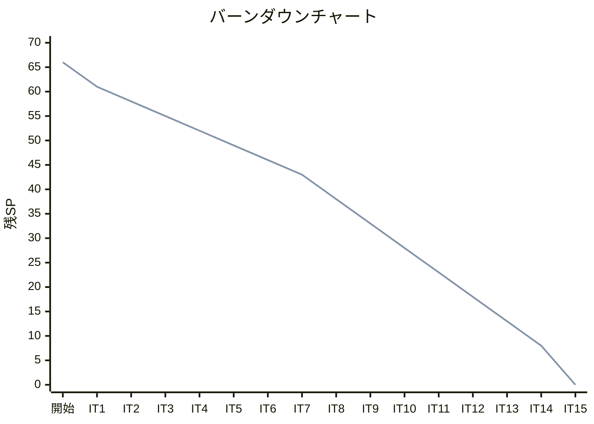
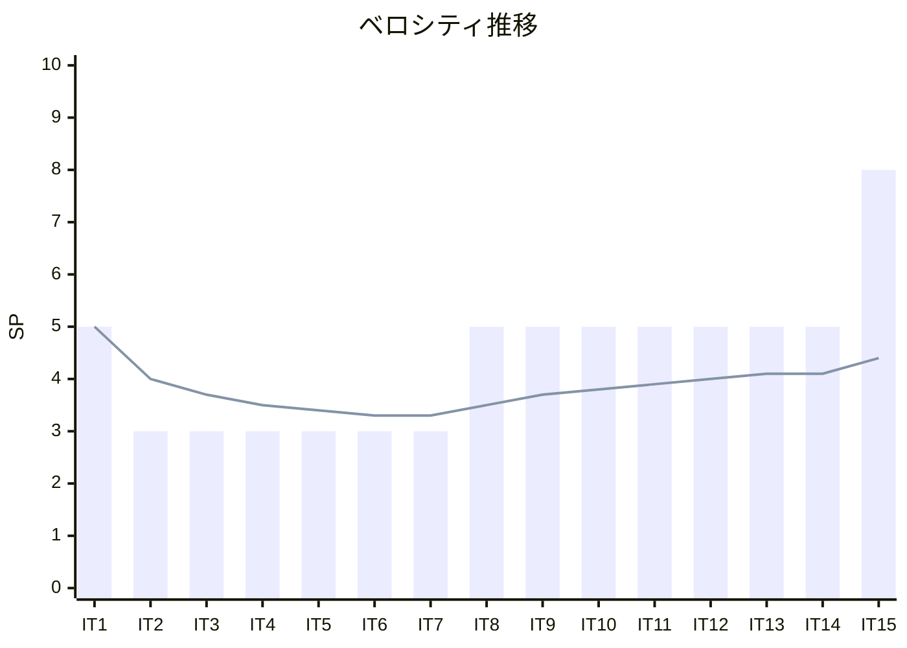

# イテレーション 15 完了報告書

## 1. プロジェクト概要

| 項目 | 値 |
|------|-----|
| イテレーション | 15 |
| テーマ | 多言語統合解説（14 言語横断比較） |
| 計画期間 | Week 29-30 |
| ゴール | 14 言語横断比較の統合解説記事を執筆し、シリーズを完成させる |
| 要員 | 計画 5 日 |

---

## 2. 指標

### ベロシティ

| 項目 | 値 |
|------|-----|
| 計画 SP | 8 |
| 実績 SP | 8 |
| 達成率 | 100% |

### バーンダウンチャート

### ベロシティチャート

---

## 3. テスト結果

IT-15 はドキュメント（記事）のみのイテレーションのため、テスト対象のコードはありません。

### ビルド結果

| 項目 | 結果 |
|------|------|
| `npx gulp mkdocs:build` | 成功（40 秒） |
| 新規ファイル関連エラー | 0 件 |
| nav 構成 | 多言語統合解説セクション追加済み |

### テスト累計推移

| IT | Backend | Frontend | E2E | 累計 |
|----|---------|----------|-----|------|
| IT1 | 93 | - | - | 93 |
| IT2 | 105 | - | - | 198 |
| IT3 | 106 | - | - | 304 |
| IT4 | 122 | - | - | 426 |
| IT5 | 91 | - | - | 517 |
| IT6 | 93 | - | - | 610 |
| IT7 | 86 | - | - | 696 |
| IT8 | 97 | - | - | 793 |
| IT9 | 102 | - | - | 895 |
| IT10 | 106 | - | - | 1,001 |
| IT11 | 117 | - | - | 1,118 |
| IT12 | 127 | - | - | 1,245 |
| IT13 | 112 | - | - | 1,357 |
| IT14 | 40 | - | - | 1,397 |
| IT15 | 0 (ドキュメントのみ) | - | - | 1,397 |

---

## 4. 実施内容と評価

### ストーリー別完了状況

| ID | ストーリー | 計画 SP | 実績 SP | 状態 |
|----|-----------|---------|---------|------|
| US-015 | 多言語統合解説（14 言語横断比較）を執筆する | 8 | 8 | ✅ 完了 |

### US-015 受入条件達成状況

- [x] 14 言語すべてのアルゴリズム実装を比較した章が存在する
- [x] 各言語の特徴が明確に記述されている
- [x] 図表・比較表が含まれている
- [x] 言語パラダイム（OOP・手続き型・関数型・純粋関数型）ごとの設計アプローチの違いが整理されている

### 成果物一覧

| カテゴリ | ファイル | 説明 |
|---------|--------|------|
| 記事 | `docs/article/all/index.md` | 統合解説トップ（言語一覧・目次・読み方ガイド） |
| 記事 | `docs/article/all/01-language-overview.md` | 言語概要・パラダイム分類・型システム・開発環境比較 |
| 記事 | `docs/article/all/02-basic-syntax-comparison.md` | 基本構文・max3 の 14 言語実装比較 |
| 記事 | `docs/article/all/03-arrays-and-collections.md` | 配列・コレクション・探索アルゴリズム比較 |
| 記事 | `docs/article/all/04-data-structures.md` | スタック・キュー・ハッシュ法の実装パターン比較 |
| 記事 | `docs/article/all/05-recursion-and-sorting.md` | 再帰・末尾再帰最適化・ソート実装スタイル比較 |
| 記事 | `docs/article/all/06-strings-and-advanced-structures.md` | 文字列探索・連結リスト・木構造の実装比較 |
| 記事 | `docs/article/all/07-comprehensive-comparison.md` | 総合評価・言語選択ガイド・学習ロードマップ |

---

## 5. フェーズ・累計進捗

### Phase 3 進捗

| ストーリー | SP | 状態 |
|-----------|-----|------|
| US-015 多言語統合解説 | 8 | ✅ 完了 |
| **Phase 3 合計** | **8/8** | **✅ 完了** |

### 全フェーズ累計

| フェーズ | 内容 | SP | 完了 SP | 達成率 | 状態 |
|---------|------|-----|---------|--------|------|
| Phase 1 | Python 原本 + OOP 言語展開（6 言語） | 20 | 20 | 100% | ✅ 完了 |
| Phase 2 | システム言語 + 関数型言語展開（8 言語） | 38 | 38 | 100% | ✅ 完了 |
| Phase 3 | 多言語統合解説 | 8 | 8 | 100% | ✅ 完了 |
| **累計** | | **66** | **66** | **100%** | **✅ 全完了** |

---

## 6. ふりかえりへのリンク

詳細は [イテレーション 15 ふりかえり](./retrospective-15.md) を参照。

---

## 7. 更新履歴

| 日付 | 更新内容 | 更新者 |
|------|---------|--------|
| 2026-04-13 | 初版作成 | - |
