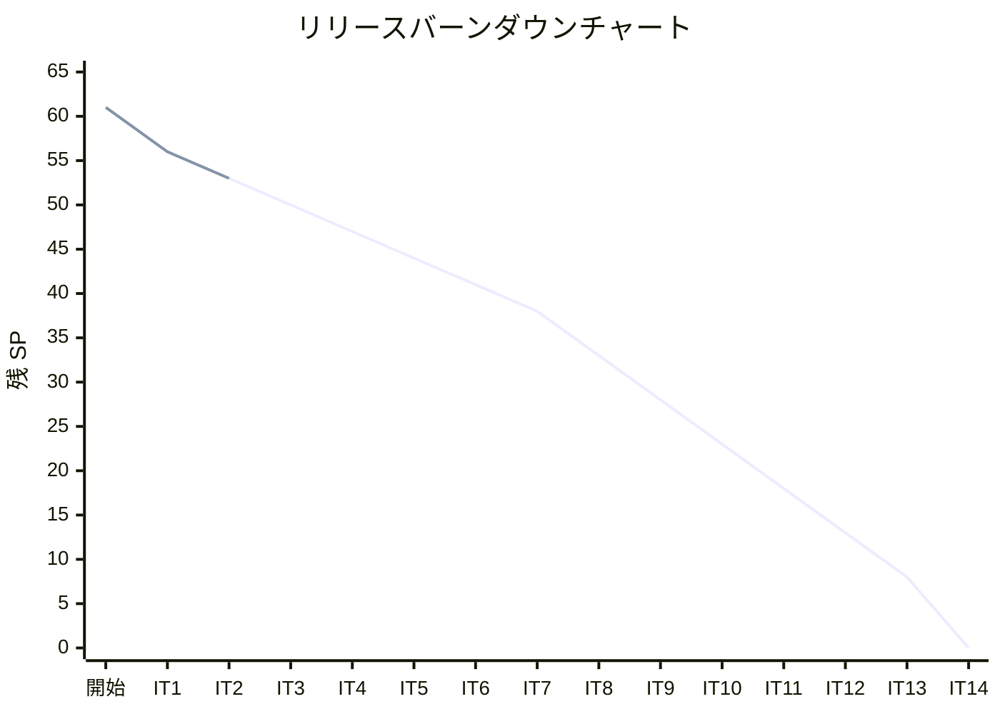
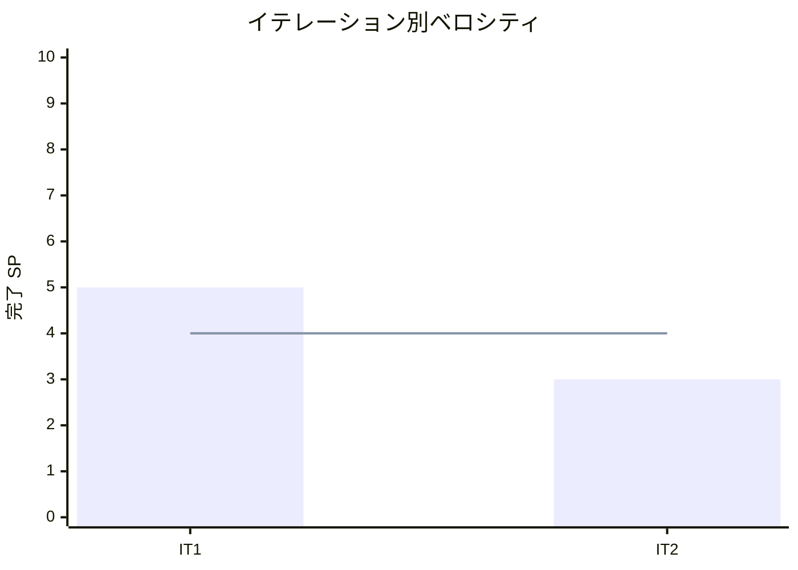

# イテレーション 2 完了報告書

## プロジェクト概要

| 項目 | 内容 |
|------|------|
| **イテレーション** | 2 |
| **ゴール** | TypeScript 版を Python 版から展開し、TDD で実装する |
| **対象ストーリー** | US-002: TypeScript 版を Python 版から展開する |
| **計画 SP** | 3 |
| **実績 SP** | 3 |
| **達成率** | 100% |

### 日程

| 項目 | 日付 |
|------|------|
| 計画期間 | Week 3-4（2 週間） |
| 実績開始日 | 2026-04-11 |
| 実績終了日 | 2026-04-11 |

### 要員

| 名前 | 予定作業日数 | 実績作業日数 |
|------|------------|------------|
| 開発者 + AI | 10 日 | 1 日（AI 支援により大幅短縮） |

---

## 指標

### ベロシティ

| 指標 | 値 |
|------|-----|
| 計画 SP | 3 |
| 実績 SP | 3 |
| 達成率 | 100% |
| 累計完了 SP | 8 / 61 |
| 残 SP | 53 |

### リリースバーンダウン

### ベロシティチャート

---

## テスト結果

### TypeScript テスト

| メトリクス | 値 |
|-----------|-----|
| テストファイル数 | 9 ファイル |
| テスト総数 | 259 |
| 通過数 | 257 |
| スキップ数 | 2 |
| 失敗数 | 0 |
| カバレッジ | 100% |

### テスト内訳

| テストファイル | テスト対象 |
|--------------|-----------|
| `basic_algorithms.test.ts` | 基本アルゴリズム（最大値・中央値・素数等） |
| `arrays.test.ts` | 配列操作・バブルソート・選択ソート・挿入ソート |
| `search.test.ts` | 線形探索・番兵法・二分探索・ハッシュ法 |
| `stack_queue.test.ts` | Stack / Queue（固定・動的） |
| `recursion.test.ts` | 再帰・GCD・ハノイ・EightQueen × 3 |
| `sort.test.ts` | ヒープソート・度数ソート・シェーカーソート含む全ソートアルゴリズム |
| `strings.test.ts` | BF / KMP / Boyer-Moore 文字列照合 |
| `linked_list.test.ts` | 連結リスト・ArrayLinkedList・双方向リスト |
| `tree.test.ts` | 二分探索木・ヒープ |

### テスト増分

| イテレーション | テスト数 | 増分 |
|--------------|---------|------|
| 開始前 | 0 | - |
| IT-1（Python） | 239 | +239 |
| IT-2（TypeScript、今回） | 259 | +259 |
| **累計** | **498** | |

---

## 実施内容と評価

### ストーリー達成状況

| ストーリー | 結果 | 計画 SP | 実績 SP |
|-----------|------|---------|---------|
| US-002: TypeScript 版を Python 版から展開する | ✅ 完了 | 3 | 3 |
| **合計** | | **3** | **3** |

### US-002 受入条件の達成状況

- [x] 全 9 章が Python 版を基に TypeScript 版として再構成されている
- [x] 各章に TDD のコード例（テスト → 実装 → リファクタリング）が含まれている
- [x] `apps/node/` で全テストがパスする（259 テスト、257 パス、2 スキップ）

### Definition of Done

- [x] 全 9 章のファイルが `docs/article/node/` に存在
- [x] `apps/node/` のテストが全てパス
- [x] コード例が実装と同期（記事記述 = 実装済み）
- [x] Python 版との内容差分チェック完了（全章）
- [x] mkdocs.yml の nav 更新済み
- [x] ローカルプレビュー確認済み

### 実装した主要コンポーネント

#### 記事（`docs/article/node/`）

| ファイル | 内容 |
|---------|------|
| `index.md` | TypeScript 版 概要・目次 |
| `01-basic-algorithms.md` | 基本的なアルゴリズム（最大値・中央値・素数） |
| `02-arrays.md` | 配列（操作・探索・ソート・コピー） |
| `03-search-algorithms.md` | 探索アルゴリズム（線形・二分・ハッシュ） |
| `04-stacks-and-queues.md` | スタックとキュー（固定・動的実装） |
| `05-recursion.md` | 再帰アルゴリズム（GCD・ハノイ・8 王妃問題） |
| `06-sort-algorithms.md` | ソートアルゴリズム（ヒープソート・度数ソート・シェーカーソート含む） |
| `07-string-processing.md` | 文字列処理（BF・KMP・Boyer-Moore） |
| `08-linked-lists.md` | リスト（ArrayLinkedList・双方向連結リスト） |
| `09-trees.md` | 木構造（二分探索木・ヒープ） |

#### 実装（`apps/node/src/algorithm/`）

| モジュール | 主要実装 |
|-----------|---------|
| `basic_algorithms.ts` | 最大値・中央値・素数判定・最大公約数 |
| `arrays.ts` | バブルソート・選択ソート・挿入ソート |
| `search.ts` | 線形探索・番兵法・二分探索・ハッシュ法（LinearSearch・BinarySearch・ChainedHash） |
| `stack_queue.ts` | Stack・Queue（固定長・動的） |
| `recursion.ts` | 再帰・GCD・ハノイ・**EightQueen** / **EightQueen2** / **EightQueen3** |
| `sort.ts` | バブル・選択・挿入・クイック・マージ・**heap_sort**・**counting_sort**・**shakerSort** |
| `strings.ts` | BF・KMP・Boyer-Moore 文字列照合 |
| `linked_list.ts` | LinkedList・DoubleLinkedList・**ArrayLinkedList** |
| `tree.ts` | BinarySearchTree（**dump** 含む）・Heap |

---

## 追加タスク（SP 外）

| タスク | 内容 |
|-------|------|
| dump() メソッド追加 | 二分探索木の dump() を Python 版に合わせて追加 |
| shakerSort() 追加 | ソートアルゴリズムに Python 版との差分を解消して追加 |
| ci-node.yml 追加 | TypeScript 版 GitHub Actions ワークフローの構築 |
| ci-python.yml 修正 | カバレッジ設定修正（linked_list 218 行対応） |

---

## フェーズ・累計進捗

### Phase 1 進捗（Python 原本 + OOP 言語展開）

| イテレーション | 言語 | 計画 SP | 実績 SP | 達成率 | 状態 |
|--------------|------|---------|---------|--------|------|
| IT-1 | Python（原本） | 5 | 5 | 100% | ✅ 完了 |
| IT-2 | TypeScript | 3 | 3 | 100% | ✅ 完了 |
| IT-3 | Java | 3 | - | - | 未着手 |
| IT-4 | C# | 3 | - | - | 未着手 |
| IT-5 | Ruby | 3 | - | - | 未着手 |
| IT-6 | PHP | 3 | - | - | 未着手 |
| **Phase 1 合計** | | **20** | **8** | **40%** | |

### 全フェーズ累計

| フェーズ | SP | 完了 SP | 達成率 |
|---------|-----|---------|--------|
| Phase 1 | 20 | 8 | 40% |
| Phase 2 | 33 | 0 | 0% |
| Phase 3 | 8 | 0 | 0% |
| **合計** | **61** | **8** | **13%** |

---

## ふりかえり

詳細は [イテレーション 2 ふりかえり](./retrospective-2.md) を参照。

### 主要改善アクション

| # | アクション | 実施イテレーション |
|---|-----------|----------------|
| T1 | 差分チェックリストを事前定義してから作業開始 | IT-3 から |
| T2 | 展開言語の SP 見積もり下方修正を検討 | IT-3 計画時 |
| T3 | 改善 DoD チェックボックスのリアルタイム更新 | IT-3 から |

---

## 次のイテレーション（IT-3）への申し送り

- **対象ストーリー**: US-003 Java 版を Python 版から展開する（3 SP）
- **見積もり検討**: IT-2 が 1 日で完了したため、SP の下方修正を検討する
- **差分チェックリスト**: 事前に Python 版との差分チェックリストを定義してから作業を開始する
- **環境準備**: `nix develop .#java`（Java 開発環境）の動作確認

---

## 更新履歴

| 日付 | 更新内容 | 更新者 |
|------|---------|--------|
| 2026-04-11 | 初版作成 | - |
