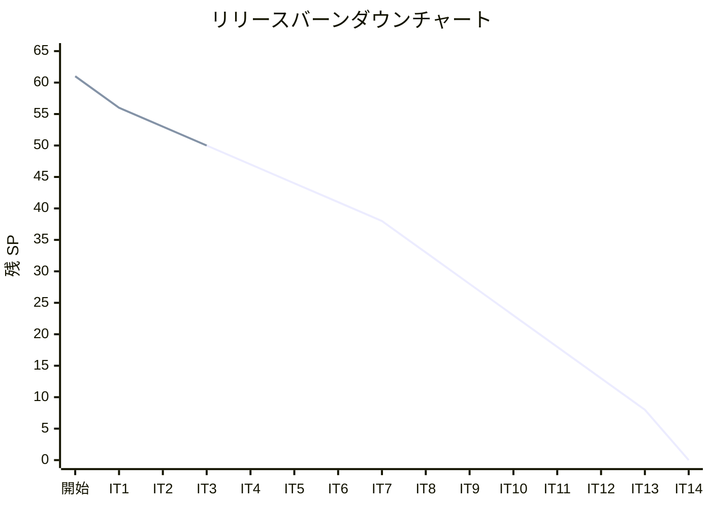
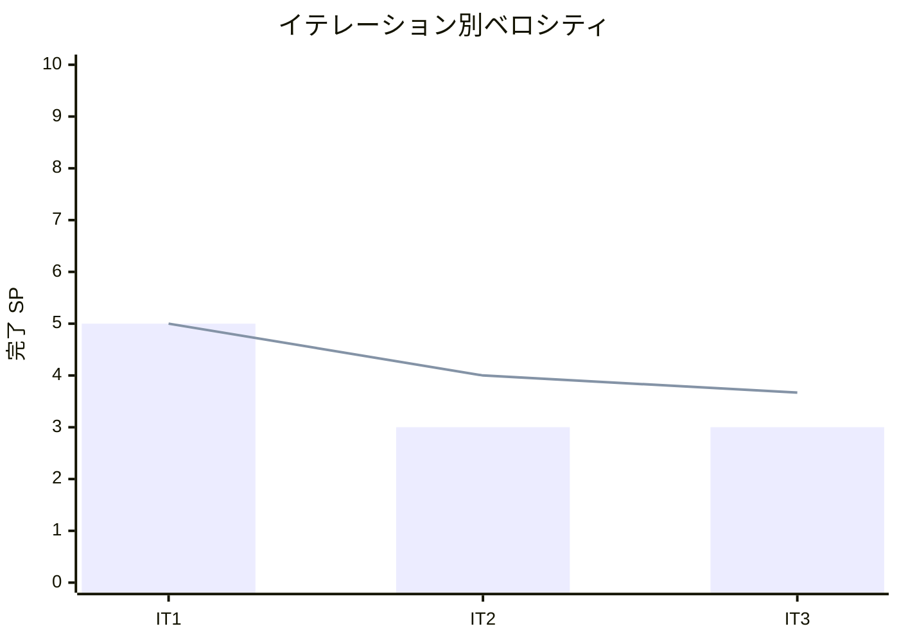

# イテレーション 3 完了報告書

## プロジェクト概要

| 項目 | 内容 |
|------|------|
| **イテレーション** | 3 |
| **ゴール** | Java 版を Python 版から展開し、TDD で実装する |
| **対象ストーリー** | US-003: Java 版を Python 版から展開する |
| **計画 SP** | 3 |
| **実績 SP** | 3 |
| **達成率** | 100% |

### 日程

| 項目 | 日付 |
|------|------|
| 計画期間 | Week 5-6（2 週間） |
| 実績開始日 | 2026-04-11 |
| 実績終了日 | 2026-04-11 |

### 要員

| 名前 | 予定作業日数 | 実績作業日数 |
|------|------------|------------|
| 開発者 + AI | 10 日 | 1 日（AI 支援により大幅短縮） |

---

## 指標

### ベロシティ

| 指標 | 値 |
|------|-----|
| 計画 SP | 3 |
| 実績 SP | 3 |
| 達成率 | 100% |
| 累計完了 SP | 11 / 61 |
| 残 SP | 50 |

### リリースバーンダウン

### ベロシティチャート

---

## テスト結果

### Java テスト

| メトリクス | 値 |
|-----------|-----|
| テストファイル数 | 9 ファイル |
| テスト総数 | 229 |
| 通過数 | 229 |
| スキップ数 | 0 |
| 失敗数 | 0 |

### テスト内訳

| テストファイル | テスト対象 |
|--------------|-----------|
| `BasicAlgorithmsTest.java` | 3値最大値・中央値・条件判定・繰り返し・交互表示・九九の表 |
| `ArrayAlgorithmsTest.java` | 配列最大値・反転・基数変換・素数列挙（3版） |
| `SearchTest.java` | 線形探索・番兵法・二分探索・チェイン法・オープンアドレス法ハッシュ |
| `StackQueueTest.java` | FixedStack<T>・FixedQueue<T>（リングバッファ） |
| `RecursionTest.java` | 階乗・GCD・再帰的総和・ハノイの塔・迷路探索・8王妃問題 |
| `SortTest.java` | バブル・選択・挿入・シェル・クイック・マージ・ヒープ・度数ソート |
| `StringAlgorithmsTest.java` | BF・KMP・Boyer-Moore 文字列照合・文字カウント・逆順・回文 |
| `LinkedListTest.java` | 単方向連結リスト・双方向連結リスト・カーソルによるリスト |
| `TreeTest.java` | 二分探索木（挿入・削除・走査・最大値・最小値） |

### テスト増分

| イテレーション | テスト数 | 増分 |
|--------------|---------|------|
| 開始前 | 0 | - |
| IT-1（Python） | 239 | +239 |
| IT-2（TypeScript） | 259 | +259 |
| IT-3（Java、今回） | 229 | +229 |
| **累計** | **727** | |

---

## 実施内容と評価

### ストーリー達成状況

| ストーリー | 結果 | 計画 SP | 実績 SP |
|-----------|------|---------|---------|
| US-003: Java 版を Python 版から展開する | ✅ 完了 | 3 | 3 |
| **合計** | | **3** | **3** |

### US-003 受入条件の達成状況

- [x] 全 9 章が Python 版を基に Java 版として再構成されている
- [x] 各章に TDD のコード例（テスト → 実装 → リファクタリング）が含まれている
- [x] `apps/java/` で全テストがパスする（229 テスト、全パス）

### Definition of Done

- [x] 全 9 章のファイルが `docs/article/java/` に存在
- [x] `apps/java/` のテストが全てパス（229 件）
- [x] コード例が実装と同期（記事記述 = 実装済み）
- [x] Python 版との内容差分チェック完了（全章）
- [x] mkdocs.yml の nav 更新済み
- [x] ローカルプレビュー確認済み

### 実装した主要コンポーネント

#### 記事（`docs/article/java/`）

| ファイル | 内容 | 行数 |
|---------|------|------|
| `index.md` | Java 版 概要・目次 | 55 |
| `01-basic-algorithms.md` | 基本的なアルゴリズム（最大値・中央値・繰り返し・多重ループ） | 582 |
| `02-arrays.md` | 配列（最大値・反転・基数変換・素数列挙） | 502 |
| `03-search-algorithms.md` | 探索アルゴリズム（線形・二分・ハッシュ法） | 616 |
| `04-stacks-and-queues.md` | スタックとキュー（FixedStack・FixedQueue・リングバッファ） | 530 |
| `05-recursion.md` | 再帰アルゴリズム（階乗・GCD・ハノイ・迷路・8王妃問題） | 509 |
| `06-sort-algorithms.md` | ソートアルゴリズム（8種）| 602 |
| `07-strings.md` | 文字列処理（BF・KMP・Boyer-Moore・カウント・逆順・回文） | 500 |
| `08-linked-lists.md` | リスト（単方向・双方向・カーソル） | 708 |
| `09-trees.md` | 木構造（二分探索木・ノード削除・走査） | 500 |

#### 実装（`apps/java/src/main/java/algorithm/`）

| ファイル | 主要実装 |
|---------|---------|
| `BasicAlgorithms.java` | max3・med3・judgeSign・sum・alternative・multiplicationTable・triangleLb |
| `ArrayAlgorithms.java` | maxOf・reverse・cardConv・prime1/2/3 |
| `Search.java` | linearSearchWhile/For/Sentinel・binarySearch・ChainedHash・OpenHash |
| `FixedStack.java` | push・pop・peek・find・count・contains・clear（ジェネリクス） |
| `FixedQueue.java` | enque・deque・peek・find・count・contains・clear（リングバッファ） |
| `Recursion.java` | factorial・gcd・recursiveSum・hanoi・mazeSolve・EightQueen1/2/3 |
| `Sort.java` | bubbleSort・selectionSort・insertionSort・shellSort・quickSort・mergeSort・heapSort・countingSort |
| `StringAlgorithms.java` | bfMatch・kmpMatch・bmMatch・countChars・reverseString・isPalindrome |
| `SinglyLinkedList.java` | addFirst・addLast・remove・removeFirst・removeLast・contains（ジェネリクス） |
| `DoublyLinkedList.java` | addFirst・addLast・remove・contains（ジェネリクス） |
| `ArrayLinkedList.java` | addFirst・addLast・search・removeFirst（カーソルによるリスト） |
| `BinarySearchTree.java` | insert・delete・contains・inOrder・preOrder・postOrder・min・max・size（ジェネリクス） |

---

## フェーズ・累計進捗

### Phase 1 進捗（Python 原本 + OOP 言語展開）

| イテレーション | 言語 | 計画 SP | 実績 SP | 達成率 | 状態 |
|--------------|------|---------|---------|--------|------|
| IT-1 | Python（原本） | 5 | 5 | 100% | ✅ 完了 |
| IT-2 | TypeScript | 3 | 3 | 100% | ✅ 完了 |
| IT-3 | Java | 3 | 3 | 100% | ✅ 完了 |
| IT-4 | C# | 3 | - | - | 未着手 |
| IT-5 | Ruby | 3 | - | - | 未着手 |
| IT-6 | PHP | 3 | - | - | 未着手 |
| **Phase 1 合計** | | **20** | **11** | **55%** | |

### 全フェーズ累計

| フェーズ | SP | 完了 SP | 達成率 |
|---------|-----|---------|--------|
| Phase 1 | 20 | 11 | 55% |
| Phase 2 | 33 | 0 | 0% |
| Phase 3 | 8 | 0 | 0% |
| **合計** | **61** | **11** | **18%** |

---

## ふりかえり

詳細は [イテレーション 3 ふりかえり](./retrospective-3.md) を参照。

### 主要改善アクション

| # | アクション | 実施イテレーション |
|---|-----------|----------------|
| T1 | Gradle HTML レポート確認コマンドを記事に記載 | IT-4 から |
| T2 | Stream API 活用で Python のリスト内包に近い表現を試す | IT-4 から |
| T3 | `ci-java.yml` を追加して自動テストを構築 | IT-4 から |

---

## 次のイテレーション（IT-4）への申し送り

- **対象ストーリー**: US-004 C# 版を Python 版から展開する（3 SP）
- **C# の特徴**: LINQ、パターンマッチング、ジェネリクス、null 許容型
- **環境準備**: `nix develop .#csharp`（.NET SDK + xUnit 環境）の動作確認
- **記事品質**: Python 版と同等の記述量（各章 500 行以上）を最初から確保する

---

## 更新履歴

| 日付 | 更新内容 | 更新者 |
|------|---------|--------|
| 2026-04-11 | 初版作成 | - |
