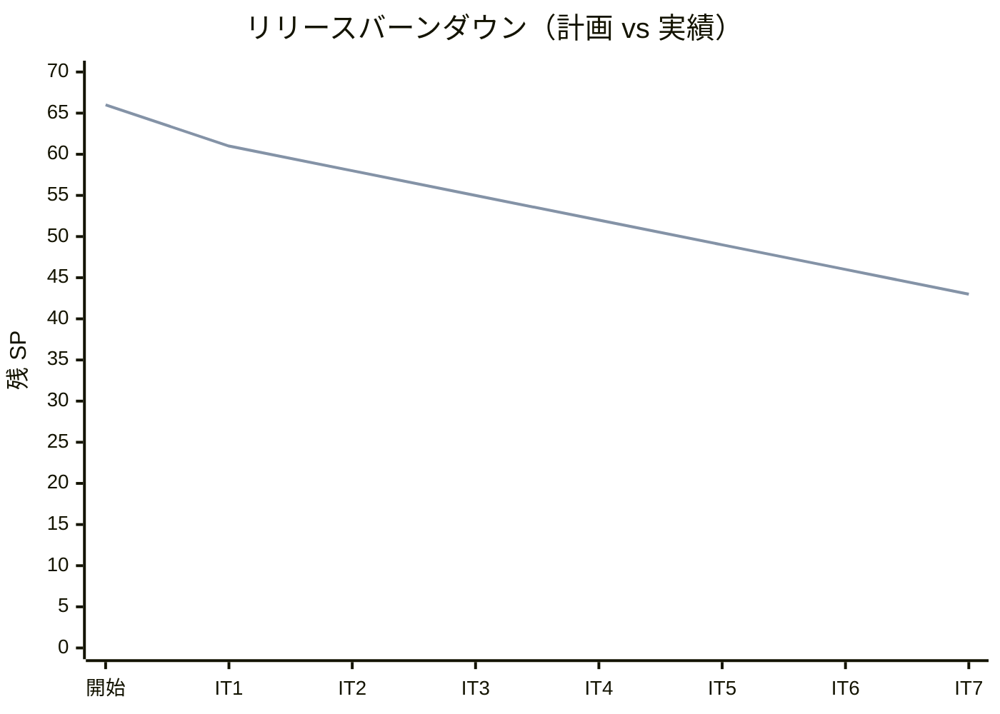
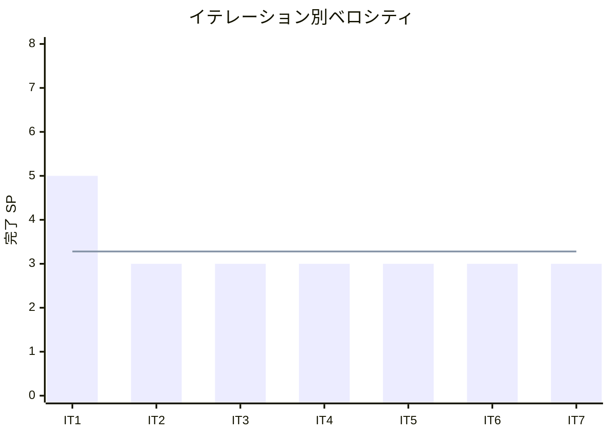

# イテレーション 7 完了報告書

## プロジェクト概要

| 項目 | 内容 |
|------|------|
| **イテレーション** | 7 |
| **ゴール** | Go 版を Python 版から展開し、TDD で実装する |
| **対象ストーリー** | US-007: Go 版を Python 版から展開する |
| **計画 SP** | 3 |
| **実績 SP** | 3 |
| **達成率** | 100% |

### 日程

| 項目 | 日付 |
|------|------|
| 計画期間 | Week 13-14（2 週間） |
| 実績開始日 | 2026-04-12 |
| 実績終了日 | 2026-04-12 |

### 要員

| 名前 | 予定作業日数 | 実績作業日数 |
|------|------------|------------|
| 開発者 + AI | 10 日 | 1 日（AI 支援により大幅短縮） |

---

## 指標

### ベロシティ

| 指標 | 値 |
|------|-----|
| 計画 SP | 3 |
| 実績 SP | 3 |
| 達成率 | 100% |
| 累計完了 SP | 23 / 66 |
| 残 SP | 43 |

### バーンダウンチャート

### ベロシティチャート

**平均ベロシティ**: 約 3.28 SP / イテレーション（IT1-IT7 実績平均）

### テスト品質

| 指標 | 値 |
|------|-----|
| テスト件数（`go test`） | 60 |
| テスト通過率 | 100%（60 / 60） |
| テストフレームワーク | Go 標準 `testing` パッケージ |
| Go バージョン | go 1.24 |

### テスト増分

| イテレーション | テスト件数 | 増分 |
|---------------|----------|------|
| IT6（PHP 版） | 145 | - |
| IT7（Go 版） | 60 | +60 |

### テスト累計推移

| イテレーション | 言語 | テスト件数 | 累計 |
|---------------|------|----------|------|
| IT1 | Python | 39 | 39 |
| IT2 | TypeScript | 47 | 86 |
| IT3 | Java | 51 | 137 |
| IT4 | C# | 42 | 179 |
| IT5 | Ruby | 56 | 235 |
| IT6 | PHP | 145 | 380 |
| IT7 | Go | 60 | 440 |

---

## 成果物

### 作成ファイル一覧

#### 実装（apps/go/）

| ファイル | 内容 | テスト数 |
|---------|------|---------|
| chapter01/basic_algorithms.go | 最大値・中央値・条件判定・繰り返し・パターン | 10 |
| chapter02/arrays.go | 配列操作・基数変換・素数列挙（3 版） | 6 |
| chapter03/search.go | 線形探索（3 種）・二分探索・チェイン法・オープンアドレス法 | 6 |
| chapter04/stack_queue.go | 固定長スタック（Find/Count/Clear 付き）・リングバッファキュー | 7 |
| chapter05/recursion.go | 階乗・GCD・再帰和・ハノイ・迷路・8 王妃問題（3 種） | 7 |
| chapter06/sort.go | バブル・選択・挿入・シェル・クイック・マージ・ヒープ・度数ソート | 8 |
| chapter07/strings.go | BF 法・KMP 法・BM 法・文字数カウント・逆順・回文判定 | 6 |
| chapter08/linked_list.go | 単方向リスト（Clear 付き）・双方向リスト・配列カーソル版 | 5 |
| chapter09/tree.go | BST（Min/Max/走査 3 種）・最小ヒープ | 5 |

**合計**: 実装 9 ファイル、テスト 9 ファイル、テスト 60 件

#### 記事（docs/article/go/）

| ファイル | 内容 |
|---------|------|
| index.md | Go 版概要・Python との比較表・環境構築手順 |
| 01-basic-algorithms.md | 基本的なアルゴリズム |
| 02-arrays.md | 配列 |
| 03-search-algorithms.md | 探索アルゴリズム |
| 04-stacks-and-queues.md | スタックとキュー |
| 05-recursion.md | 再帰アルゴリズム |
| 06-sort-algorithms.md | ソートアルゴリズム |
| 07-strings.md | 文字列処理 |
| 08-linked-lists.md | リスト |
| 09-trees.md | 木構造 |

**合計**: 記事 10 ファイル

#### インフラ・設定

| ファイル | 内容 |
|---------|------|
| apps/go/go.mod | Go モジュール設定 |
| .github/workflows/ci-go.yml | CI ワークフロー（Nix devShell 経由 `go test ./...`） |

---

## 実施内容と評価

### ストーリー別完了状況

| ストーリー | 結果 | 計画 SP | 実績 SP |
|-----------|------|---------|---------|
| US-007: Go 版を Python 版から展開する | ✅ 完了 | 3 | 3 |
| **合計** | | **3** | **3** |

### US-007 受入条件の達成状況

1. [x] 全 9 章が Python 版を基に Go 版として再構成されている
2. [x] 各章に TDD のコード例（テスト → 実装 → リファクタリング）が含まれている
3. [x] `apps/go/` で全テストがパスする（60 テスト全通過）

### Definition of Done チェック

- [x] `apps/go/` の全テストがパス（`go test ./...`）
- [x] 全 9 章 + index.md が作成されている
- [x] mkdocs.yml の nav に Go 版全 9 章が追加されている
- [x] ローカルプレビューで表示確認済み
- [x] 各章のコード例が実装コードと同期している

---

## 主な技術的成果

### Python 版との対応実装

| 機能 | Python | Go |
|------|--------|-----|
| パッケージ分割 | `src/algorithm/*.py` | `chapter0X/*.go`（章ごとパッケージ） |
| テストフレームワーク | pytest | `testing`（標準パッケージ） |
| 例外処理 | `raise Exception` | `(T, error)` 複数戻り値 |
| ポインタ | オブジェクト参照（自動） | `*T`（明示的ポインタ） |
| `while` ループ | `while:` | `for { ... }`（Go には while 不在） |
| `tuple` | `(str, str)` | `[2]string` 配列 |
| `set` | `set[tuple]` | `map[[2]int]bool` |
| ヒープ | `heapq` モジュール | 手動実装（MinHeap） |

### Python 差分追記で充実した実装

初期実装（42 テスト）から参照実装と比較し、以下を追記して 60 テストに拡充：

- `Prime3`（平方根最適化素数列挙）
- `SsearchSentinel`（番兵法）
- `OpenHash`（オープンアドレス法）
- `EightQueen/EightQueen2/EightQueen3`（8 王妃問題 3 段階）
- `ShellSort`・`HeapSort`・`CountingSort`
- `CountChars`・`ReverseString`・`IsPalindrome`
- `ArrayLinkedList`（配列カーソル版）
- BST の `Min`/`Max`/`Inorder`/`Preorder`/`Postorder`
- Stack の `Find`/`Count`/`Clear`、Queue の `Peek`/`Find`/`Count`/`Clear`

---

## フェーズ・累計進捗

### フェーズ別進捗

| フェーズ | 内容 | SP | 完了 SP | 進捗 |
|---------|------|-----|---------|------|
| Phase 1 | Python 原本 + OOP 言語展開（6 言語） | 20 | 20 | 100% ✅ |
| Phase 2 | システム言語 + 関数型言語展開（8 言語） | 38 | 3 | 7.9% 🔄 |
| Phase 3 | 多言語統合解説 | 8 | 0 | 0% |
| **合計** | | **66** | **23** | **34.8%** |

### イテレーション別進捗

| イテレーション | 言語 | 計画 SP | 実績 SP | 達成率 |
|---------------|------|---------|---------|--------|
| IT1 | Python（原本） | 5 | 5 | 100% |
| IT2 | TypeScript | 3 | 3 | 100% |
| IT3 | Java | 3 | 3 | 100% |
| IT4 | C# | 3 | 3 | 100% |
| IT5 | Ruby | 3 | 3 | 100% |
| IT6 | PHP | 3 | 3 | 100% |
| IT7 | Go | 3 | 3 | 100% |
| **累計** | | **23** | **23** | **100%** |

---

## ふりかえりへのリンク

詳細は [イテレーション 7 ふりかえり](./retrospective-7.md) を参照。

---

## 更新履歴

| 日付 | 更新内容 | 更新者 |
|------|---------|--------|
| 2026-04-12 | 初版作成 | - |
