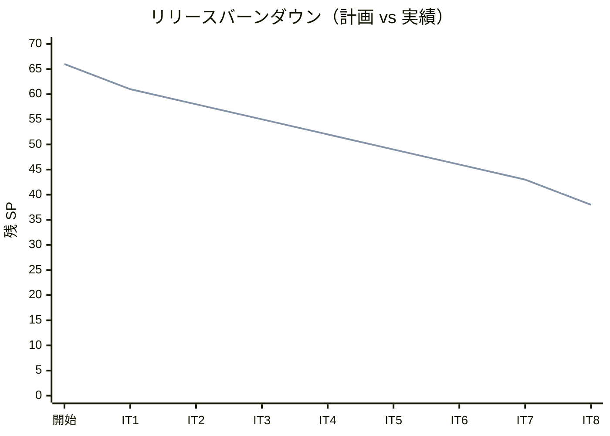
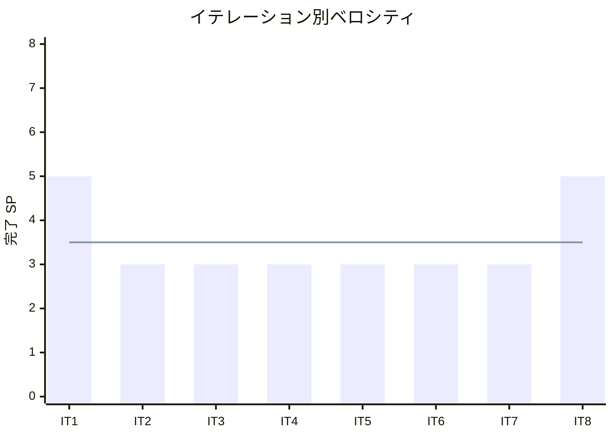

# イテレーション 8 完了報告書

## プロジェクト概要

| 項目 | 内容 |
|------|------|
| **イテレーション** | 8 |
| **ゴール** | C 版を Python 版から展開し、TDD で実装する |
| **対象ストーリー** | US-008: C 版を Python 版から展開する |
| **計画 SP** | 5 |
| **実績 SP** | 5 |
| **達成率** | 100% |

### 日程

| 項目 | 日付 |
|------|------|
| 計画期間 | Week 15-16（2 週間） |
| 実績開始日 | 2026-04-12 |
| 実績終了日 | 2026-04-12 |

### 要員

| 名前 | 予定作業日数 | 実績作業日数 |
|------|------------|------------|
| 開発者 + AI | 10 日 | 1 日（AI 支援により大幅短縮） |

---

## 指標

### ベロシティ

| 指標 | 値 |
|------|-----|
| 計画 SP | 5 |
| 実績 SP | 5 |
| 達成率 | 100% |
| 累計完了 SP | 28 / 66 |
| 残 SP | 38 |

### バーンダウンチャート

### ベロシティチャート

**平均ベロシティ**: 3.5 SP / イテレーション（IT1-IT8 実績平均）

### テスト品質

| 指標 | 値 |
|------|-----|
| テスト件数（C 版） | 204 |
| テスト通過率 | 100%（204 / 204） |
| テストフレームワーク | カスタムアサートマクロ（test_helper.h） |
| C 規格 | C99 |
| メモリ安全性 | AddressSanitizer 確認済み |

### テスト増分

| イテレーション | テスト件数 | 増分 |
|---------------|----------|------|
| IT7（Go 版） | 60 | - |
| IT8（C 版） | 204 | +204 |

### テスト累計推移

| イテレーション | 言語 | テスト件数 | 累計 |
|---------------|------|----------|------|
| IT1 | Python | 39 | 39 |
| IT2 | TypeScript | 47 | 86 |
| IT3 | Java | 51 | 137 |
| IT4 | C# | 42 | 179 |
| IT5 | Ruby | 56 | 235 |
| IT6 | PHP | 145 | 380 |
| IT7 | Go | 60 | 440 |
| IT8 | C | 204 | 644 |

---

## 成果物

### 作成ファイル一覧

#### 実装（apps/c/）

| ファイル | 内容 | テスト数 |
|---------|------|---------|
| chapter01/basic_algorithms.c | 最大値・中央値・条件判定・繰り返し・パターン | 17 |
| chapter02/arrays.c | 配列操作・基数変換・素数列挙 | 13 |
| chapter03/search.c | 線形探索（3 種）・二分探索・チェイン法・オープンアドレス法 | 22 |
| chapter04/stack_queue.c | 固定長スタック（Find/Count/Clear 付き）・リングバッファキュー | 25 |
| chapter05/recursion.c | 階乗・GCD・再帰和・ハノイ・迷路・8 王妃問題（3 種） | 14 |
| chapter06/sort.c | バブル・選択・挿入・シェル・クイック・マージ・ヒープ・度数ソート | 51 |
| chapter07/strings.c | BF 法・KMP 法・BM 法・文字数カウント・逆順・回文判定 | 11 |
| chapter08/linked_list.c | 単方向リスト（Clear 付き）・双方向リスト・配列カーソル版 | 21 |
| chapter09/tree.c | BST（Min/Max/走査 3 種）・最小ヒープ | 30 |

**合計**: 実装 9 + ヘッダ 9 + テスト 9 + Makefile 1 + test_helper.h 1 = 29 ファイル、204 テスト

#### 記事（docs/article/c/）

| ファイル | 内容 |
|---------|------|
| index.md | C 版概要・Python との比較表・環境構築手順 |
| 01-basic-algorithms.md | 基本的なアルゴリズム |
| 02-arrays.md | 配列 |
| 03-search-algorithms.md | 探索アルゴリズム |
| 04-stacks-and-queues.md | スタックとキュー |
| 05-recursion.md | 再帰アルゴリズム |
| 06-sort-algorithms.md | ソートアルゴリズム |
| 07-strings.md | 文字列処理 |
| 08-linked-lists.md | リスト |
| 09-trees.md | 木構造 |

**合計**: 記事 10 ファイル

#### インフラ・設定

| ファイル | 内容 |
|---------|------|
| apps/c/Makefile | `make test`（AddressSanitizer 付き C99 コンパイル） |
| apps/c/test_helper.h | カスタムアサートマクロ（外部フレームワーク不要） |
| .github/workflows/ci-c.yml | CI ワークフロー（Nix devShell 経由 `make test`） |

**IT-8 総作成ファイル数**: 実装 9 + ヘッダ 9 + テスト 9 + 記事 10 + CI 1 + Makefile 1 + test_helper.h 1 = **39 ファイル**

---

## 実施内容と評価

### ストーリー別完了状況

| ストーリー | 結果 | 計画 SP | 実績 SP |
|-----------|------|---------|---------|
| US-008: C 版を Python 版から展開する | ✅ 完了 | 5 | 5 |
| **合計** | | **5** | **5** |

### US-008 受入条件の達成状況

1. [x] 全 9 章が Python 版を基に C 版として再構成されている
2. [x] 各章に TDD のコード例（テスト → 実装 → リファクタリング）が含まれている
3. [x] `apps/c/` で全テストがパスする（204 テスト全通過）
4. [x] AddressSanitizer によるメモリ安全性が確認されている
5. [x] CI ワークフロー（ci-c.yml）が整備されている

### Definition of Done チェック

- [x] `apps/c/` の全テストがパス（`make test`）
- [x] 全 9 章 + index.md が作成されている
- [x] mkdocs.yml の nav に C 版全 9 章が追加されている
- [ ] ローカルプレビューで表示確認済み（`mkdocs serve` 未実施 — IT-9 で対応予定）
- [x] 各章のコード例が実装コードと同期している
- [x] AddressSanitizer でメモリ安全性確認済み

---

## 追加タスク（SP 外）

### Go 版記事の全面書き直し

IT-8 の作業中に Go 版記事（07〜09 章）の記述量不足が発覚し、Python 版の構成・詳細度に準拠した全面書き直しを実施した。

| ファイル | 追加行数 |
|---------|---------|
| docs/article/go/07-strings.md | 約 1,200 行追加 |
| docs/article/go/08-linked-lists.md | 約 1,759 行追加 |
| docs/article/go/09-trees.md | 約 1,800 行追加 |
| **合計** | **約 4,759 行追加** |

**内容**: ブルートフォース/KMP/BM 法の詳細フローチャート、Go 文字列基本操作、双方向リスト構造図、BST 全操作フローチャート、ヒープ状態遷移、Python との比較表などを追加。

---

## フェーズ・累計進捗

### フェーズ別進捗

| フェーズ | 内容 | SP | 完了 SP | 進捗 |
|---------|------|-----|---------|------|
| Phase 1 | Python 原本 + OOP 言語展開（6 言語） | 20 | 20 | 100% ✅ |
| Phase 2 | システム言語 + 関数型言語展開（8 言語） | 38 | 8 | 21.1% 🔄 |
| Phase 3 | 多言語統合解説 | 8 | 0 | 0% |
| **合計** | | **66** | **28** | **42.4%** |

### イテレーション別進捗

| イテレーション | 言語 | 計画 SP | 実績 SP | 達成率 |
|---------------|------|---------|---------|--------|
| IT1 | Python（原本） | 5 | 5 | 100% |
| IT2 | TypeScript | 3 | 3 | 100% |
| IT3 | Java | 3 | 3 | 100% |
| IT4 | C# | 3 | 3 | 100% |
| IT5 | Ruby | 3 | 3 | 100% |
| IT6 | PHP | 3 | 3 | 100% |
| IT7 | Go | 3 | 3 | 100% |
| IT8 | C | 5 | 5 | 100% |
| **累計** | | **28** | **28** | **100%** |

---

## ふりかえりへのリンク

詳細は [イテレーション 8 ふりかえり](./retrospective-8.md) を参照。

---

## 更新履歴

| 日付 | 更新内容 | 更新者 |
|------|---------|--------|
| 2026-04-12 | 初版作成 | - |
