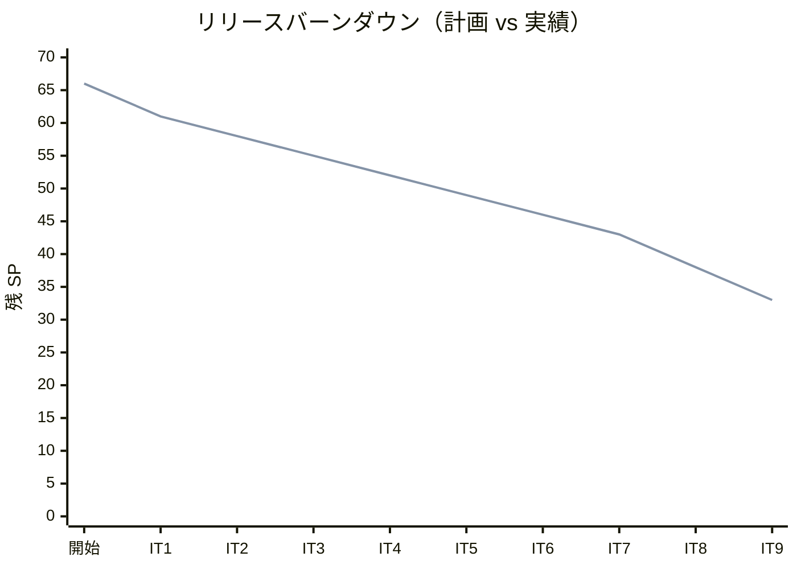
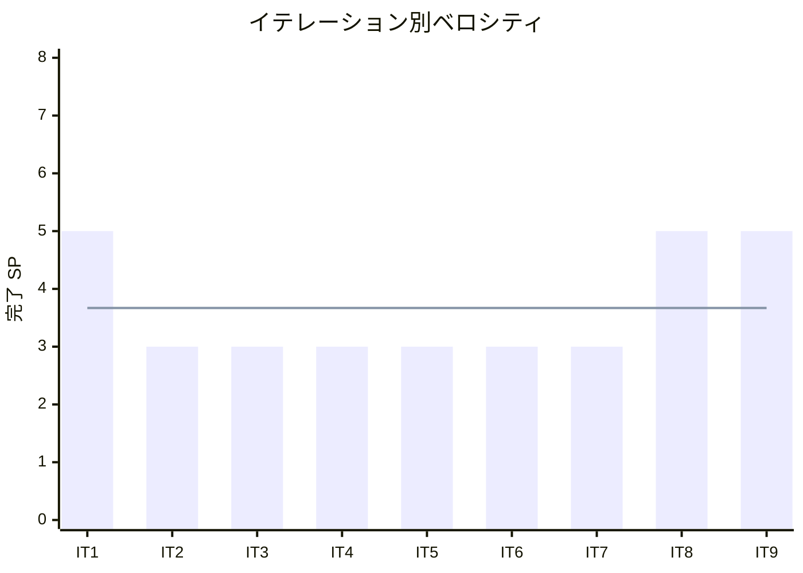

# イテレーション 9 完了報告書

## プロジェクト概要

| 項目 | 内容 |
|------|------|
| **イテレーション** | 9 |
| **ゴール** | Rust 版を Python 版から展開し、TDD で実装する |
| **対象ストーリー** | US-009: Rust 版を Python 版から展開する |
| **計画 SP** | 5 |
| **実績 SP** | 5 |
| **達成率** | 100% |

### 日程

| 項目 | 日付 |
|------|------|
| 計画期間 | Week 17-18（2 週間） |
| 実績開始日 | 2026-04-12 |
| 実績終了日 | 2026-04-12 |

### 要員

| 名前 | 予定作業日数 | 実績作業日数 |
|------|------------|------------|
| 開発者 + AI | 10 日 | 1 日（AI 支援により大幅短縮） |

---

## 指標

### ベロシティ

| 指標 | 値 |
|------|-----|
| 計画 SP | 5 |
| 実績 SP | 5 |
| 達成率 | 100% |
| 累計完了 SP | 33 / 66 |
| 残 SP | 33 |

### バーンダウンチャート

### ベロシティチャート

**平均ベロシティ**: 3.67 SP / イテレーション（IT1-IT9 実績平均）

### テスト品質

| 指標 | 値 |
|------|-----|
| テスト件数（Rust 版） | 285 |
| テスト通過率 | 100%（285 / 285） |
| テストフレームワーク | `#[cfg(test)] mod tests`（Rust 標準） |
| Rust エディション | 2021 |
| 所有権モデル | `Box<T>` + `Option<T>` による安全なメモリ管理 |

### テスト増分

| イテレーション | テスト件数 | 増分 |
|---------------|----------|------|
| IT8（C 版） | 204 | - |
| IT9（Rust 版） | 285 | +285 |

### テスト累計推移

| イテレーション | 言語 | テスト件数 | 累計 |
|---------------|------|----------|------|
| IT1 | Python | 39 | 39 |
| IT2 | TypeScript | 47 | 86 |
| IT3 | Java | 51 | 137 |
| IT4 | C# | 42 | 179 |
| IT5 | Ruby | 56 | 235 |
| IT6 | PHP | 145 | 380 |
| IT7 | Go | 60 | 440 |
| IT8 | C | 204 | 644 |
| IT9 | Rust | 285 | 929 |

---

## 成果物

### 作成ファイル一覧

#### 実装（apps/rust/）

| ファイル | 内容 | テスト数 |
|---------|------|---------|
| chapter01/src/lib.rs | 最大値・中央値・条件判定・繰り返し・パターン | 25 |
| chapter02/src/lib.rs | 配列操作・基数変換・素数列挙 | 17 |
| chapter03/src/lib.rs | 線形探索（3 種）・二分探索・チェイン法・オープンアドレス法 | 29 |
| chapter04/src/lib.rs | 固定長スタック（Find/Count/Clear 付き）・リングバッファキュー | 31 |
| chapter05/src/lib.rs | 階乗・GCD・再帰和・ハノイ・迷路・8 王妃問題（3 種） | 23 |
| chapter06/src/lib.rs | バブル・選択・挿入・シェル・クイック・マージ・ヒープ・度数ソート | 46 |
| chapter07/src/lib.rs | BF 法・KMP 法・BM 法・文字数カウント・逆順・回文判定 | 29 |
| chapter08/src/lib.rs | 単方向リスト・双方向リスト・配列カーソル版 | 40 |
| chapter09/src/lib.rs | BST（Min/Max/走査 3 種）・最小ヒープ | 32 |

**合計**: lib.rs 9 + Cargo.toml 10（ワークスペース 1 + 章別 9）= 19 ファイル、285 テスト

#### 記事（docs/article/rust/）

| ファイル | 内容 |
|---------|------|
| index.md | Rust 版概要・Python との比較表・環境構築手順 |
| 01-basic-algorithms.md | 基本的なアルゴリズム |
| 02-arrays.md | 配列 |
| 03-search-algorithms.md | 探索アルゴリズム |
| 04-stacks-and-queues.md | スタックとキュー |
| 05-recursion.md | 再帰アルゴリズム |
| 06-sort-algorithms.md | ソートアルゴリズム |
| 07-strings.md | 文字列処理 |
| 08-linked-lists.md | リスト |
| 09-trees.md | 木構造 |

**合計**: 記事 10 ファイル

#### インフラ・設定

| ファイル | 内容 |
|---------|------|
| apps/rust/.gitignore | `target/` 等のビルド成果物除外 |
| .github/workflows/ci-rust.yml | CI ワークフロー（`cargo test`） |

**IT-9 総作成ファイル数**: Cargo.toml 10 + lib.rs 9 + 記事 10 + CI 1 + .gitignore 1 = **31 ファイル**

---

## 実施内容と評価

### ストーリー別完了状況

| ストーリー | 結果 | 計画 SP | 実績 SP |
|-----------|------|---------|---------|
| US-009: Rust 版を Python 版から展開する | 完了 | 5 | 5 |
| **合計** | | **5** | **5** |

### US-009 受入条件の達成状況

1. [x] 全 9 章が Python 版を基に Rust 版として再構成されている
2. [x] 各章に TDD のコード例（テスト → 実装 → リファクタリング）が含まれている
3. [x] `apps/rust/` で全テストがパスする（285 テスト全通過）
4. [x] 所有権モデル（`Box<T>`・`Option<T>`）を活用したメモリ安全な実装

### Definition of Done チェック

- [x] `apps/rust/` の全テストがパス（`cargo test`）
- [x] 全 9 章 + index.md が作成されている
- [x] mkdocs.yml の nav に Rust 版全 9 章が追加されている
- [x] ローカルプレビューで表示確認済み（`mkdocs serve`）
- [x] 各章のコード例が実装コードと同期している
- [x] Python 版との記事記述量差分が 30% 以内
- [x] 所有権モデルの設計指針に準拠した実装

---

## 追加タスク（SP 外）

なし

---

## フェーズ・累計進捗

### フェーズ別進捗

| フェーズ | 内容 | SP | 完了 SP | 進捗 |
|---------|------|-----|---------|------|
| Phase 1 | Python 原本 + OOP 言語展開（6 言語） | 20 | 20 | 100% |
| Phase 2 | システム言語 + 関数型言語展開（8 言語） | 38 | 13 | 34.2% |
| Phase 3 | 多言語統合解説 | 8 | 0 | 0% |
| **合計** | | **66** | **33** | **50.0%** |

### イテレーション別進捗

| イテレーション | 言語 | 計画 SP | 実績 SP | 達成率 |
|---------------|------|---------|---------|--------|
| IT1 | Python（原本） | 5 | 5 | 100% |
| IT2 | TypeScript | 3 | 3 | 100% |
| IT3 | Java | 3 | 3 | 100% |
| IT4 | C# | 3 | 3 | 100% |
| IT5 | Ruby | 3 | 3 | 100% |
| IT6 | PHP | 3 | 3 | 100% |
| IT7 | Go | 3 | 3 | 100% |
| IT8 | C | 5 | 5 | 100% |
| IT9 | Rust | 5 | 5 | 100% |
| **累計** | | **33** | **33** | **100%** |

---

## ふりかえりへのリンク

詳細は [イテレーション 9 ふりかえり](./retrospective-9.md) を参照。

---

## 更新履歴

| 日付 | 更新内容 | 更新者 |
|------|---------|--------|
| 2026-04-12 | 初版作成 | - |
