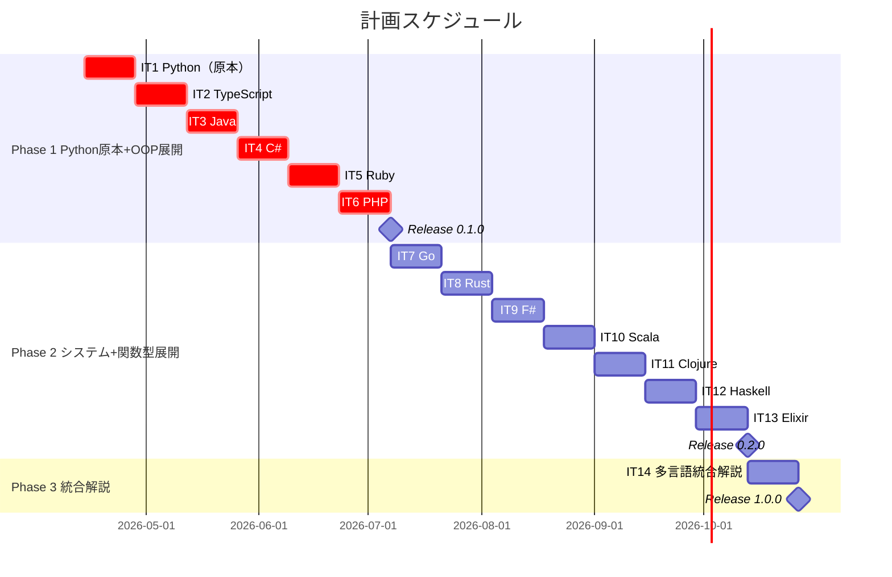
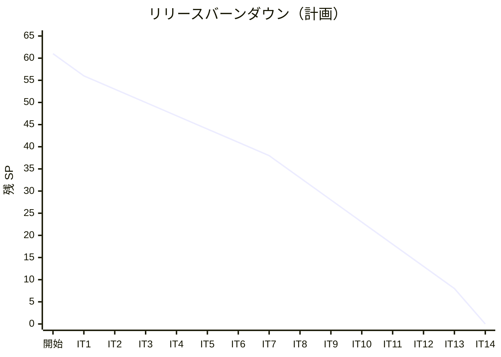

# リリース計画 - アルゴリズムから始めるプログラミング入門

## 概要

本ドキュメントは、「アルゴリズムから始めるプログラミング入門」記事シリーズのリリース計画を定義します。

### プロジェクト情報

| 項目 | 内容 |
|------|------|
| **プロジェクト名** | アルゴリズムから始めるプログラミング入門 |
| **目的** | アルゴリズムとデータ構造を 13 言語で TDD しながら学べる記事シリーズの執筆 |
| **対象ユーザー** | プログラミング基礎を持つ学習者、多言語比較に興味のある開発者 |
| **開発チーム** | AI ペアプログラミング（1 名 + AI） |

---

## 満足条件

### スコープ

Wiki 記事のうち最も完成度の高い Python 版を原本として作成し、Python 版を基に 12 言語へ多言語展開する。

| フェーズ | 内容 | 言語数 | ストーリー数 |
|---------|------|--------|-------------|
| Phase 1 | Python 原本作成 + OOP 言語展開 | 6 | 6 |
| Phase 2 | システム言語 + 関数型言語展開 | 7 | 7 |
| Phase 3 | 多言語統合解説 | - | 1 |
| **合計** | | **13 + 統合** | **14** |

### スケジュール

- **開発期間**: 28 週間（7 ヶ月）
- **イテレーション**: 2 週間 × 14
- **リリース**: 3 段階リリース（Phase 1 → Phase 2 → Phase 3）

### リソース

- **開発者**: 1 名 + AI
- **想定稼働時間**: 週 10-15 時間

---

## ユーザーストーリー一覧とストーリーポイント

### 優先順位マトリックス

4 軸評価で優先順位を決定:

1. **金銭価値（BV）**: 読者にとっての学習価値
2. **コスト（C）**: 執筆・実装コスト
3. **知識習得（KA）**: 執筆者の技術的学習価値
4. **リスク軽減（RR）**: テンプレート確立・リスク軽減効果

### ストーリーポイント基準

| SP | 基準 |
|----|------|
| 3 | Wiki 既存言語の移行（参照記事あり、コード例の言語変換のみ） |
| 5 | 新規言語の執筆（参照記事なし、ゼロから執筆 + 実装） |
| 8 | 統合解説の執筆（12 言語横断比較、図表作成） |

### Phase 1: Python 原本 + OOP 言語展開（イテレーション 1-6）

Python 原本を最初に作成し、構造的に類似する OOP 言語へ展開する。

| ID | ユーザーストーリー | SP | BV | C | KA | RR | 優先度 |
|----|-------------------|----|----|---|----|----|--------|
| US-001 | Python 版（原本）の全 9 章を執筆・実装する | 5 | 高 | 中 | 中 | 高 | 必須 |
| US-002 | TypeScript 版を Python 版から展開する | 3 | 高 | 低 | 中 | 中 | 必須 |
| US-003 | Java 版を Python 版から展開する | 3 | 高 | 低 | 低 | 低 | 必須 |
| US-004 | C# 版を Python 版から展開する | 3 | 中 | 低 | 中 | 低 | 必須 |
| US-005 | Ruby 版を Python 版から展開する | 3 | 中 | 低 | 中 | 低 | 必須 |
| US-006 | PHP 版を Python 版から展開する | 3 | 中 | 低 | 低 | 低 | 必須 |
| **合計** | | **20** | | | | | |

### Phase 2: システム言語 + 関数型言語展開（イテレーション 7-12）

言語固有の設計判断が必要な言語群を展開する。Wiki 記事は補助参照として活用。

| ID | ユーザーストーリー | SP | BV | C | KA | RR | 優先度 |
|----|-------------------|----|----|---|----|----|--------|
| US-007 | Go 版を Python 版から展開する | 3 | 高 | 低 | 中 | 低 | 必須 |
| US-008 | Rust 版を Python 版から展開する | 5 | 高 | 高 | 高 | 低 | 必須 |
| US-009 | F# 版を Python 版から展開する | 5 | 中 | 中 | 高 | 低 | 中 |
| US-010 | Scala 版を Python 版から展開する | 5 | 中 | 中 | 高 | 低 | 中 |
| US-011 | Clojure 版を Python 版から展開する | 5 | 中 | 中 | 高 | 低 | 中 |
| US-012 | Haskell 版を Python 版から展開する | 5 | 中 | 高 | 高 | 低 | 中 |
| US-013 | Elixir 版を Python 版から展開する | 5 | 中 | 中 | 高 | 低 | 中 |
| **合計** | | **33** | | | | | |

### Phase 3: 多言語統合解説（イテレーション 14）

| ID | ユーザーストーリー | SP | BV | C | KA | RR | 優先度 |
|----|-------------------|----|----|---|----|----|--------|
| US-014 | 多言語統合解説（13 言語横断比較）を執筆する | 8 | 高 | 高 | 高 | 低 | 中 |
| **合計** | | **8** | | | | | |

### 全体サマリー

| フェーズ | ストーリーポイント | イテレーション |
|---------|-------------------|---------------|
| Phase 1 | 20 SP | 1-6 |
| Phase 2 | 33 SP | 7-13 |
| Phase 3 | 8 SP | 14 |
| **合計** | **61 SP** | 14 イテレーション |

---

## ベロシティ見積もり

### 初期ベロシティ推定

| 項目 | 値 |
|------|-----|
| **イテレーション期間** | 2 週間 |
| **チーム規模** | 1 名 + AI |
| **想定ベロシティ** | 5-8 SP/イテレーション |
| **バッファ係数** | 0.8（20% バッファ） |
| **実効ベロシティ** | 4-6 SP/イテレーション |

### 基準ストーリー

**US-001（Python 原本）** を基準ストーリーとする。

- Wiki 記事は存在するが、原本として最も丁寧に執筆する必要がある
- テストコードの実装、記事との同期確認を含む
- 5 SP = 2 週間（1 イテレーション）で完了見込み

### ベロシティ検証計画

- イテレーション 1-3 の実績で初期ベロシティを検証
- 移行（3 SP）と新規（5 SP）のコスト差を実測
- イテレーション 3 終了後にリリース計画を再調整

---

## 段階的リリース戦略

### リリーススケジュール

#### 計画スケジュール

### リリース内容

#### Release 0.1.0（Phase 1 完了）: Python 原本 + OOP 言語版

**目標**: Python 原本と OOP 系 5 言語への展開を完了

**含まれる機能**:

- Python 版（原本）全 9 章
- TypeScript 版全 9 章（Python から展開）
- Java 版全 9 章（Python から展開）
- C# 版全 9 章（Python から展開）
- Ruby 版全 9 章（Python から展開）
- PHP 版全 9 章（Python から展開）
- 各言語の TDD 実装コード（apps/）

**リリース条件**:

- [ ] 全 6 言語 × 9 章 = 54 章ファイルが完成
- [ ] 各言語のテストが全てパス
- [ ] MkDocs でローカルプレビュー確認済み
- [ ] mkdocs.yml の nav が更新済み

#### Release 0.2.0（Phase 2 完了）: 12 言語完全版

**目標**: システム言語・関数型言語への展開を完了し、12 言語版を公開

**含まれる機能**:

- Go 版全 9 章（Python から展開）
- Rust 版全 9 章（Python から展開）
- F# 版全 9 章（Python から展開）
- Scala 版全 9 章（Python から展開）
- Clojure 版全 9 章（Python から展開）
- Haskell 版全 9 章（Python から展開）
- Elixir 版全 9 章（Python から展開）

**リリース条件**:

- [ ] 全 13 言語 × 9 章 = 117 章ファイルが完成
- [ ] 各言語のテストが全てパス
- [ ] MkDocs でローカルプレビュー確認済み

#### Release 1.0.0（Phase 3 完了）: 統合解説付き完成版

**目標**: 多言語統合解説を追加し、シリーズ完成

**含まれる機能**:

- 多言語統合解説（13 言語横断比較）
- 章ごとのアルゴリズム比較解説
- 言語パラダイム別の設計アプローチ比較

**リリース条件**:

- [ ] 統合解説の全章が完成
- [ ] 全内部リンクが正常に動作
- [ ] MkDocs ビルド・デプロイ完了

---

## バッファ戦略

### フィーチャバッファ

| フェーズ | 計画 SP | バッファ（30%） | 実効 SP |
|---------|---------|-----------------|---------|
| Phase 1 | 20 | 6 | 14 |
| Phase 2 | 33 | 10 | 23 |
| Phase 3 | 8 | 2 | 6 |

### スケジュールバッファ

- **予備イテレーション**: 2 イテレーション（4 週間）
- **全体バッファ**: 15%（14 + 2 = 16 イテレーション = 32 週間）

### バッファ消費ルール

1. フィーチャバッファを先に消費（低優先度言語の後回し）
2. Phase 2 の言語順序を入れ替えて効率化
3. スケジュールバッファは最後の手段

---

## イテレーション計画概要

### イテレーション 1（Week 1-2）

**ゴール**: Python 原本の全 9 章を執筆・実装する

**主なタスク**:

- [ ] Python プロジェクト初期化（apps/python/）
- [ ] Wiki 記事の移行・再構成（9 章）
- [ ] TDD 実装と記事の同期確認
- [ ] mkdocs.yml に Python 記事を追加

**目標 SP**: 5

### イテレーション 2（Week 3-4）

**ゴール**: TypeScript 版を Python 版から展開する

**主なタスク**:

- [ ] TypeScript プロジェクト初期化（apps/node/）
- [ ] Python 版を基に TypeScript 版 9 章を執筆
- [ ] TDD 実装と記事の同期確認

**目標 SP**: 3

### イテレーション 3（Week 5-6）

**ゴール**: Java 版を Python 版から展開する

**主なタスク**:

- [ ] Java プロジェクト初期化（apps/java/）
- [ ] Python 版を基に Java 版 9 章を執筆
- [ ] TDD 実装と記事の同期確認
- [ ] ベロシティ検証・リリース計画再調整

**目標 SP**: 3

### イテレーション 4（Week 7-8）

**ゴール**: C# 版を Python 版から展開する

**目標 SP**: 3

### イテレーション 5（Week 9-10）

**ゴール**: Ruby 版を Python 版から展開する

**目標 SP**: 3

### イテレーション 6（Week 11-12）

**ゴール**: PHP 版を Python 版から展開する

**目標 SP**: 3

### イテレーション 7-12（Week 13-24）

**ゴール**: システム言語・関数型言語（Go, Rust, F#, Scala, Clojure, Haskell, Elixir）を Python 版から順次展開

**目標 SP**: Go 3 SP、他 各 5 SP

### イテレーション 14（Week 27-28）

**ゴール**: 多言語統合解説を執筆する

**目標 SP**: 8

---

## リスク管理

### 技術リスク

| リスク | 影響度 | 発生確率 | 対策 |
|--------|--------|----------|------|
| 言語固有のデータ構造が書籍のアルゴリズムと合わない | 中 | 中 | 各言語のイディオムに合わせた実装方針を事前に検討 |
| Nix 環境で特定言語のビルドが失敗する | 低 | 中 | Docker フォールバック環境を準備 |
| 関数型言語でのミュータブルなデータ構造の扱い | 中 | 高 | 永続データ構造やイミュータブル版の実装方針を定義 |

### スケジュールリスク

| リスク | 影響度 | 発生確率 | 対策 |
|--------|--------|----------|------|
| 新規言語の執筆が想定より時間がかかる | 高 | 中 | Phase 1 のベロシティで Phase 2 を再見積もり |
| 統合解説の執筆が大規模になる | 中 | 高 | 章ごとに分割して段階的に執筆 |

---

## 進捗管理

### メトリクス

| メトリクス | 目標 |
|-----------|------|
| ベロシティ | 4-6 SP/イテレーション |
| 章ファイル完成率 | 100%（117 + 統合解説） |
| テスト通過率 | 100% |
| 予定達成率 | 90% 以上 |

### 進捗状況

| イテレーション | 言語 | 計画 SP | 実績 SP | 達成率 | 状態 |
|---------------|------|---------|---------|--------|------|
| 1 | Python（原本） | 5 | - | - | 未着手 |
| 2 | TypeScript | 3 | - | - | 未着手 |
| 3 | Java | 3 | - | - | 未着手 |
| 4 | C# | 3 | - | - | 未着手 |
| 5 | Ruby | 3 | - | - | 未着手 |
| 6 | PHP | 3 | - | - | 未着手 |
| 7 | Go | 3 | - | - | 未着手 |
| 8 | Rust | 5 | - | - | 未着手 |
| 9 | F# | 5 | - | - | 未着手 |
| 10 | Scala | 5 | - | - | 未着手 |
| 11 | Clojure | 5 | - | - | 未着手 |
| 12 | Haskell | 5 | - | - | 未着手 |
| 13 | Elixir | 5 | - | - | 未着手 |
| 14 | 統合解説 | 8 | - | - | 未着手 |

### バーンダウンチャート

---

## 次のステップ

1. イテレーション 1 計画の詳細作成（Python 原本）
2. Python プロジェクト初期化（apps/python/）
3. Wiki 記事の Python 版を移行開始

---

## 更新履歴

| 日付 | 更新内容 | 更新者 |
|------|---------|--------|
| 2026-04-10 | 初版作成 | - |
| 2026-04-11 | Elixir を対象言語に追加（13 言語体制、14 イテレーション、61 SP） | - |
