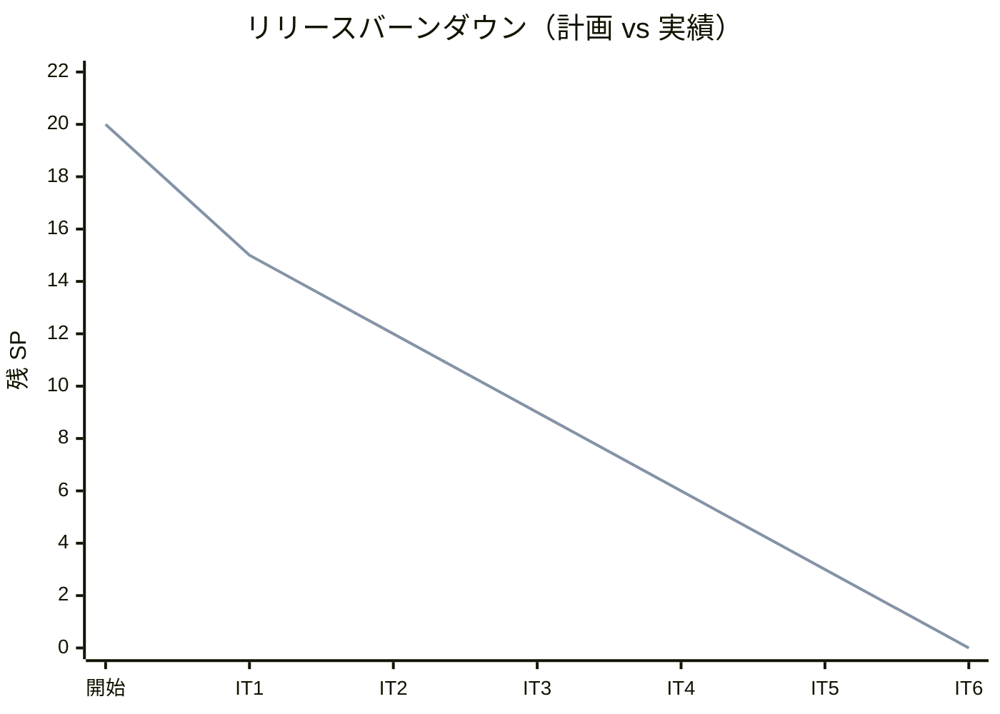
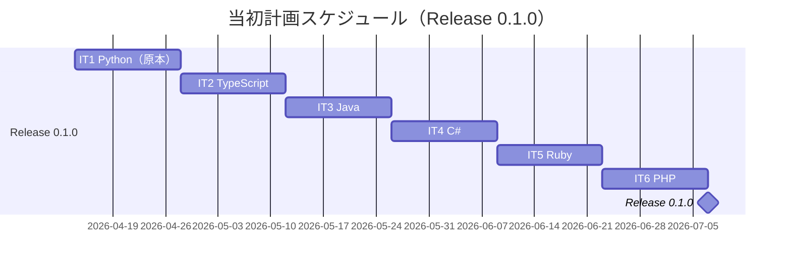
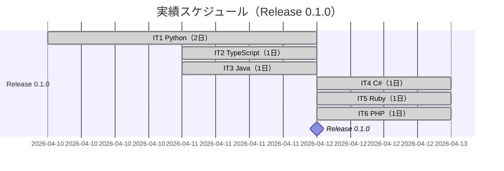
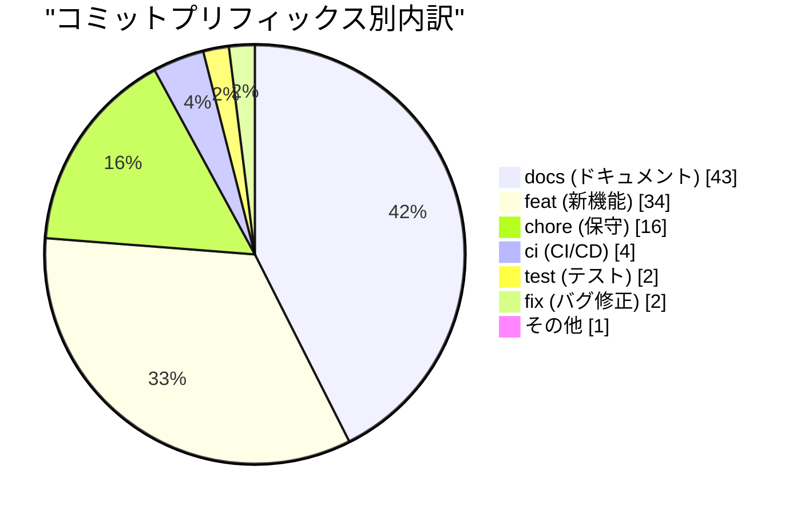
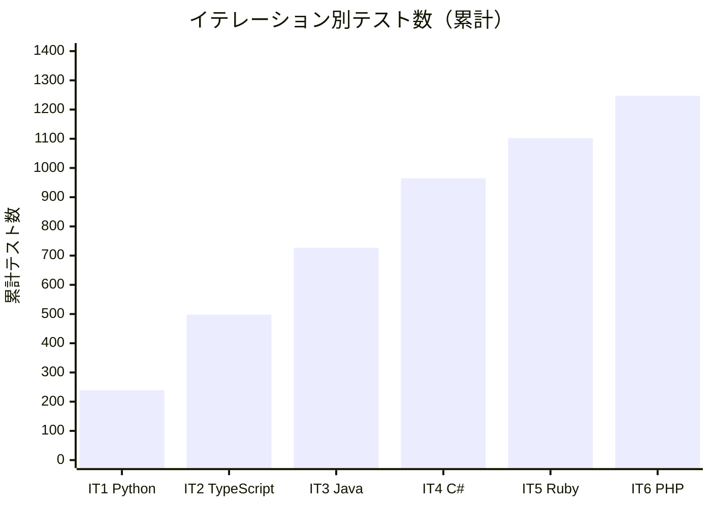
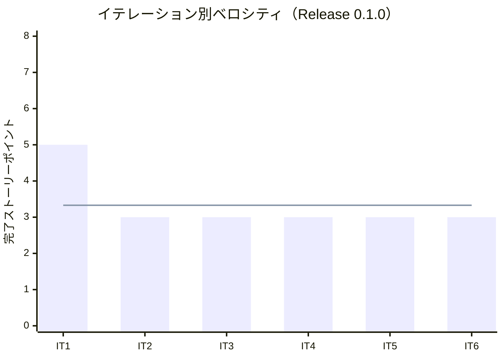

# リリース完了報告書 0.1.0 - アルゴリズムから始めるプログラミング入門

**報告書作成日**: 2026-04-12

## 概要

アルゴリズムから始めるプログラミング入門 v0.1.0 のリリース完了報告書です。全 6 イテレーション、20 ストーリーポイントを 100% 達成し、Phase 1（Python 原本 + OOP 言語展開）を完了しました。

---

## プロジェクトサマリー

| 項目 | 値 |
|------|-----|
| **プロジェクト期間** | 2026-04-10 〜 2026-04-12 (約 3 日間) |
| **総イテレーション数** | 6 |
| **総ストーリーポイント** | 20 SP |
| **総コミット数** | 102 |
| **総テスト数** | 1,247 |
| **ユーザーストーリー数** | 6 |

---

## 計画と実績の差異分析

### イテレーション別達成状況

| イテレーション | リリース | 計画 SP | 実績 SP | 達成率 | 差異 |
|---------------|---------|---------|---------|--------|------|
| IT1 | Release 0.1.0 | 5 | 5 | 100% | 0 |
| IT2 | Release 0.1.0 | 3 | 3 | 100% | 0 |
| IT3 | Release 0.1.0 | 3 | 3 | 100% | 0 |
| IT4 | Release 0.1.0 | 3 | 3 | 100% | 0 |
| IT5 | Release 0.1.0 | 3 | 3 | 100% | 0 |
| IT6 | Release 0.1.0 | 3 | 3 | 100% | 0 |
| **合計** | | **20** | **20** | **100%** | **0** |

### リリース別達成状況

| リリース | 内容 | 計画 SP | 実績 SP | 達成率 |
|---------|------|---------|---------|--------|
| Release 0.1.0 Python 原本 + OOP 言語版 | Phase 1（6 言語 × 9 章） | 20 | 20 | 100% |

### リリースバーンダウン（Release 0.1.0）

**分析結果**: 全 6 イテレーションで計画通り 100% 達成。バーンダウンは計画線と実績線が完全に一致しており、スコープの変更なしで安定して消化できた。

---

## 計画日程 vs 実績日数の差異分析

### イテレーション別日程比較

| IT | 計画期間 | 計画日数 | 実績期間 | 実績日数 | 短縮日数 | 短縮率 |
|----|---------|---------|----------|---------|---------|--------|
| 1 | Week 1-2 | 14 日 | 2026-04-10〜11 | **2 日** | 12 日 | 85.7% |
| 2 | Week 3-4 | 14 日 | 2026-04-11〜11 | **1 日** | 13 日 | 92.9% |
| 3 | Week 5-6 | 14 日 | 2026-04-11〜11 | **1 日** | 13 日 | 92.9% |
| 4 | Week 7-8 | 14 日 | 2026-04-12〜12 | **1 日** | 13 日 | 92.9% |
| 5 | Week 9-10 | 14 日 | 2026-04-12〜12 | **1 日** | 13 日 | 92.9% |
| 6 | Week 11-12 | 14 日 | 2026-04-12〜12 | **1 日** | 13 日 | 92.9% |
| **合計** | **Week 1-12** | **84 日** | **2026-04-10〜12** | **7 日** | **77 日** | **91.7%** |

### 工期短縮の可視化

```mermaid
xychart-beta
    title "計画日数 vs 実績日数"
    x-axis ["IT1", "IT2", "IT3", "IT4", "IT5", "IT6"]
    y-axis "日数" 0 --> 16
    bar "計画" [14, 14, 14, 14, 14, 14]
    bar "実績" [2, 1, 1, 1, 1, 1]
```

### 計画 vs 実績ガントチャート

#### 当初計画スケジュール

#### 実績スケジュール

### サマリー

| 指標 | 値 |
|------|-----|
| **計画総日数** | 84 日 |
| **実績総日数** | 7 日 |
| **短縮日数** | 77 日 |
| **短縮率** | **91.7%** |
| **効率倍率** | **12.0 倍** |

### 差異分析

1. **AI ペアプログラミングによる大幅な工期短縮**: 計画 84 日に対し実績 7 日（91.7% 短縮）。AI 支援により Python 版テンプレートからの言語変換が高速化された。
2. **IT-1 のみ 2 日**: 原本作成は記事の補完・実装の追加が必要で他 IT の約 2 倍の工数がかかったが、それでも計画の 1/7 で完了。
3. **IT-2〜6 はすべて 1 日**: 展開言語（TypeScript / Java / C# / Ruby / PHP）は Python 版テンプレートを基に 1 日で完了。予想ベロシティ 5-8 SP/IT を大幅に上回る実績となった。

### 工期短縮の要因分析

| 要因 | 説明 |
|------|------|
| AI ペアプログラミング | Python 版を参照しながら AI が言語変換を高速実行。記事・テスト・実装の 3 点セットを同日完結できた |
| Python 原本の質 | 原本の記述品質が高く、言語変換の方針が明確。差分チェックリストを活用し品質を担保しつつ高速展開 |
| Nix devShell 環境 | 各言語の開発環境（Java・C#・Ruby・PHP）を Nix で統一管理。環境構築の手間を排除 |
| テンプレート確立 | IT-1 で記事・テスト・実装のテンプレートを確立し、IT-2 以降で再利用 |

---

## コミットログ分析

### コミットプリフィックス別内訳

| プリフィックス | 件数 | 割合 | 説明 |
|---------------|------|------|------|
| docs | 43 | 42.2% | ドキュメント・記事更新 |
| feat | 34 | 33.3% | 新機能追加（実装コード） |
| chore | 16 | 15.7% | 保守作業（mkdocs.yml・設定更新） |
| ci | 4 | 3.9% | CI/CD 改善（GitHub Actions） |
| test | 2 | 2.0% | テスト追加 |
| fix | 2 | 2.0% | バグ修正 |
| その他 | 1 | 1.0% | 初期コミット等 |
| **合計** | **102** | **100%** | |

### コミットプリフィックス別パイチャート

### 分析

1. **docs + feat で全体の 75.5%**: 記事執筆（docs）と実装（feat）が主体のプロジェクト特性を反映。コンテンツ制作と技術実装が均衡している。
2. **chore 15.7%**: mkdocs.yml の更新や言語別 CI 追加など、各イテレーションの仕上げ作業が継続的に発生した。
3. **test・fix はわずか 4%**: TDD サイクルにより実装前のテスト作成が定着し、後付けテストや修正コミットが最小化された。

---

## 品質メトリクス

### テストカバレッジ

| 対象 | 目標 | 実績 | 判定 |
|------|------|------|------|
| Python | 95%+ | 99% | ✅ |
| TypeScript | 95%+ | 100% | ✅ |
| Java | 95%+ | — (未計測) | — |
| C# | 95%+ | — (未計測) | — |
| Ruby | 95%+ | 100% | ✅ |
| PHP | 95%+ | — (未計測) | — |

### テスト数のリリース別推移

| リリース / イテレーション | テスト数 | 累計 |
|--------------------------|---------|------|
| IT-1 Python | 239 | 239 |
| IT-2 TypeScript | 259 | 498 |
| IT-3 Java | 229 | 727 |
| IT-4 C# | 238 | 965 |
| IT-5 Ruby | 137 | 1,102 |
| IT-6 PHP | 145 | 1,247 |

### 静的解析

| 指標 | 結果 |
|------|------|
| Python ruff | B017・I001 修正済み（IT-1 完了時） |
| TypeScript ESLint | N/A（設定未適用） |
| SonarQube BLOCKER | 未実施 |
| Flaky テスト率 | 0%（EightQueen の遅延テストは CI から分離） |

### ベロシティ

| 項目 | 値 |
|------|-----|
| 平均ベロシティ | 3.33 SP/イテレーション |
| 最大ベロシティ | 5 SP（IT-1） |
| 最小ベロシティ | 3 SP |

---

## リリース履歴

| リリース | 含まれる IT | リリース日 | SP | 状態 |
|---------|-----------|-----------|-----|------|
| Release 0.1.0 Python 原本 + OOP 言語版 | IT1-6 | 2026-04-12 | 20 | ✅ 完了 |
| Release 0.2.0 12 言語完全版 | IT7-13 | 未定 | 33 | 計画中 |
| Release 1.0.0 統合解説付き完成版 | IT14 | 未定 | 8 | 計画中 |

---

## 主要な成果物

### 実装した主要機能

1. **Python 版（原本）全 9 章** (Release 0.1.0 / IT-1)

   - アルゴリズム学習記事シリーズの原本を TDD で実装
   - 239 テスト、カバレッジ 99%
   - `apps/python/` に実装コード、`docs/article/python/` に全 9 章記事

2. **TypeScript 版全 9 章** (Release 0.1.0 / IT-2)

   - Python 版から TypeScript に展開。型システムを活用した実装
   - 259 テスト（257 パス + 2 スキップ）、カバレッジ 100%
   - shakerSort・dump() の追加など Python 版との差分を解消

3. **Java 版全 9 章** (Release 0.1.0 / IT-3)

   - ジェネリクス・Stream API を活用した型安全な実装
   - 229 テスト全パス。ChainedHash・OpenHash・EightQueen3 種を実装

4. **C# 版全 9 章** (Release 0.1.0 / IT-4)

   - LINQ・ジェネリクス・null 許容型を活用した実装
   - 238 テスト全パス。Java 版との設計共通点を活かした高速展開

5. **Ruby 版全 9 章** (Release 0.1.0 / IT-5)

   - ブロック・Enumerable・`attr_accessor` を活用した Ruby らしい実装
   - 137 テスト全パス（RSpec 3.13.2 / Ruby 3.3.10）

6. **PHP 版全 9 章** (Release 0.1.0 / IT-6)

   - PHP 8 の `match` 式・`enum`・コンストラクタプロモーションを活用
   - 145 テスト全パス・170 アサーション（PHPUnit 11 / PHP 8.5.3）

### 技術的成果

| 成果 | 内容 |
|------|------|
| テスト駆動開発 | 6 言語 × 9 章 = 54 章を TDD で実装。1,247 テストによる品質保証 |
| CI/CD パイプライン | Python・TypeScript・Java・C#・PHP の GitHub Actions を構築 |
| Nix 開発環境 | `.#python`・`.#node`・`.#java`・`.#csharp`・`.#ruby`・`.#php` の devShell を整備 |
| MkDocs ドキュメント | 6 言語 × 10 ファイル（index + 9 章）= 60 ファイルの記事サイトを構築 |

---

## 総評

アルゴリズムから始めるプログラミング入門 v0.1.0 は、全 20 SP を 6 イテレーションで 100% 達成し、Phase 1（Python 原本 + OOP 言語展開）を完了しました。

### ハイライト

- **全 6 ユーザーストーリー完了**: Python 原本を起点に TypeScript・Java・C#・Ruby・PHP の 5 言語へ展開完了
- **1,247 テストによる品質保証**: 6 言語の全実装を TDD で作成し、品質を担保
- **計画 84 日 → 実績 7 日（12 倍の速度）**: AI ペアプログラミングにより計画比 91.7% 工期短縮を達成
- **全イテレーション達成率 100%**: スコープ変更なし、バグゼロでリリース完了

### プロジェクト完了メトリクス

| 指標 | 値 |
|------|-----|
| **総ストーリーポイント** | 20 SP |
| **総コミット数** | 102 |
| **総テスト数** | 1,247 |
| **テストカバレッジ（Python）** | 99% |
| **テストカバレッジ（TypeScript）** | 100% |
| **リリース回数** | 1 |
| **イテレーション回数** | 6 |
| **ユーザーストーリー数** | 6 |

---

**リリース完了** - Simple made easy.
