### アルゴリズムから始めるプログラミング入門 AI 時代の写経 Part 3

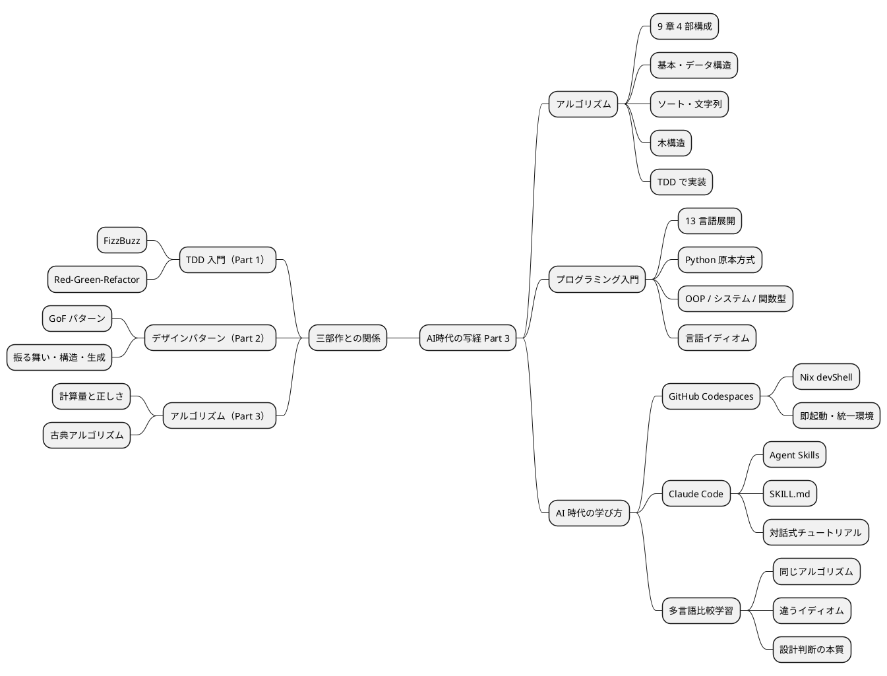

---

### 構成

- 三部作の到達点
- アルゴリズムから始めるプログラミング入門
- アルゴリズムが解く問題
- 代表アルゴリズム 5 選
- 言語別イディオム比較
- TDD サイクルでの実装
- AI 時代の学び方
- Agent Skills
- デモ
- まとめ

---

### 三部作の到達点

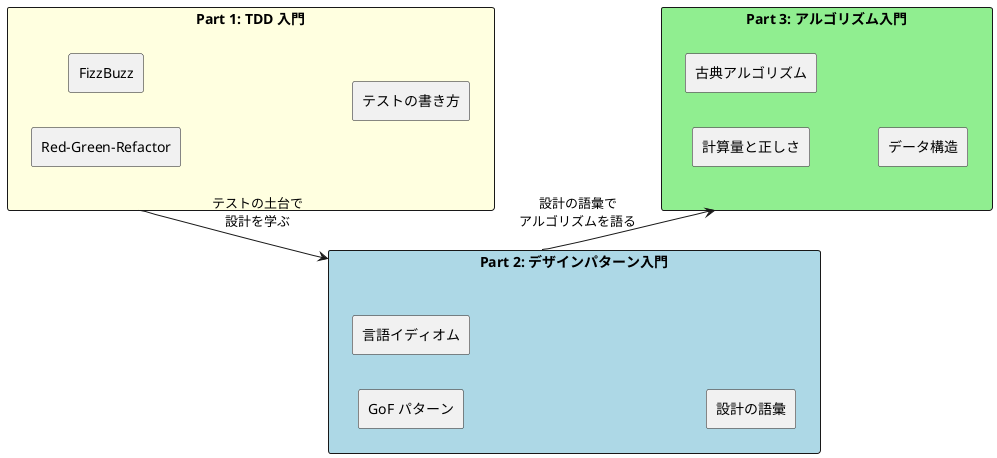

- Part 1 で **テストを書く力**、Part 2 で **設計の語彙**、Part 3 で **古典アルゴリズム** を獲得
- 三部作通じて **Red-Green-Refactor** と **多言語比較学習** という共通装置を継続使用

---

### アルゴリズムから始めるプログラミング入門

『新・明解 Python で学ぶアルゴリズムとデータ構造』を題材に、TDD で 13 言語のイディオムに沿ったアルゴリズム実装を体験するシリーズ

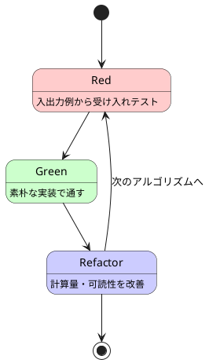

- 9 章 4 部構成。基本 → データ構造 → ソートと文字列 → 高度なデータ構造の順に深化
- **素朴な実装 → 計算量を意識した実装** の Before/After で性能の意味を体感
- 同じアルゴリズムを複数言語で実装し、**言語の設計思想がアルゴリズム表現に与える影響**を学ぶ

---

### アルゴリズムから始めるプログラミング入門 対象 13 言語

| カテゴリ | 言語 | アルゴリズム理解の重点 |
| :--- | :--- | :--- |
| 原本 | Python | 動的型付き、リスト内包、可読性重視 |
| OOP | Java / C# / TypeScript / Ruby / PHP | クラス・コレクション・ジェネリクス |
| システム | Go / Rust | スライス、所有権、メモリ局所性 |
| 関数型 | F# / Scala / Clojure / Haskell / Elixir | 再帰、パターンマッチ、永続データ構造 |

- **Python 版を原本**として作成し、完成後に他 12 言語へ展開
- Wiki 記事が存在する Go / Haskell / Clojure / F# / TypeScript は補助参照
- **Nix devShell** で 13 環境を再現性ありで提供

---

### アルゴリズムから始めるプログラミング入門 章構成

9 章 4 部構成。基本アルゴリズムからデータ構造、ソートと文字列、高度なデータ構造へ段階的に深化

| 部 | テーマ | 章 |
| :--- | :--- | :--- |
| 第 1 部 | 基本 | 1. 基本的なアルゴリズム / 2. 配列 / 3. 探索アルゴリズム |
| 第 2 部 | データ構造 | 4. スタックとキュー / 5. 再帰アルゴリズム |
| 第 3 部 | ソートと文字列 | 6. ソートアルゴリズム / 7. 文字列処理 |
| 第 4 部 | 高度なデータ構造 | 8. リスト / 9. 木構造 |

- 第 1 部で条件分岐・反復・配列操作という土台を確認
- 第 2 部で **抽象データ型** としてのスタック・キューと **再帰** を導入
- 第 3〜4 部で **計算量の比較** と **連結リスト・二分探索木** へ

---

### Python 原本方式と多言語展開

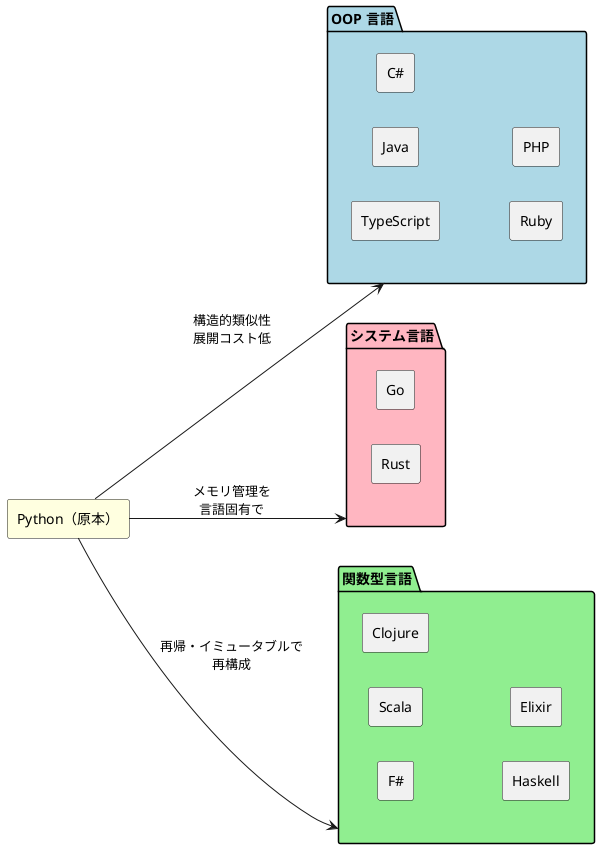

- Python 版が最も完成度が高いため**原本**として位置付け
- OOP → システム → 関数型 の順に展開コストが上がる構造を意識
- 各言語の **イディオムへの翻訳** が学びの中心

---

### アルゴリズムが解く問題

> 「動けばいい」から「変更を楽に安全にできて役に立つ」へ

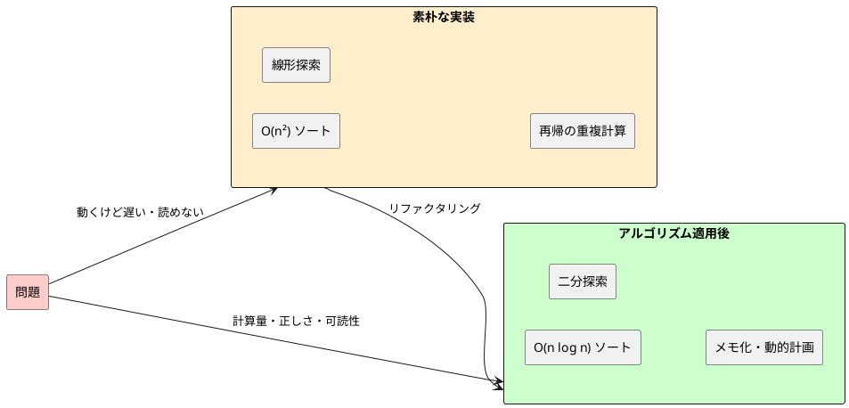

- アルゴリズムは **計算量・正しさ・可読性** を改善する設計判断
- 「銀の弾丸」ではなく、**変更を楽に安全にできて役に立つコード** にするための語彙
- TDD と組み合わせることで、**安心してリファクタリング** できる

---

### 代表アルゴリズム ① 第 1 章 3 値の最大値

<div class="columns">
<div>

#### コード（Python）

```python
def max3(a: int, b: int, c: int) -> int:
    """3 つの整数値の最大値を返す"""
    maximum = a
    if b > maximum:
        maximum = b
    if c > maximum:
        maximum = c
    return maximum
```

#### ポイント

- **条件分岐の網羅** が肝。13 通りの大小関係をテストで網羅
- 「変数 maximum を更新する」発想は **逐次更新** の基本パターン
- TDD では **境界値（等値ケース）** を見落とさないことが重要

</div>
<div>

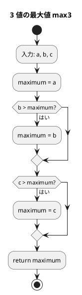

</div>
</div>

---

### 代表アルゴリズム ② 第 3 章 二分探索

<div class="columns">
<div>

#### コード（Python）

```python
def bseach(a, key):
    """ソート済み配列から二分探索で key を探す"""
    pl, pr = 0, len(a) - 1
    while True:
        pc = (pl + pr) // 2
        if a[pc] == key:
            return pc
        elif a[pc] < key:
            pl = pc + 1
        else:
            pr = pc - 1
        if pl > pr:
            break
    return -1
```

#### ポイント

- **計算量 O(log n)**。線形探索 O(n) と比べると 100 万要素で 20 ステップ
- **前提条件「ソート済み」** を満たさないと壊れる
- 配列を半分ずつ捨てる発想は **分割統治** の起点

</div>
<div>

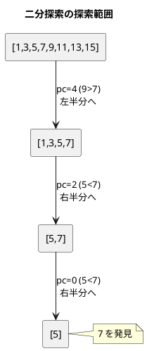

</div>
</div>

---

### 代表アルゴリズム ③ 第 5 章 ハノイの塔（再帰）

<div class="columns">
<div>

#### コード（Python）

```python
def hanoi(n, src, dst, via):
    """n 枚の円盤を src から dst へ via 経由で移動"""
    if n == 1:
        return [(src, dst)]
    moves = []
    moves.extend(hanoi(n - 1, src, via, dst))
    moves.append((src, dst))
    moves.extend(hanoi(n - 1, via, dst, src))
    return moves
```

#### ポイント

- **問題を一回り小さい同じ問題に帰着** させる再帰の典型例
- 「最大の円盤を動かす前と後」で問題を分解
- 計算量 **O(2ⁿ)**。再帰の威力と計算爆発を同時に体感

</div>
<div>

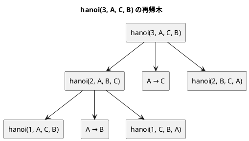

</div>
</div>

---

### 代表アルゴリズム ④ 第 6 章 クイックソート

<div class="columns">
<div>

#### コード（Python）

```python
def quick_sort(a, left=0, right=None):
    if right is None:
        right = len(a) - 1
    if left >= right:
        return
    pivot = a[(left + right) // 2]
    i, j = left, right
    while i <= j:
        while a[i] < pivot:
            i += 1
        while a[j] > pivot:
            j -= 1
        if i <= j:
            a[i], a[j] = a[j], a[i]
            i += 1
            j -= 1
    quick_sort(a, left, j)
    quick_sort(a, i, right)
```

#### ポイント

- 平均 **O(n log n)**、最悪 O(n²)
- ピボットを軸に **分割統治** で再帰的にソート
- in-place なので追加メモリが少ない

</div>
<div>

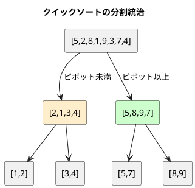

</div>
</div>

---

### 代表アルゴリズム ⑤ 第 9 章 二分探索木

<div class="columns">
<div>

#### コード（Python）

```python
def search(self, key):
    """キー key をもつノードを探索"""
    p = self.root
    while True:
        if p is None:
            return None
        if key == p.key:
            return p.value
        elif key < p.key:
            p = p.left
        else:
            p = p.right
```

#### ポイント

- 平均 **O(log n)**、最悪 O(n)（木が偏ったとき）
- 二分探索の **動的データ構造** 版
- 第 8 章「連結リスト」での **ノードと参照** の理解が前提

</div>
<div>

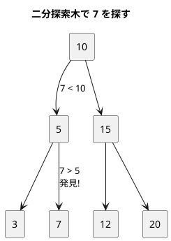

</div>
</div>

---

<!-- _class: small -->

### 言語別イディオム比較（探索編）

同じ二分探索でも、言語のイディオムでこれだけ姿が変わる

<div class="columns3">
<div>

#### Java（OOP / 反復）

```java
int bsearch(int[] a, int key) {
  int pl = 0, pr = a.length - 1;
  while (pl <= pr) {
    int pc = (pl + pr) / 2;
    if (a[pc] == key) return pc;
    else if (a[pc] < key) pl = pc + 1;
    else pr = pc - 1;
  }
  return -1;
}
```

</div>
<div>

#### Haskell（純粋関数型 / 再帰）

```haskell
bsearch :: Ord a => [a] -> a -> Maybe Int
bsearch xs key = go 0 (length xs - 1)
  where
    go pl pr
      | pl > pr   = Nothing
      | x == key  = Just pc
      | x < key   = go (pc + 1) pr
      | otherwise = go pl (pc - 1)
      where pc = (pl + pr) `div` 2
            x  = xs !! pc
```

</div>
<div>

#### Clojure（LISP / 末尾再帰）

```clojure
(defn bsearch [v key]
  (loop [pl 0 pr (dec (count v))]
    (if (> pl pr)
      -1
      (let [pc (quot (+ pl pr) 2)
            x  (v pc)]
        (cond
          (= x key) pc
          (< x key) (recur (inc pc) pr)
          :else     (recur pl (dec pc)))))))
```

</div>
</div>

- **Java** は配列インデックスと while ループ、**Haskell** はパターンガードと `Maybe`、**Clojure** は `loop/recur` で末尾再帰最適化
- 同じアルゴリズムでも言語の **抽象化軸** が違うとコードの粒度が変わる

---

<!-- _class: small -->

### 言語別イディオム比較（ソート編）

クイックソートの典型表現を 3 言語で比較

<div class="columns3">
<div>

#### Python（リスト内包）

```python
def quick_sort(a):
    if len(a) <= 1:
        return a
    pivot = a[len(a) // 2]
    left  = [x for x in a if x < pivot]
    mid   = [x for x in a if x == pivot]
    right = [x for x in a if x > pivot]
    return quick_sort(left) + mid + quick_sort(right)
```

</div>
<div>

#### F#（パターンマッチ）

```fsharp
let rec quickSort = function
  | [] -> []
  | pivot :: rest ->
    let smaller, larger =
      List.partition (fun x -> x < pivot) rest
    quickSort smaller @ [pivot] @ quickSort larger
```

</div>
<div>

#### Rust（イテレータ）

```rust
fn quick_sort<T: Ord + Clone>(a: &[T]) -> Vec<T> {
    if a.len() <= 1 { return a.to_vec(); }
    let pivot = &a[a.len() / 2];
    let smaller: Vec<T> = a.iter()
        .filter(|x| *x < pivot).cloned().collect();
    let equal: Vec<T> = a.iter()
        .filter(|x| *x == pivot).cloned().collect();
    let larger: Vec<T> = a.iter()
        .filter(|x| *x > pivot).cloned().collect();
    [quick_sort(&smaller), equal, quick_sort(&larger)].concat()
}
```

</div>
</div>

- **Python** はリスト内包、**F#** はリストパターンマッチ、**Rust** はイテレータ + 所有権
- 同じ「分割統治」が、言語の **データ構造とメモリモデル** によって違う形に翻訳される

---

### TDD サイクルでの実装

<div class="columns">
<div>

#### Red-Green-Refactor

1. **Red**: 入出力例を受け入れテストに変換
2. **Green**: 素朴な実装でテストを通す（ブルートフォースで OK）
3. **Refactor**: 計算量・可読性・命名を改善

#### アルゴリズム特有のポイント

- **境界値テスト** が肝（空配列、要素 1 個、ソート済み、逆順）
- 計算量を意識したリファクタは Refactor フェーズに集中
- **同じ受け入れテスト** を 13 言語で再利用できる

</div>
<div>

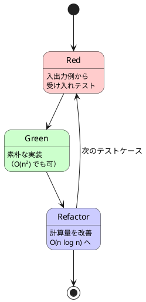

</div>
</div>

---

### AI 時代の学び方

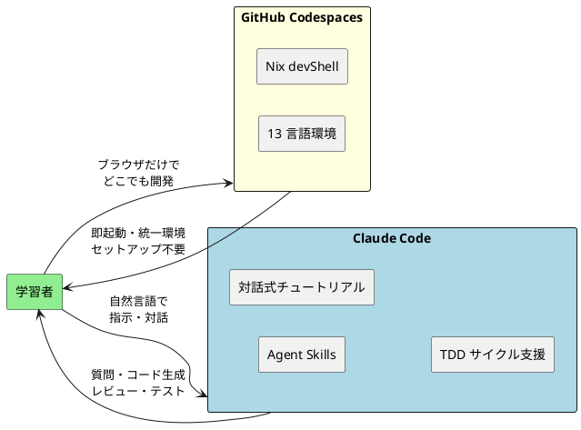

- **Codespaces + Nix devShell** で 13 言語環境がブラウザだけで再現
- **Claude Code Agent Skills** が TDD サイクル・コード生成・レビューを支援
- 学習者は **アルゴリズムの本質** に集中できる（環境構築の苦行からの解放）

---

### Agent Skills 三部作の対話式チュートリアル

<div class="columns">
<div>

#### practicing-getting-start-tdd（既存）

- Part 1「テスト駆動開発から始めるプログラミング入門」
- **FizzBuzz** を題材に 14 言語 × 12 章
- Red-Green-Refactor を段階的にコーチ

#### practicing-getting-start-algorithm（新規）

- Part 3「アルゴリズムから始めるプログラミング入門」
- **古典アルゴリズム 9 章** を 14 言語で
- TDD + **計算量・不変条件・境界値** までコーチ
- `docs/article/{lang}/0N-*.md` を教材として参照

</div>
<div>

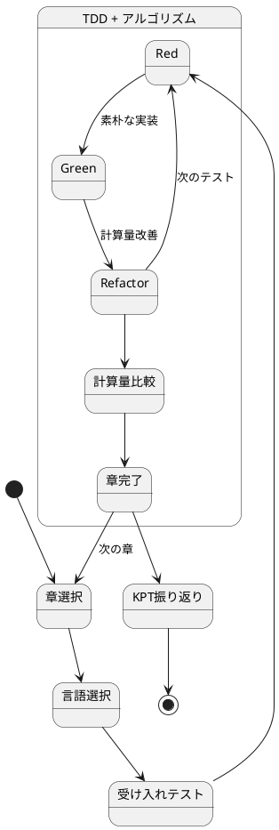

</div>
</div>

- **対話のトーン**：教えるのではなく **一緒に学ぶ**。コードを書くのはユーザー
- **記述方法**：手動記述（学習効果重視）／自動記述（テンポ重視）を選択可能

---

<!-- _class: small -->

### practicing-getting-start-algorithm の進行モデル

<div class="columns">
<div>

#### Step 0〜4 の進行

0. **環境構築**：`apps/{lang}/` 確認・初期化
1. **言語選択**：Python / OOP / システム / 関数型
2. **章選択**：4 部 9 章。経験に応じて開始章を提案
3. **対話式チュートリアル**：入出力例 → テスト → 素朴実装 → 計算量改善
4. **KPT 振り返り**：Keep / Problem / Try

#### コーチング 5 観点

- **計算量**：O 記法 + n の具体値で直感補強
- **不変条件**：「ソート済み」「左 < 親 < 右」
- **境界値**：空・単一・ソート済み・逆順・重複
- **構造選択**：配列 vs 連結、ハッシュ vs 木
- **言語イディオム**：ループ／再帰／fold／イテレータ

</div>
<div>

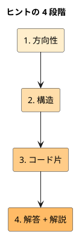

- 段階的にヒントを出し、**ユーザーが詰まったら一段ずつ降りていく**
- 最終段では教材コードを提示し、**なぜそうなるか**（計算量・不変条件）を必ず解説
- 「答えを教えて」と言われても、理解の足場を残すのがコツ

</div>
</div>

---

### デモ

```bash
# 1. 言語環境に入る
nix develop .#python

# 2. テスト駆動でアルゴリズムを実装
cd apps/python
uv run pytest tests/test_basic_algorithms.py -v

# 3. Claude Code に対話で支援を求める
claude
> docs/article/python/03-search-algorithms.md の二分探索を
> TDD で実装したい。受け入れテストから始めて。
```

- **`nix develop .#<lang>`** で対象言語の環境を起動
- 各言語の **テストランナー** が `apps/{lang}/` に既に用意されている
- Claude Code が **記事を読みながらテストを生成 → 実装 → リファクタ** を支援

---

### まとめ

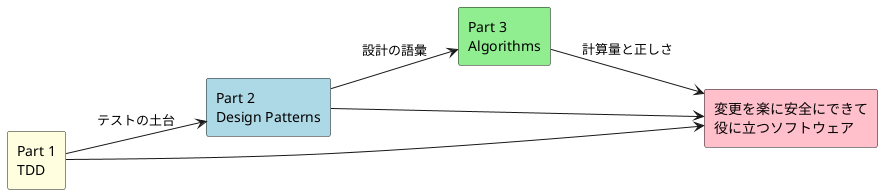

- **Part 3 はアルゴリズムを通じて「役に立つコード」の輪郭を描く**
- TDD（Part 1）と設計の語彙（Part 2）を土台に、**計算量と正しさ** を語彙に追加
- 13 言語の比較で **アルゴリズムの本質** と **言語の設計思想** を同時に学ぶ
- 三部作で **「変更を楽に安全にできて役に立つソフトウェア」** に少しずつ近づく
